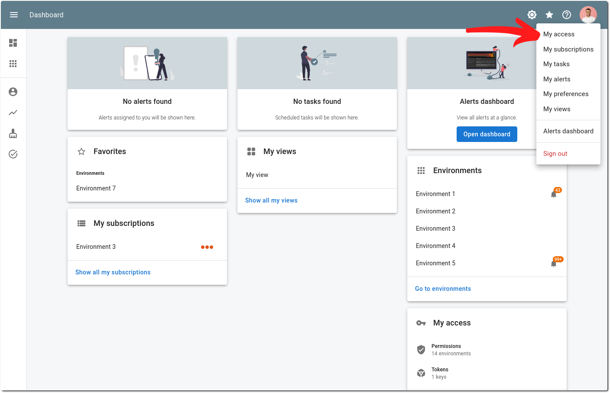
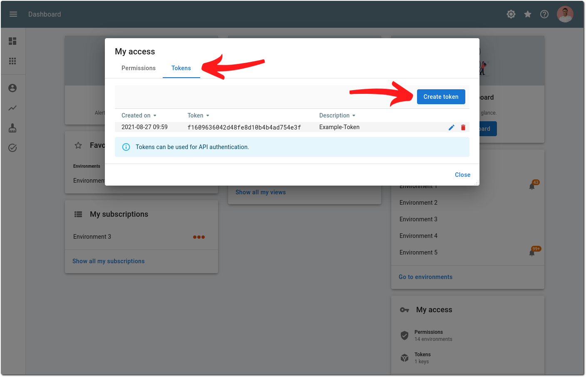

# Authentication

The authentication scheme that the InfraSonar API makes use of is "Bearer authentication".

## Bearer Authentication

Bearer authentication (also called token authentication) is an HTTP authentication scheme that involves security tokens called bearer tokens. The name “Bearer authentication” can be understood as “give access to the bearer of this token.” The client must send this token in the Authorization header when making requests to the InfraSonar API:

```bash
Authorization: Bearer <token>
```

## Creating a token

Follow the steps below to create and add a token to your account.

1. Open the "My access" dialog by clicking on the **My access** button in the account menu.
   {: style="width:500px"}
2. Navigate to the tokens tab and click on the **+** button.
   {: style="width:500px"}
3. Enter a useful description and click on the **Create** button to add the token to your account.

!!! note
    Tokens are user bound. A token therefore has the same rights as the user for which the token was created.
