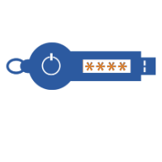

{ width="200" align=right}

# Authentication

The authentication scheme that the InfraSonar API makes use of is "Bearer authentication".

## Bearer Authentication

Bearer authentication (also called token authentication) is an HTTP authentication scheme that involves security tokens called bearer tokens. The name “Bearer authentication” can be understood as “give access to the bearer of this token.” The client must send this token in the Authorization header when making requests to the InfraSonar API:

```bash
Authorization: Bearer <token>
```

## Creating a token

Infrasonar supports two types of tokens:

**User tokens**

:   User tokens are bound to an user and can be used to automated actions as the user issuing the token.

    !!! warning

        This token has the same privileges as the user!

    User can be valuable for scripts or [integrations](../integrations/index.md) that require access to multiple containers.

**Container tokens**

:   Container tokens can be used to give granular access to a specific container.


### User tokens

Follow these steps below to create and add a token to your user account.

1. Open the "My access" dialog by clicking on the **My access** button in the account menu.
   {: style="width:500px"}
2. Navigate to the tokens tab and click on the **+** button.
   {: style="width:500px"}
3. Enter a useful description and click on the **Create** button to add the token to your account.

### Container tokens

!!! tip inline end
    We strongly suggest setting up separate tokens when possible.

Container tokens are also required for [agentcore](../documentation/application/agentcores.md) and [agent](../collectors/agents/index.md) authentication.


1. Navigate to the container you want to create a token for.
2. Click the tokens icon :material-key-outline: in the left hand menu.
3. Click the **Add token** button.
4. Give the token a identifiable name and provide just enough access<br>*observe we added some shorcuts to create access tokens for agentcores and probes*
5. Click **Save**, enter a **reason** and click **confirm**
6. Reopen the just created token and copy the ID.

!!! info "Rules"
    - User who have the de `container Access` flag set can create container tokens.
    - A user can not grant more access permissions to a token then he or she already has.