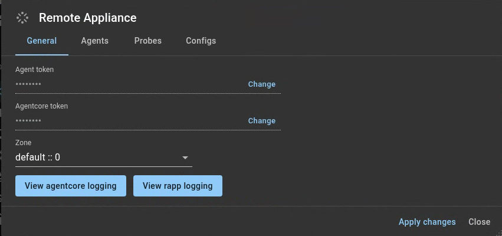
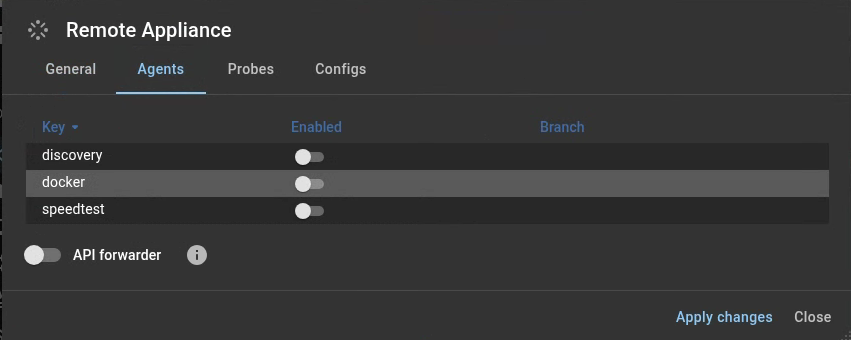
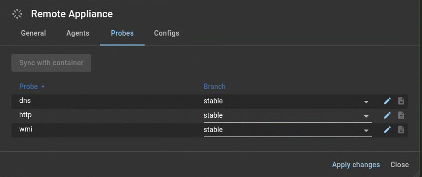
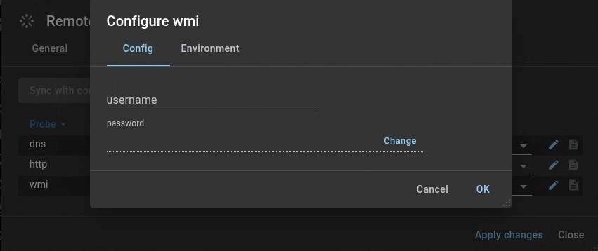
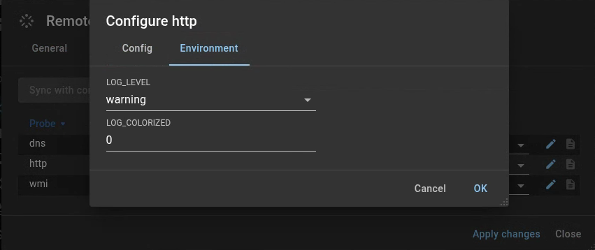
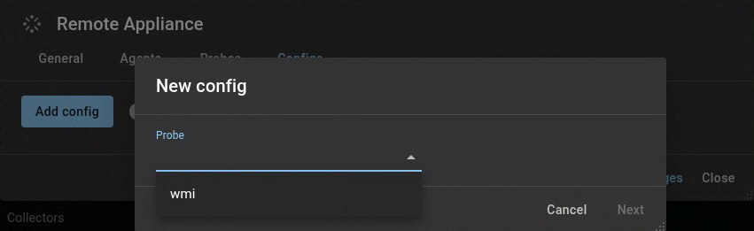
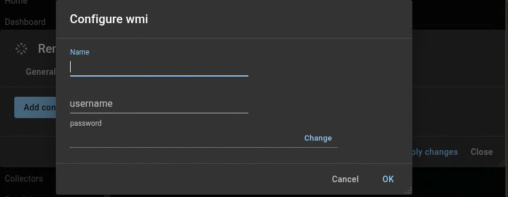

{ width="150" align=right}

# Agentcores & Zones

## Agentcore

It this panel you can see the status of the [Agentcores](../collectors/probes/agentcore.md) deployed for a container.

### Remote Appliance Manager

Our preferred installation automatically installs the Remote application manager.

The remote appliance manager runs as a docker container on our appliance and allows remote commands to be send from the Agentcore page in our web-app.

If the remote appliance manager is active you can access it's configuration by clicking the gear :gear: icon.

#### General section

Here you can change your tokens, select a different zone and view overall logging.

<figure markdown>
  { width="800" }
</figure>

#### Agents section

Here you can enable agents which run inside a docker container.

<figure markdown>
  { width="800" }
</figure>

TODO agent pages

#### Probes section

Use the sync with container button to ensure the configured [collector](./collectors.md) are deployed on the remote appliance.

_Enabled collectors which are not included in the list will be added, and collectors which are turned off will be removed. No changes will be applied until you explicitly choose to do so._

<figure markdown>
  { width=800"}
</figure>

!!! note Additional configuration
    Some collectors require an additional configuration or credemtials.
    These can be set by clicking the pencil icon :fontawesome-solid-pen:

<figure markdown>
  { width=800"}
</figure>

The **Environment** tab allows you to set a debug level.

<figure markdown>
  { width=800"}
</figure>

#### Config section

Use the config section to create a specific probe configuration that can be applied on a collector in the **Local configuration** which is available for curtain probes.

<figure markdown>
  { width=800"}
</figure>

The **Name** field can be used as a **Local configuration**

<figure markdown>
  { width=800"}
</figure>

### Removing a Agentcore 

With the proper autorotation it is possible to remove an Agentcore here.

!!! danger "Proceed with caution"

    Removing an Agentcore without having a secondary agentcore in the same zone can seriously impact the availability of your monitoring solution.

## Zones

{ width="150" align=right}

Zones can be useful when assets are located in a dmz or other remote network as it allows to direct assets to a specific Agentcore by configuring the asset to be a member of the specific zone.

## Good to know

* When one or more [Agentcores](agentcores.md) are configured in the specified zone an asset is bound to one of the Agentcores in this zone.
* If no agentcores are configured in the specified zone we fall back to any other agent core.
* For assets being monitored using an agent the zone configuration is purely cosmetic.