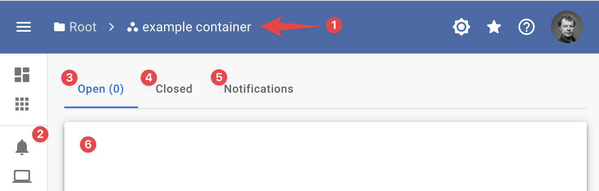
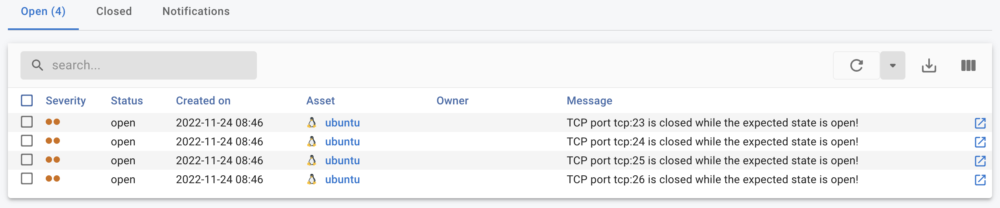
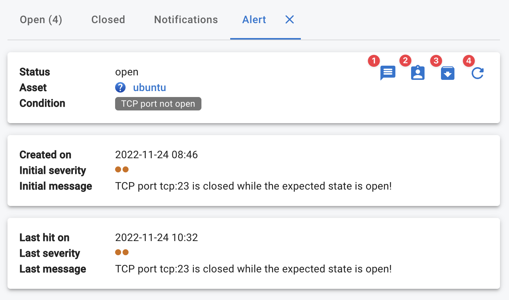

{ width="150" align=right}

# Alerts

Alerts are raised by conditions using the `return` statement in our condition edition.

Using [rules](rules.md) it is possible to route the alert to email or [DutyCalls](https://dutycalls.me).

## Viewing alerts

When you are in a container view (1) you can view the alerts and [notifications](notifications.md) in the **:material-bell: Alerts & Notifications page** (2) 

{ width="500"}

This view shows:

* [Open alerts (3)](alerts.md#open-alerts) 
* [Closed alerts (4)](#closed-alerts)
* [Notifications (5)](#notifications)

### Open alerts

The open alerts (3) pane shows a list (6) of all open alerts and its status.

{ width="500"}

When you click the show details button :octicons-link-external-16: the details pane opens.

{ width="500"}

1. **Add message**, allows you to add a message to the alert; this might be useful to inform coworkers.
2. **Assign alert**, allows you to assign the alert to yourself or another member of this container.
3. **Close alert**, closes the alert; when the issue is not resolved, the issue is reopened and automatically assigned to the user who closed the alert.
4. **Refresh**, refreshes the alert pane.

### Closed alerts

The closed alerts pane (4) shows a list of closed alerts.

### Notifications

The closed alerts pane (5) shows a list of all open notifications (6); see our detailed [notification section](notifications.md) for more information.

## Managing alerts

### Closing alerts

There are three ways an alert gets closed:

1. **User close**, an end users closed the alert;
2. **auto close**, the condition is configured to close the alert if the issue is resolved;
3. **indirect close**, the relation between the condition and asset is removed:
    1. When the asset is removed from the condition (e.g. removing the label applying the condition);
    2. When the check triggering the condition is disabled;
    3. When the asset is removed.

!!! note "Auto close caveat"
    it is possible that an **auto close** fails when the item triggering the alert no longer exists upon a new check result.
    This can happen for example when you create a condition on cpu usage in a list of processes, if you then kill the process InfraSonar will never see this item again. When this happens you need to close the alert manually.