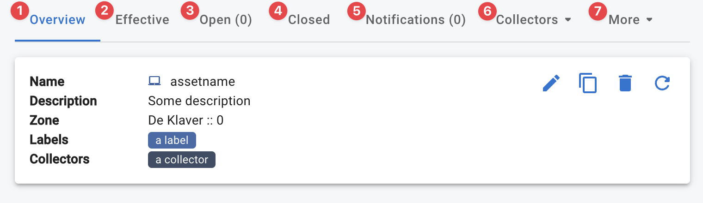
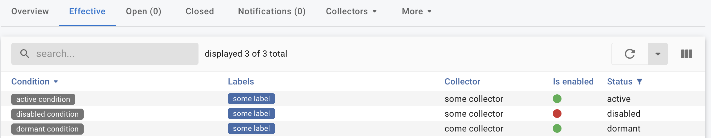

{ width="150" align=right}

# :material-laptop: Assets

The InfraSonar Asset concept is described [here](../concept/assets.md).

## Add asset

When you are in the assets view you can add a new asset using the Add asset button.

<figure markdown>
  { width="800" }
</figure>

### Asset configuration

<figure markdown>
  { width="800" }
</figure>

Configuring an asset involves the following steps:

1. Enter an asset name. 
   *We strongly suggest entering the correct hostname in [FQDN](https://en.wikipedia.org/wiki/Fully_qualified_domain_name) format here, but do not enforce this.*
2. Enter an optional description.
3. Select the mode. 
   *This is usually normal, see our [mode](modes.md) documentation for more details*
4. Select the zone.
   *This is usually 0, see our [zone](./agentcores.md/#zones) documentation for more details*
5. Select the [collectors](../collectors/index.md) you want to use.
6. Enter the correct [labels](labels.md) for this asset.

!!! note "Advanced asset configuration and credentials"

    Some collectors require a more advanced configuration or credentials to be setup on the appliance running the collector. See our [credentials](../concept/credentials.md) section if this applies to your setup.

### Adding multiple assets

When there is a need to add multiple assets at once we suggest using our [api](../api/container/create-asset.md)

## Asset usage

<figure markdown>
  { width="800" }
</figure>

### Overview :material-numeric-1-circle:{ .red }

Provides an overview of the asset.

Using the pencil :material-pencil: icon you can [edit](./assets.md#asset-configuration) this asset.

### Effective :material-numeric-2-circle:{ .red }
Shows the effective conditions for this asset.
<figure markdown>
  { width="800" }
</figure>

This overview shows all conditions configured for this asset.
A condtion can have three states: 

1. **Active**, this condition is actively being evaluated.
2. **Disabled**, the condition is disabled on this asset. 
    You can disable a condition by clicking the condition name and toggle the condition in the lower left corner of the modal: :green_circle: :material-arrow-right: :red_circle:
3. **Dormant**, there is no data for which this condition is applicable.
    

### Open :material-numeric-3-circle:{ .red }

All open [alerts](./alerts.md) for this asset.
    

### Closed :material-numeric-4-circle:{ .red }

All closed [alerts](./alerts.md) for this asset.

### Notifications :material-numeric-5-circle:{ .red }

All [notifications](alerts.md#notifications) for this asset.

### Collectors :material-numeric-6-circle:{ .red }
A detailed view off all collected data per collector.

### More :material-numeric-7-circle:{ .red }

Here you can jump to:

* **Forecasts**, manage [forecasts](../guides/forecasting.md) for this asset. 
  You van view the generated forecasts here and drop :fontawesome-solid-trash: forecasts when it is needed to regenerate a forecast.
* **History**, show all logged actions for this asset.
* **Schedule**, manage the [mode](./modes.md) schedule for this asset.
* **Statistics**, alert statistics for this asset
* **Time series**, manage [time series](./timeseries.md) for this asset.

