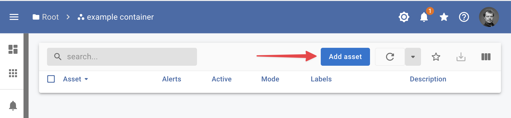
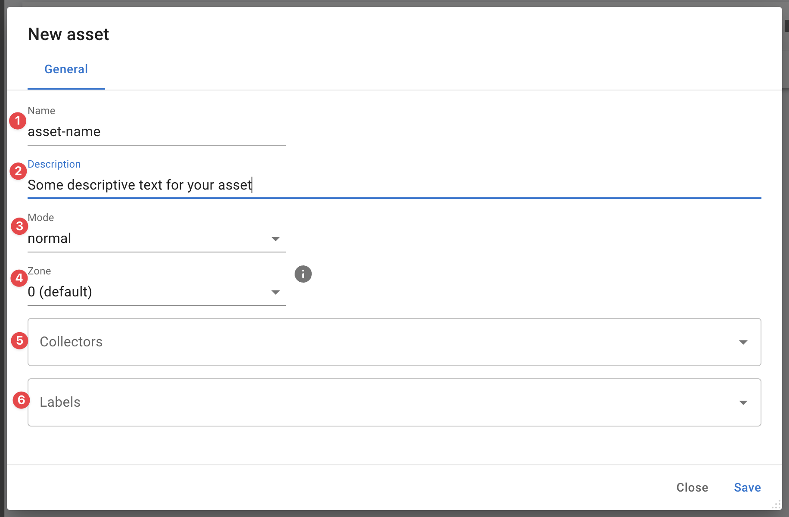

{ width="150" align=right}

# :material-laptop: Assets

Assets are in essence the monitored objects in an InfraSonar implementation. Assets can be IT components such as routers, switches, servers etc but can easily also consists of any other device which can be monitored such as elevators :elevator:, IOT devices :material-radio-tower:, etc. 

## Add asset

When you are in the assets view you can add a new asset using the Add asset button.

<figure markdown>
  { width="800" }
  <figcaption>InfraSonar add asset</figcaption>
</figure>

### Asset configuration

<figure markdown>
  { width="800" }
  <figcaption>InfraSonar add asset details</figcaption>
</figure>

Configuring an asset involves the following steps:

1. Enter an asset name. 
   *We strongly suggest entering the correct hostname in [FQDN](https://en.wikipedia.org/wiki/Fully_qualified_domain_name) format here, but do not enforce this.*
2. Enter an optional description.
3. Select the mode. 
   *This is usually normal, see our [mode](modes.md) documentation for more details*
4. Select the zone.
   *This is usually 0, see our [zone](zones.md) documentation for more details*
5. Select the [collectors](../collectors/index.md) you want to use.
6. Enter the correct [labels](labels.md) for this asset.

!!! note "Advanced asset configuration and credentials"

    Some collectors require a more advanced configuration or credentials to be setup on the appliance running the collector. See our [credentials](../collectors/probes/appliance/credentials.md) section if this applies to your setup.

### Adding multiple assets

When there is a need to add multiple assets at once we suggest using our [api](../api/container/create-asset.md)

## Asset usage

<figure markdown>
  { width="800" }
  <figcaption>InfraSonar add asset</figcaption>
</figure>

**Overview**
:   Todo

**Effective**
:   Todo

**Open (0)**
:   Todo

**Closed**
:   Todo

**Notifications (0)**
:   Todo

**Collectors**
:   Todo

**More**
:   Todo

### Manage forecasts

### Manage Time series

