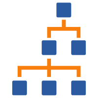
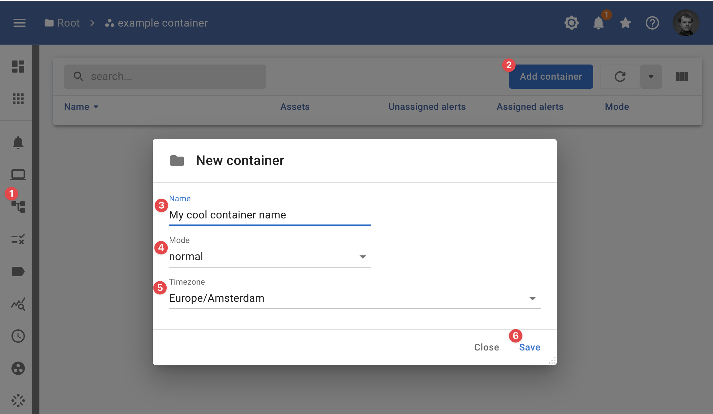

{ width="150" align=right}

# :material-apps: Child containers 

From the container view, you can add child [containers](../concept/containers.md).

<figure markdown>
  { width="800" }
  <figcaption>InfraSonar add container</figcaption>
</figure>

1. When you are in asset view you can use the child containers button :material-file-tree: to switch to child container view;
2. Click the add **container button**;
3. Enter a name for your container;
4. Select the [mode](modes.md), this is usual **normal**;
5. Select the **timezone** for this container;
6. CLick **save**.