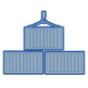
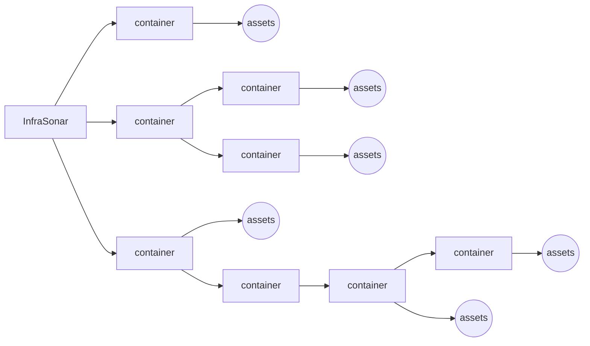
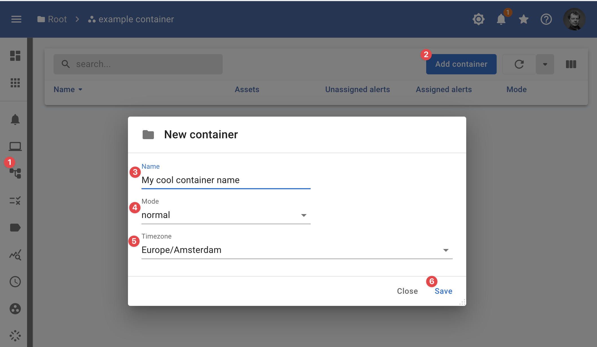

{ width="150" align=right}

# :material-apps: InfraSonar containers 

InfraSonar containers are a hierarchial setup of you monitored infrastructure.

A container can contain monitored assets and/or sub-containers.

Depending on your access level the following can be configured at container level:

* Authorization
* Labels
* Conditions.
* Collectors
* Billing
* Modes
* Timezone

## Hierarchy

### Principles

Authorization is inherited to "lower" containers. Inheritance can be "broken" down the chain.

#### InfraSonar hierarchical setup



??? Example "Hierarchy implementation for a service provider"

    ``` mermaid
    graph LR
      A[InfraSonar] --> B[service provider];
      B --> C[internal infrastructure]
      B --> D[monitoring only]
      B --> E[managed service]
      C --> F((assets))
      D --> customer1[customer 1]
      D --> customer2[customer 2]
      customer1 --> I((assets))
      customer2 --> J((assets))
      E --> customer3[customer 3]
      customer3 --> K((assets))
      E --> customer4[customer 4]
      customer4 --> L((assets))
      E --> customer5[customer 5]
      customer5 --> M[development]
      customer5 --> N[acceptance]
      customer5 --> O[production]
      M --> Q((assets))
      N --> R((assets))
      O --> S((assets))
    ```

## Setup a new container

!!! note First time users

    When you are new to InfraSonar and sign in for the first time, you will see the message:
    > Welcome to InfraSonar! It appears that you are not yet a member of an InfraSonar container. If you are a member of an organization that uses InfraSonar, ask for permission from an authorized person to add you to the relevant container. Otherwise, request a free demo via the [website](https://infrasonar.com/support)!

From the container view, you can add a new child container.

<figure markdown>
  { width="800" }
  <figcaption>InfraSonar add container</figcaption>
</figure>

1. When you are in asset view you can use the child containers button :material-file-tree: to switch to child container view;
2. Click the add **container button**;
3. Enter a name for your container;
4. Select the [mode](modes.md), this is usual **normal**;
5. Select the **timezone** for this container;
6. CLick **save**.