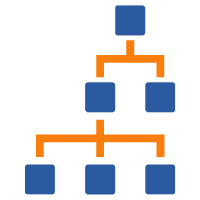

{ width="150" align=right}

# Containers

The containers view shows the hierarchy of containers and allows you to configure the container [mode](modes.md) and timezone.

You also move containers within the hierarchy within this view and renew containers.

In this view you can also add/remove columns to show you:

* Container Id
* Container name
* Number of Assets
* Number of Unassigned alerts
* Number of Assigned alerts
* Number of Notifications
* Mode
* Timezone