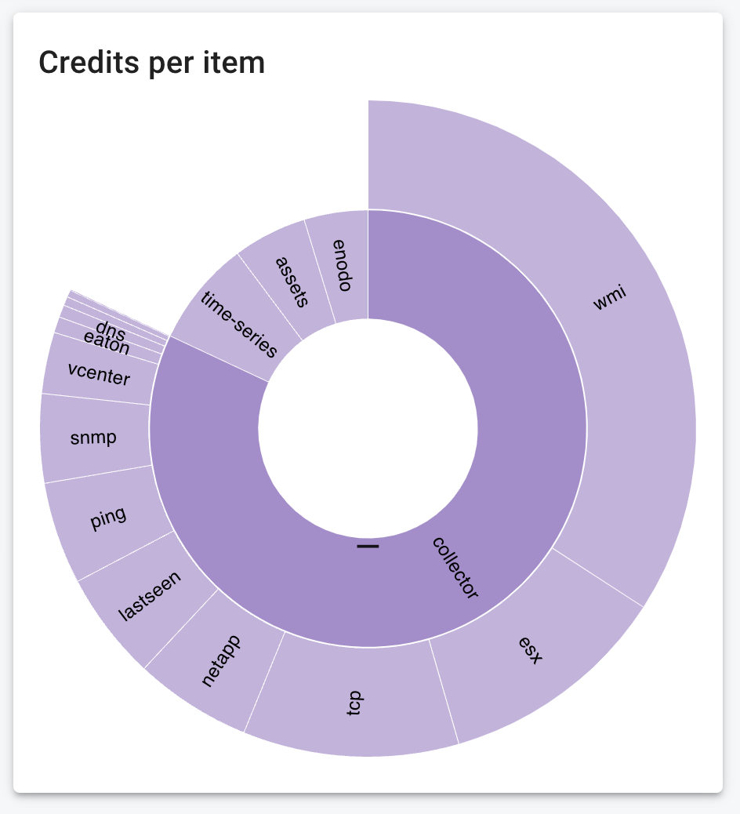
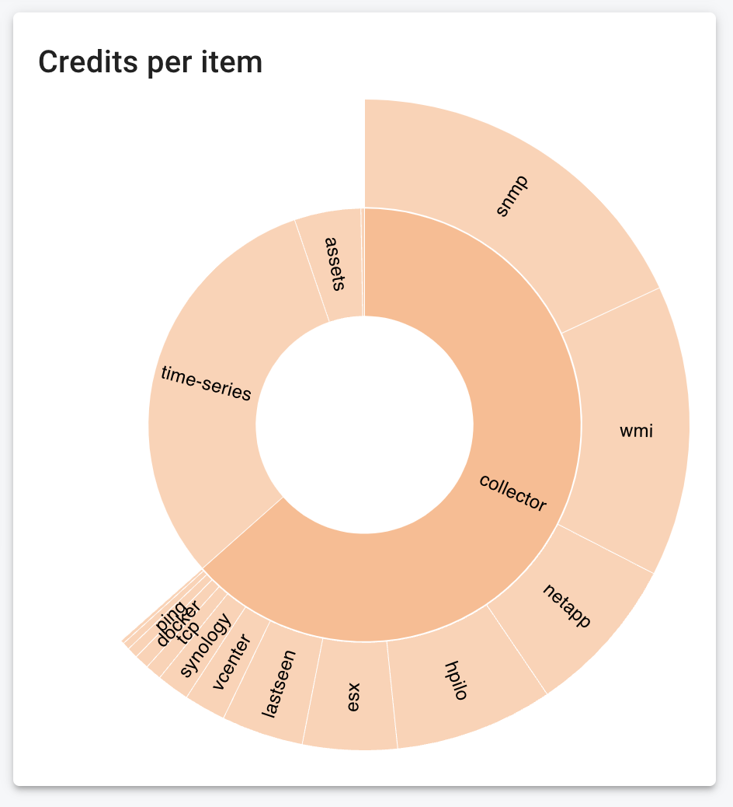

{ width="150" align=right}

# :material-credit-card-edit-outline: Credits

On the credits page you can find the "*in use*" credits and "*available*" credits for a container and it's children.

You can drill-down per container to retrieve detailed usage:

{ width="300"}
{ width="300"}