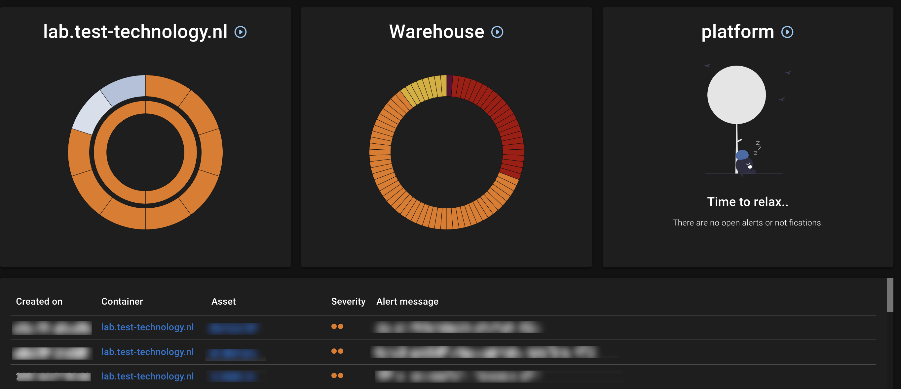
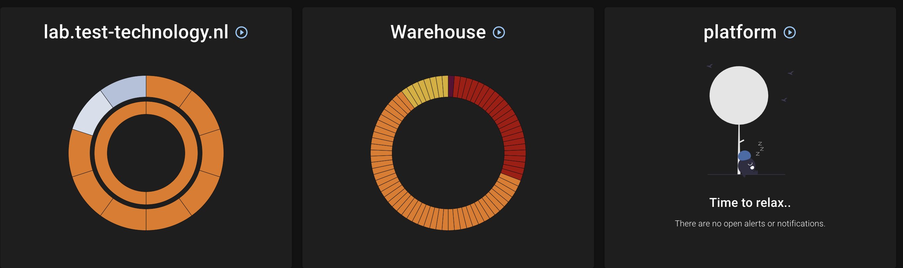
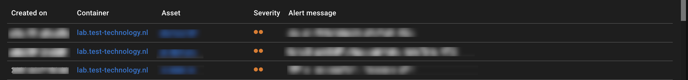
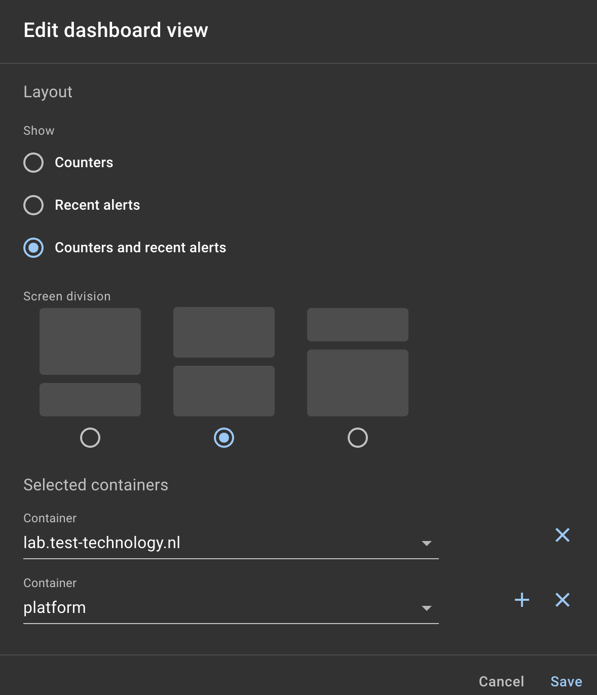

{ width="150" align=right}

# Dashboard

The dashboard gives an overview of all unassigned alerts and notifications per configured container and can be used to display on a central display.

When you open the dashboard for the first time or in a new browser session you are created by a setup wizard.
See our [Dashboard setup paragraph](#dashboard-setup) how to setup you dashboard but first have a look on at our dashboard concept as this helps you decide on how to setup your dashboard.

!!! tip "Raspberry Pi dashboard server"

    See our [Raspberry Pi guide](../guides/raspberrypi_dashboard.md) on how we have setup our autonomous dashboards using a couple of Raspberry Pi's.

## Dashboard overview

Our dashboard consists of two main sections:

1. Graphical container overview
2. Unassigned alerts

{ width="800"}

### Graphical container section

{ width="800"}

* The outer circle show all alerts
* Assigned alerts are colored in a blue tint
* The inner circle shows all notifications

### Unassigned alerts section

{ width="800"}

The section shows all unassigned alerts sorted by time of creation.

## Dashboard setup

You can edit the dashboard using the :material-pencil: icon.

{ width="400"}

1. Select which section you want to show.
2. Select an optional screen division if you have chosen to use multiple sections
3. Select the containers you want to display on this dashboard

!!! note "Configuration"

    The dashboard configuration is stored in the browsers local storage allowing you to setup multiple dashboards on multiple systems using a single read-only account.
