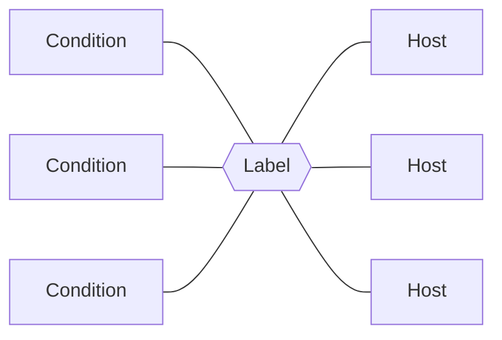
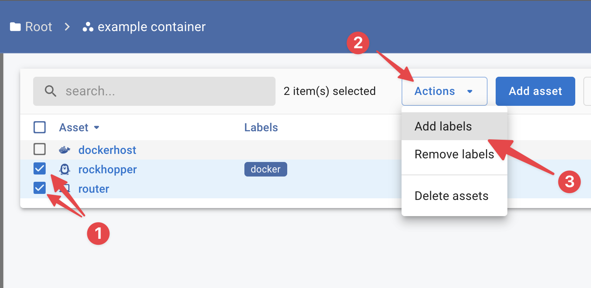
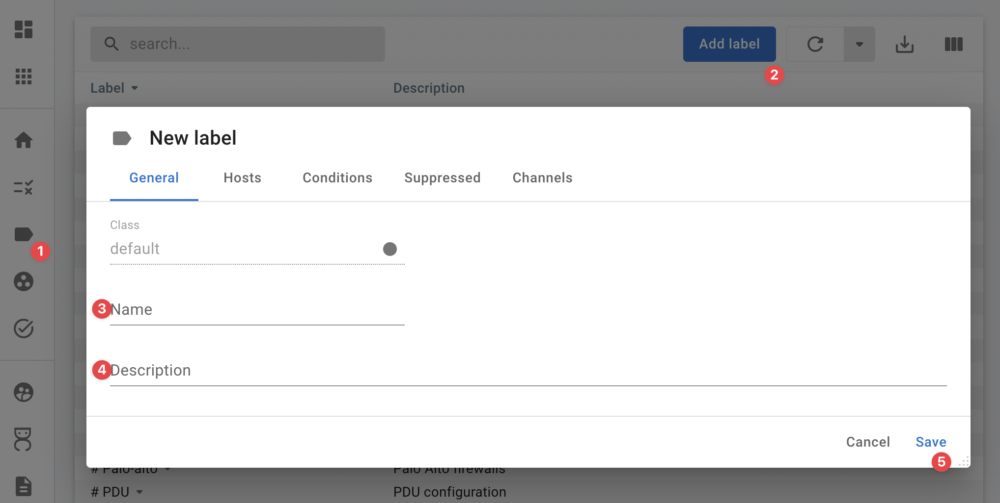

{ width="150" align=right}

# :material-label: Labels

## Purpose

**Grouping**, labels can be added to hosts to group and identify them quickly.

**Apply conditions**, Labels are also used to control which conditions are active.

!!! tip inline end "Glue"

    Labels "glue" conditions onto hosts.

## How to use

Labels can be assigned to hosts either by :material-playlist-edit: editing a host or by selecting one or more hosts and using the **action menu**.

<figure markdown>
  
  <figcaption>Action menu in action</figcaption>
</figure>

## Custom labels

InfraSonar container admins can create custom labels for a container.

<figure markdown>
  { width="800" }
  <figcaption>InfraSonar add label</figcaption>
</figure>

!!! tip inline end "Pro Tip"
    As must browsers support emoji it is possible to use these in your labels. 
    Examples:

    - The round pushpin 📍 to indicate labels used for locations. 
      `📍 InfraSonar HQ`
    - Bust in Silhouette 👤 to indicate labels used for to indicate who is responsible for an asset. 
      `👤 C.E. Shannon`

1. Navigate to the labels page (:material-label:) in the left navigation drawer;
2. Click the **Add label** button;
3. Enter a name (1);
4. Pick a color (2):  
   :material-label:{.label-steel} Steel  
   :material-label:{.label-olive} Olive  
   :material-label:{.label-mauve} Mauve  
   :material-label:{.label-emerald} Emerald  
   :material-label:{.label-orange} Orange  
   :material-label:{.label-magenta} Magenta  
   :material-label:{.label-infrasonarblue} InfraSonar-blue, (reserved for InfraSonar labels)
5. Enter a description(3).

## Predefined labels

