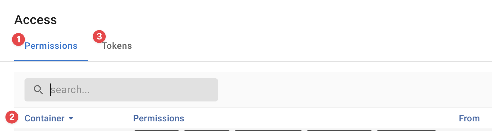
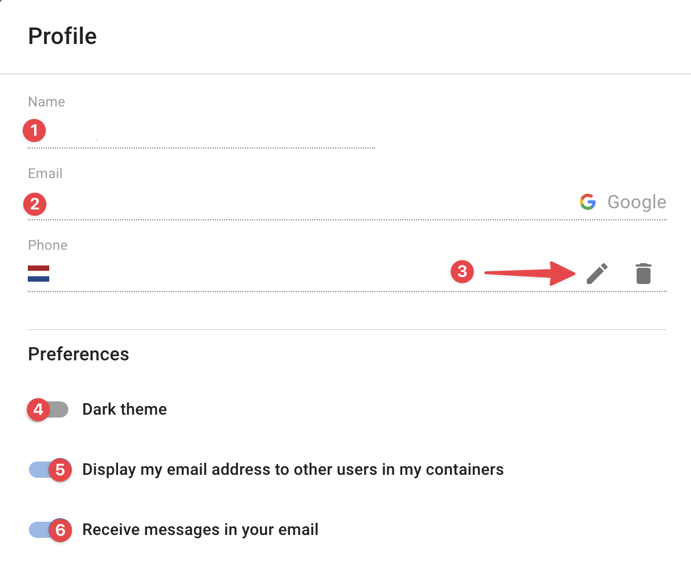

{ width="150" align=right}

# Profile menu

In the top right corner you can find individual settings to configure your profile.

## Access

The access menu option shows you which containers your account has access to.
Your personal access tokens are also managed here.

<figure markdown>
  { width="800" }
  <figcaption>InfraSonar profile - access</figcaption>
</figure>

**:material-numeric-1-circle:{ .red }Permissions**

:   Here you can lookup your InfraSonar permissions per container :material-numeric-2-circle:{ .red }:

    - The *Container* column shows the container;
    - The *Permissions* column shows the configured permissions for this container;
    - The *From* column shows in the permissions were configured on the container or where inherited from a parent container.

**:material-numeric-3-circle:{ .red }Tokens**

:   You will also configure your personal access tokens here.

    !!! note "Keep tokes personal"

        Tokens configured here are personal and represent you.

## Alerts

Any alerts assigned to you can be found here.

## Messages

InfraSonar system-wide announcements and messages can be found here.

These provide a valuable insight into new releases, planned maintenance windows etc.

## Status

You can set your status to mute avoiding InfraSonar from sending any notification to you.

!!! note "Mute stops also rules"
    Any rules sending you direct messages (SMS, email, WhatsApp and voice) are alo muted.

You can create a schedule to set your status automatically.

## Profile

Your profile details

<figure markdown>
  { width="800" }
  <figcaption>InfraSonar profile - profile</figcaption>
</figure>

**:material-numeric-1-circle:{ .red }Name**
:   Your display name as provided by your authentication provider.

**:material-numeric-2-circle:{ .red }Email**
:   Your email address as provided by your authentication provider. 
    Note, we will send [messages](#messages) and [notifications](./rules.md) to this address.

**:material-numeric-3-circle:{ .red }Phone**
:   If you want to use WhatsApp, SMS and/or voice [notifications]((./rules.md)) you need to configure your mobile phone number here.

**:material-numeric-4-circle:{ .red }Dark theme**
:   Choice the dark side here.

**:material-numeric-5-circle:{ .red }Display my email address to other users in my containers**
:   Makes your email address visible to other container users.

**:material-numeric-6-circle:{ .red }Receive messages in your email**
:   When disabled [InfraSonar messages](#messages) will no longer be send via email

## Dashboard

Your [personal dashboard](./dashboard.md) can be configured here.

Any settings made to the dashboard are stored in you user profile and will be reflected in all logged on sessions.
This can be useful for managing wall-boards.

## Sign out

Sign out of InfraSonar.