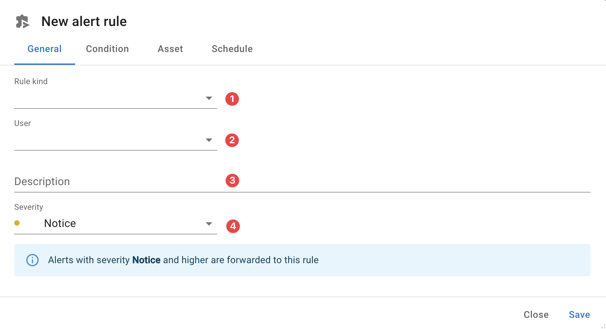
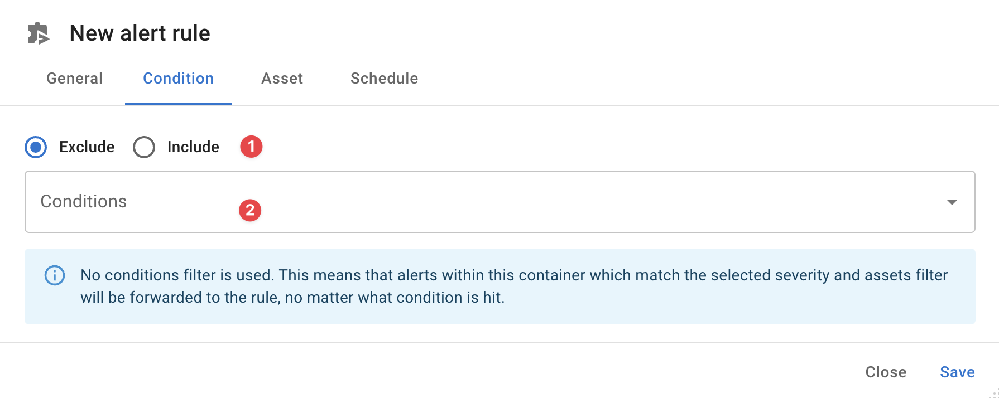
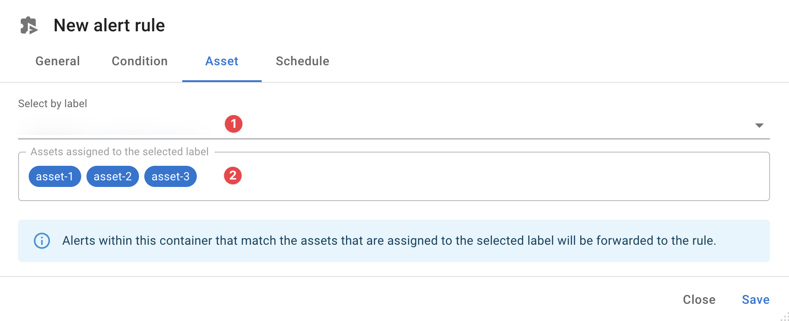
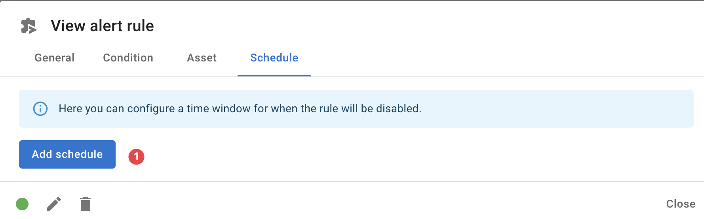
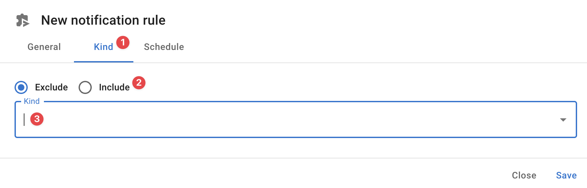

{ width="150" align=right}

# Rules

Rules are a great way to configure external notifications for end-users.

Rules can be setup for a group of conditions and assets and route messages to either SMS, WhatsApp, Email, a webhook or even a voice call.

!!! note "Setup you phone number"

    Before we can send a message using SMS or WhatsApp to your phone we need to know your phone number. 
    Your can manage your phone number in your [profile](./profile.md).

## Prerequisites

If you want to use SMS, WhatsApp or voice calls it is important to note that every time the rule is triggered this will cost one credit which will count against your monthly billed credits.

Users with the privilege [RuleManagement](./users.md#rulemanagement) can setup any rules, even for other users.

The privilege [RuleEmail](./users.md#ruleemail) allows users to manage there own email rules while [RulePhone](./users.md#rulephone) allows users to manage their own SMS, WhatsApp or voice calls.

It is important though that for each user who wants to use SMS, WhatsApp or voice calls their number must be setup in their profile.

## Configuring alert rules

!!! note "Ask your users to setup their phone number"

    If toBefore we can send a message using SMS or WhatsApp to your phone we need to know your phone number. 
    Your can manage your phone number in your profile.

The next paragraphs outline each of the tabs when configuring rules.

### General

To start, select how you'd like this rule to notify you by selecting a **rule kind** :material-numeric-1-circle:{ .red }:

* Email
* webhook
* SMS
* VoiceCall
* WhatsApp

For webhooks some additional options can be configures, see our [webhook](./webhooks.md) documentation for the specific details.

When configuring SMS, VoiceCall or WhatsApp we urge you to test the communication using the test button to ensure your desired way of communication is working.

Next step is to configure a **user** :material-numeric-2-circle:{ .red }  for whom this rule is applicable. 

Set a **description** :material-numeric-3-circle:{ .red }  for this rule, your future self and colleagues will thank you later.

Last choose in this section is for which **severity** :material-numeric-4-circle:{ .red }  level you want to be notified.

!!! note "Choose your severity level wisely"

    Choosing a lower level notifies you also about the more urgent levels. So if you choose *Critical* you will also be notified when an *Alert* or *Emergency* level is hit.
      
    To avoid unexpected costs and messages flooding you choosing the correct severity levels requires some careful consideration, if in doubt don't hesitate to contact [support](../support/index.md)

### Condition

In this section you choose for which conditions you want this rule to be active or not.

You can choose to **exclude** or **include** :material-numeric-1-circle:{ .red } specific **conditions** :material-numeric-2-circle:{ .red } this rule to applies to.

### Asset

Select the **label** :material-numeric-1-circle:{ .red } you want to use to specify for which assets this rule applies, if you don't select a label this rule will apply to all assets in the container.

When a label a selected we will show a list of assets :material-numeric-2-circle:{ .red } for which this rule applies.

### Schedule

Adding a schedule is only possible once the rule has been saved.

Click **Add schedule** :material-numeric-1-circle:{ .red } to add a schedule.

## Configuring notification rules

Configuring notification rules is similar to configuring alert rules.

The main difference between notification rules and alert rules is that notification rules specify on specific notifications you want the rule to be applied for, while alert rules specify which conditions and assets will trigger an alert.

Configuring which notification are handled by this rule is done in the **kind** :material-numeric-1-circle:{ .red } tab. Here you can select if you want to  **exclude** or **include** :material-numeric-2-circle:{ .red } one or more notification **kinds** :material-numeric-3-circle:{ .red }

