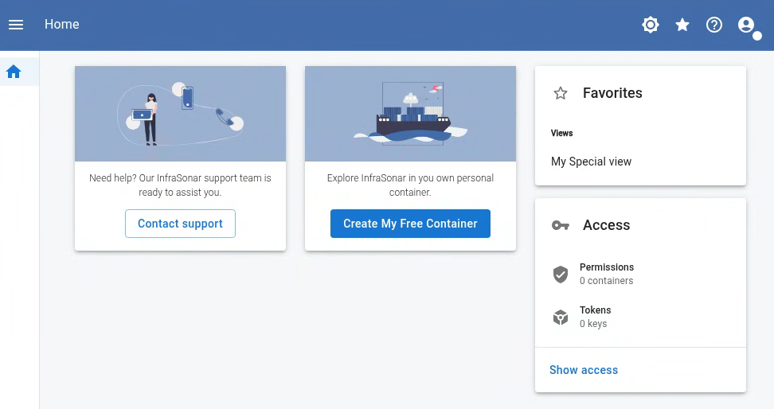

{ width="150" align=right}

# :material-view-grid: Views

> Consolidate and Visualize Your Assets

Views allow you to create comprehensive overviews of multiple assets, grouped by kind and/or label, providing a centralized dashboard for your monitoring data.

## Sharing views

Views can easily be shared even to users with only access to a container, but without any other permissions.
This is a great feature to create service management dashboards for customers or partners.

A view can be shared using a special link which is shown when clicking the link icon :material-link:, this will provide a URL like this:
```
https://app.infrasonar.com/view/<<some-key>>
```

## User access

Users accessing a shared view IRL can easily mark this view as favorite using the :octicons-star-16: icon in the top right corner.
This allows them to quickly access the view from their home-screen when the logon again.




## Public views

A view can be set to public, allowing access without an InfraSonar account. This feature is useful for sharing the platform's status, such as network uptime or server performance, in a public dashboard. Be aware that sharing this URL grants access to anyone who possesses it.

!!! danger "Public Views"
    Exercise caution when making views public, as sensitive information may be exposed.
