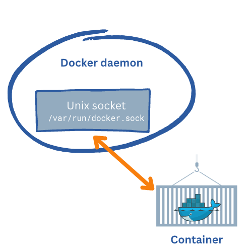

{ width="400" align=right}

# :fontawesome-brands-docker: Docker

The Docker-agent is a Docker container that can be used to monitor other Docker containers. The Docker-agent itself runs as a Docker container on the host, which hosts the containers and uses the Unix socket `docker.sock` to retrieve relevant monitoring data which, is send to the InfraSonar API.

## Prerequisites

* The Docker-agent must be able to connect to the [InfraSonar API](https://api.infrasonar.com)
* The Docker-agent must be allowed access to the Unix socket `docker.sock`.
* The Docker-agent requires a valid [token](../../api/authentication.md).

## Installation

There are multiple scenario's that can be used to deploy the docker agent and it depends on your use case which one would suites best for you.

!!! tip "Host network vs bridge network"
    When using a bridge network it is highly recommended to set the container host name using the `--hostname` / `-h` flag as this is the name used by the agent to present itself.


Upon first run the Docker agents registers itself as an asset in InfraSonar, to ensure reconnection to the same asset an asset-id is stored in `/data/.asset.json` hence the reason we mount the the `/data` folder.

### Docker command

*Deploys the docker agent using a bridged network and names the hostname to the system hostname:*

```bash
docker run \
  --name dockeragent \
  -h $HOSTNAME \
  -v infraSonarData:/data \
  -e TOKEN="<<agent token>>" \
  -v /var/run/docker.sock:/var/run/docker.sock \
  -d \
  ghcr.io/infrasonar/docker-agent
```

*Deploys the docker agent using the host network and thus automatically uses the system hostname:*

```bash
docker run \
  --name dockeragent \
  --network host \
  -v infraSonarData:/data \
  -e TOKEN="<<agent token>>" \
  -v /var/run/docker.sock:/var/run/docker.sock \
  -d \
  ghcr.io/infrasonar/docker-agent
```

### docker-compose

You can also add the Docker-agent to your `docker-compose.yml` file:

```YAML
volumes:
  infraSonarData:

services:
  dockeragent:
    network_mode: host
    container_name: dockeragent
    hostname: dockeragent
    restart: always
    logging:
      options:
        max-size: 5m
    image: ghcr.io/infrasonar/docker-agent
    environment:
      TOKEN: "<<agent token>>"
      ASSET_ID: "<<asset_ID>>" #optional
    volumes:
      - /var/run/docker.sock:/var/run/docker.sock
      - infraSonarData:/data
```

## Known issues

We have seen docker version 20.10.8, build 3967b7d fail with the following error:

```
dockeragent    | [E 250429 07:32:42 agent:133] announce failed: can't start new thread
```

Adding the `privileged` flag to the docker-compose file solved this issue:

```yaml
services:
  dockeragent:
    .....
    image: ghcr.io/infrasonar/docker-agent
    privileged: true
    .....
```


## Additional information

* :material-github: [Docker agent](https://github.com/infrasonar/docker-agent)
