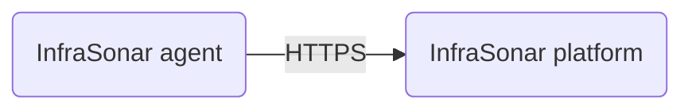
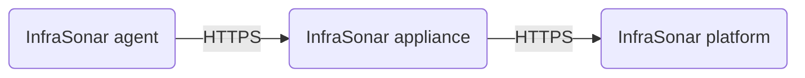

{ width="150" align=right}

# Agents

An InfraSonar agents is an installable software component that autonomously and send the retrieved monitoring data to the InfraSonar platform using the [InfraSonar API](../../api/asset/insert-check-data.md)

Our [remote appliance manager](../../application/agentcores.md#remote-appliance-manager) makes it easy to deploy specific agent onto your monitoring appliance.

## Connectivity

Agents typically have a direct connection to our api endpoint over a HTTPS connection. (api.infrasonar.com)

It is however possible to use our [InfraSonar appliance](../probes/appliance/index.md) as a proxy and route agent trafic to the appliance and then to our InfraSonar platform.

### API forwarder

For this to work you first need to enable the **API forwarder** on our appliance.

1. Open the InfraSonar webapp (https://app.infraonar.com).
2. Navigate to the [agentcore](../../application/agentcores.md) you want to use.
3. Click the **gear** :gear: icon to configure the appliance.
4. Open the **agent**s tab
5. Toggle **API forwarder** `on`

### Agent configuration

Agents are by default configured to connect to `api.infrasonar.com`, there are two supported approaches to connect agents to the appliance instead of directly to our internet endpoint.

#### DNS

For this method you need to create a response policy zone for `api.infrasonar.com` and add our API IP address to this zone.

When using Windows DNS:

1. Open DNS manager
2. Create a new primary zone 
3. Select the appropriate replication scope
4. Enter the zone name: `api.infrasonar.com`
5. Select **Do not allow dynamic updates**
6. Add a new host `A` record
   1. Leave the **name** field empty**
   2. Enter the IP address of your appliance
7. Verify if the name is resolved correctly `nslookup api.infrasonar.com`

#### Agent configuration

For most agents setting the environment variable `API_URI` to you appliance DNS name is sufficient.

Our Windows agent stores it's configuration in the registry and requires `ApiUrl` as `REG_SZ` under `Computer\HKEY_LOCAL_MACHINE\SOFTWARE\WOW6432Node\Cesbit\InfraSonarAgent`

!!! note URI format
    The URI format implies you use `https://yourappliancename.yourinternalzone.something`

Check the agent GitHub page on https://github.com/infrasonar when in doubt.