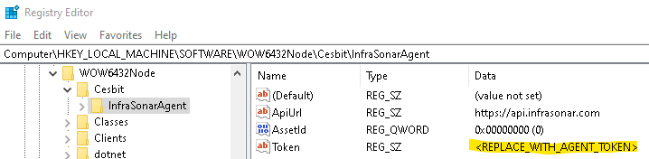
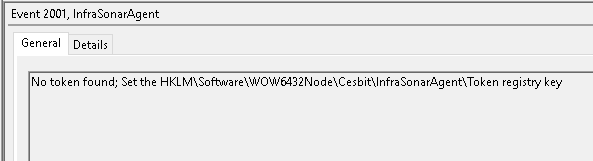

{ width="150" align=right}

# :material-microsoft-windows: Microsoft Windows agent

## Installation

### Easy deployment

You can use our easy deployment script, note this scripts requires elevated privileges as it runs an MSI installer.

```
curl -fsSL https://deploywindowsagent.infrasonar.com ^
   -o %temp%\infrasonar.cmd && %temp%\infrasonar.cmd
```

### Manual installation 

**Install the msi:**

You can download the latest msi of our latest Microsoft Windows agent from our GitHub releases page [here](https://github.com/infrasonar/windows-agent/releases/latest).


**Configure the Microsoft Windows agent:**

Open the registry and add your agent Token:



You can also use the command below in an elevated command prompt to set your agent token:

```batch
set token=YOURTOKENHRE
reg add "HKLM\SOFTWARE\Wow6432Node\Cesbit\InfraSonarAgent" /v Token /d %token% /t REG_SZ /f
```

!!! quote "Configure your asset Id"
    If you already have an Asset Id, you can configure set in the registry. When the `AssetId` registry key is 0, the agent will create a new asset once the service starts.


**(Re)start the Microsoft Windows agent:**

To apply any changed made in the registry the agent needs to be stopped and started.

You can use the services console (`services.msc`) or use the following commands in an elevated command prompt:

```batch
net stop InfraSonarAgent
net start InfraSonarAgent
```

!!! tip "More debug information"
    If you want more debug information in the Event Viewer, you can also add a `Debug` registry key of type `RED_DWORD` and set the value to `1`.
    


## Additional information

:material-github: [Windows agent source code](https://github.com/infrasonar/windows-agent)
