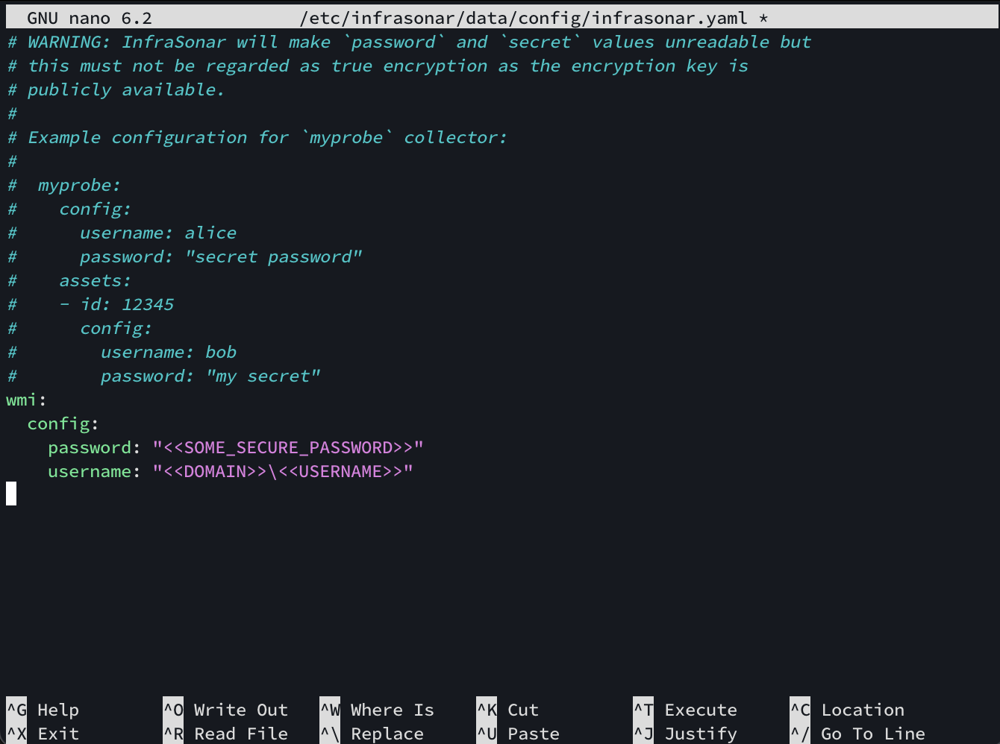

# Appliance

You can download our ready-to-run OVA (Open Virtual Appliance) [here](https://storage.googleapis.com/infrasonar-repository/infrasonar-appliance.ova).

After you deployed the appliance there are thre

1. Change the sysadmin password;
2. Configure a static IP address if required;
3. Deploy InfraSonar. 

!!! warning "Internet access is required"
    InfraSonar appliances require internet access in order to retrieve up to date docker containers, operating system updates and connect to the InfraSonar cloud.

## Default login

You can logon to the appliance using:

* User: `sysadmin`
* Password: `Infr@S0n@r`

## Change password

Enter the `passwd` command when you are logged on as sysadmin and follow the steps when prompted.

```bash
$ passwd
Changing password for sysadmin.
Current password:
New password:
Retype new password:
passwd: password updated successfully
```

Ensure to keep this password stored somewhere safe.

## Nano basics

The InfraSonar appliance configuration requires you to edit files using SSH access. The appliance includes the main text editors of **vi** and **nano**.

Since Nano is easier to use, we outline its essential functions here.

The easiest way to use Nano, is to open the file you want to edit or create directly using Nano, like this:

```bash
sudo nano /etc/infrasonar/data/config/infrasonar.yaml
```

!!! note SSH access assumed
    We assume you are logged on to the appliance using SSH.

This command will launch the Nano editor, where you can immediately make changes to the file:

<figure markdown>
  
  <figcaption>Nano screenshot</figcaption>
</figure>

When your edits are done, exit using ++ctrl+x++. Nano now prompts if you want to **Save modified buffers**.

If you want to save your edits press ++y++, followed by an ++enter++ to confirm the filename.

Press ++n++ if you want to discard your edits or ++ctrl+c++ if you want to continue editing.

## Network configuration

The InfraSonar appliance ova uses DHCP by default. You can change this to a static IP by editing the file `/etc/netplan/00-installer-config.yaml`.

!!! note "Indentation is meaningful in YAML"
    Make sure that you use spaces, rather than tab characters, to indent sections. In the default configuration files 2 spaces per indentation level are used, We recommend you do the same.

**DHCP configuration**

:   Example DHCP configuration (default):

    ```yaml title="/etc/netplan/00-installer-config.yaml" hl_lines="4"
    network:
      ethernets:
        ens160:
          dhcp4: true
      version: 2
    ```

**Static IP config**

:   Example static IP configuration:

    ```yaml title="/etc/netplan/00-installer-config.yaml" hl_lines="5 6 7 8 9 10 11 12"
    network:
      version: 2
      ethernets:
        ens160:
          dhcp4: false
         addresses:
          - 192.168.10.10/24
         routes:
          - to: default
            via: 192.168.10.1
         nameservers:
           addresses: [192.168.10.2, 192.168.10.3]
    ```

After you modified your IP configuration you need to apply the new netplan configuration using the following command:

```bash
sudo netplan generate
sudo netplan --debug apply
```
## Deploy InfraSonar

Use the [appliance manager](./appliance_manager.md) to configure InfraSonar on the appliance.
