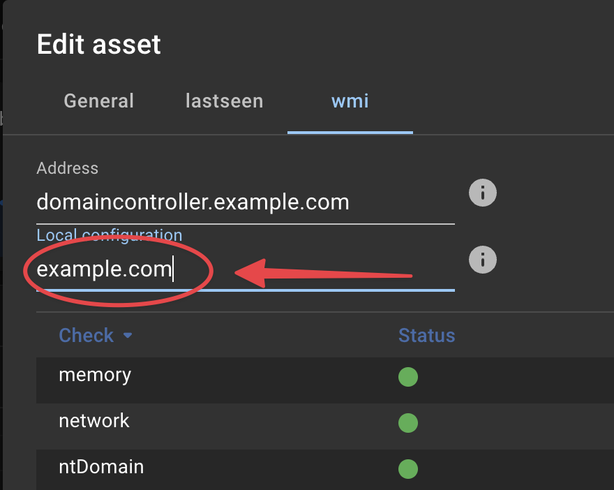

# Credentials

Some InfraSonar probes require configuration and/or credentials to execute / authenticate its queries. A good example is the WMI-probe that requires Windows domain credentials to perform WMI queries.

## Location

Credentials are stored in the `data/config` subdirectory. This directory is relative from the directory from which you deployed InfraSonar. As we suggest using `/etc/infrasonar` the credentials file would be located here: `/etc/infrasonar/data/config`

## Format

The credentials file is named: `infrasonar.yaml`
As suggested by the `.yaml` file extension the file format used is the [yaml](https://en.wikipedia.org/wiki/YAML) format.

It is worth noting that **Indentation is meaningful** in YAML.
As such make sure that you use spaces, rather than tab characters, to indent sections. In the default configuration files 2 spaces per indentation level are used, We recommend you do the same.

See also our [nano documentation section](./appliance_installation.md#nano-basics) on how to edit files on the appliance.

### Basic 

This is the most basic credentials `infrasonar.yaml` configuration file.

```yaml title="infrasonar.yaml" linenums="1"
exampleProbe:
  config:
    password: "a secret"
    username: alice
```

- The first line identifies the probe section, in this example `exampleProbe`
- The second line starts the configuration section using the keyword `config`
- The third and fourth line in this example set the configuration parameters `username` and `password`
- Note the `"  "` quotes used for the password, this ensures any special characters are parsed correctly.

When the file is saved InfraSonar removes the `password` value and adds a `encrypted` section containing the encrypted password as shown in the example below:

```yaml title="infrasonar.yaml" linenums="1" hl_lines="4 5 6"
exampleProbe:
  config:
    password: 
      encrypted: !!binary |
        Z0FBQUFBQmptMEhGq0FhTGJZNFNTckZKdXzWaVpKT2RzMzBARlJGUW1MVGVCVHNmTE15eVlOMTVD
        dGZWU1VEYUtPN2V4cWdOeGdoYlB1M29ua2JTZzNuQVlqU09eM0Z2c2c9PQ==
    username: alice
```

!!! note "How to add a new password"
    Adding a new password is easy, remove the encrypted value (lines 4-6) and add the new password as a string.

#### Security considerations

InfraSonar will make `password` and `secret` values unreadable but this must not be regarded as true encryption as the encryption key is publicly available.

### assets section

The `infrasonar.yaml` allows for specific credentials per asset to achieve this you can add the asset ID's to the configuration.

```yaml title="infrasonar.yaml" linenums="1" hl_lines="2 6 10 11 12"
exampleProbe:
  assets:
  - config:
      password: "my secret"
      username: bob
    id: 123
  - config:
      password: "other secret"
      username: charlie
    id:
    - 456
    - 789
  config:
    password: "a secret"
    username: alice
```

Asset specific configuration can be added by adding a `assets` section and assigning assets to this section by providing the asset-id using the `id` property, this can either be one asset (line 6) or a list of assets (line 10-12).

### use property

`use` is a special property to indicate a probe should inhered  the config from another probe.

```yaml
otherProbe:
  use: exampleProbe
```

The `use` property can be partially useful for SNMP based probes as it is allows to point these to the **snmp** configuration section

```yaml
some-snmp-based-probe:
  use: snmp
```

### Specific configuration

Most probes have a default section they use to lookup local configuration. For the [SNMP probe](../snmp/index.md) this is `snmp` while the [Microsoft WMI probes](../wmi/index.md) uses `wmi`

It is however possible to create your own section, in the example below you see how we created `myCustomSection`.

```yaml
myCustomSection:
  config:
    password: "esther's secret"
    username: esther
```

Using a custom section can be useful when credentials are used by multiple probes, for example:

```yaml
myCustomSection:
  config:
    password: "esther's secret"
    username: esther
wmi:
  use: myCustomSection
vcenter: 
  use: myCustomSection
```

In this scenario the wmi probe and vcenter probe both use the credentials provided by the `myCustomSection` section.

### Local configuration

You can also specific which *section* a probe should use using the InfraSonar user interface.

Each probe (:material-numeric-1-circle:{ .red }) which supports this has a **Local configuration** input box (:material-numeric-2-circle:{ .red }) where you can enter the name of the *section* you want this asset / probe to use.

{ width="500"}


!!! tip "How to add a new password"
    Adding a new password is easy, remove the encrypted value (lines 4-6) and add the new password as a string.


## Probe specifics

For most probes it is sufficient to provide a `username` and `password`; we outlined probes with a more distinct configuration here:

### SNMP

The SNNP probe supports: SNMPv1, SNMPv2c, and SNMPv3 each of these are outlined in the upcoming paragraphs.

When no credentials are provided we use the following defaults:

* **SNMP version**: 2c
* **Community string**: `public`

#### SNMPv1

```yaml title="infrasonar.yaml"  hl_lines="4"
snmp:
  config:
    community: SomeCommunityString
    version: 1
```

Note how we specify the version using the `version` property.

#### SNMPv2c

```yaml title="infrasonar.yaml"  hl_lines="4"
snmp:
  config:
    community: SomeCommunityString
    version: "2c"
```

Note how we specify the version using the `version` property using quotes

#### SNMPv3

```yaml  title="infrasonar.yaml" linenums="1" hl_lines="5 8"
snmp:
  config:
    version: 3
    username: alice
    auth:
      type: USM_AUTH_HMAC96_SHA
      password: "my secret password"
    priv:
      type: USM_PRIV_CFB128_AES
      password: "my secret password"
```

**auth (5)**

:   Supported values for *type*:

    - `USM_AUTH_HMAC96_MD5` 
    - `USM_AUTH_HMAC96_SHA`
    - `USM_AUTH_NONE`
  
    When omitted `USM_AUTH_NONE` is used.


**priv (8)**

:   Supported values for *type*:

    - USM_PRIV_CBC56_DES
    - USM_PRIV_CFB128_AES
    - USM_PRIV_NONE
    
    When  omitted `USM_PRIV_NONE` is used.

#### Encrypted community string

It is possible to encrypt the community string on the appliance by indicating the string is **secret** as such:

```yaml  title="infrasonar.yaml" hl_lines="4"
snmp:
  config:
    community:
      secret: SomeCommunityString
    version: "2c"
```

This results upon save in community string being encrypted:

```yaml  title="infrasonar.yaml" hl_lines="5 6 7"
snmp:

  community:
    secret:
      encrypted: !!binary |
        Z0FBQUFBQmptMEhGq0FhTGJZNFNTckZKdXzWaVpKT2RzMzBARlJGUW1MVGVCVHNmTE15eVlOMTVD
        dGZWU1VEYUtPN2V4cWdOeGdoYlB1M29ua2JTZzNuQVlqU09eM0Z2c2c9PQ==
    version "2c"
```

### WMI

The WMI probe uses a straightforward configuration as shown below.

When Microsoft Active directory accounts are used the **username** can be either in domain format: `domain\infrasonar_service_account` or use the UPN format: `infrasonar_service_account@domain.something`

An asset specific configuration can be useful for non-domain joined servers.

```yaml title="infrasonar.yaml" hl_lines="5 6 7 8 9"
wmi:
  config:
    username: "charlie@domain.org"
    password: "a secret"
  assets:
  - config:
      username: "bob"
      password: "my secret"
    id: 123
```

## FAQ

**Is it possible to copy credentials?**

Yes credential files can be exchanged between appliances belonging to the same InfraSonar container.

**I note my credentials are not being encoded?**

Check if you per accident configured a duplicate section, see this simplified example where we configured two *wmi* sections:
```yaml hl_lines="1 5"
wmi:
  config:
    username: alice
    password: "a secret"
wmi:
  use: something
```