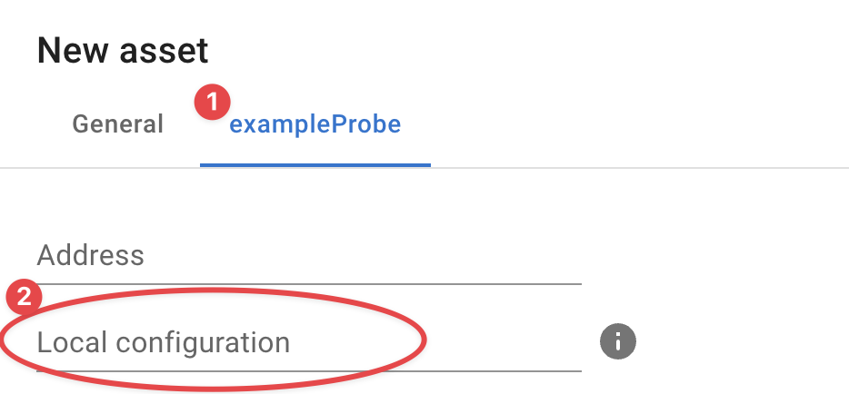

# Credentials

Some InfraSonar probes require configuration and/or credentials to execute / authenticate its queries. A good example is the WMI-probe that requires Windows domain credentials to perform WMI queries.

Credentials are stored in a [yaml](https://en.wikipedia.org/wiki/YAML) formatted file in the `data/config` directory in the directory from which you deployed InfraSonar. As we suggest using `/etc/infrasonar` the `infrasonar.yaml` file would be located here: `/etc/infrasonar/data/config`

!!! note "Indentation is meaningful in YAML"
    Make sure that you use spaces, rather than tab characters, to indent sections. In the default configuration files 2 spaces per indentation level are used, We recommend you do the same.

## infrasonar.yaml basics

The `infrasonar.yaml` file has a straightforward structure allowing probe specific configurations and per asset deviations from a default configuration.

The basic structure looks like this:

```yaml title="infrasonar.yaml"
exampleProbe:
  assets:
  - config:
      password: "my secret"
      username: bob
    id: 123
  - config:
      password: "other secret"
      username: charlie
    id:
    - 456
    - 789
  config:
    password: "a secret"
    username: alice
otherProbe:
  use: exampleProbe
```

### Configuration file breakdown

When applicable a probe has it's own section consisting of the probe name and a configuration for that probe.

```yaml
exampleProbe:
  . . .
otherProbe:
  . . .
```

The `config` section contains the default probe configuration used by all probes if no exceptions are defined.
The [Probe specific](#probe-specifics) paragraph describes probe specific configuration options.

```yaml
  config:
    username: alice
    password: "a secret"
```

Asset specific configuration can be added by adding a `assets` section and assigning assets to this section by providing the asset-id using the `id` property, this can either be one asset or a list of assets.

```yaml
  assets:
  - config:
      password: "my secret"
      username: bob
    id: 123
  - config:
      password: "other secret"
      username: charlie
    id:
    - 456
    - 789
```


`use` is a special property to indicate a probe should use the config from another probe. An example for this are the vendor specific SNMP probes we offer.

```yaml
otherProbe:
  use: exampleProbe
```

## Local configuration

Another nice way to utilize the `yaml` file is to provide a configuration section and use the local configuration option in our UI to point the asset to this specific section.

### Example

In this example we use a specific account in the domain `example.com` this account can then we used in any probe using the local configuration option.

```yaml
example.com:
  config:
    username: "alice@example.com"
    password: "a secret"
```

Now we can use `example.com` when we configure an asset in the UI.

{ width="500"}


## Security considerations

!!! danger "unreadable, not truly encrypted."

    WARNING: InfraSonar will make `password` and `secret` values unreadable but this must not be regarded as true encryption as the encryption key is publicly available.


In the examples below the password is shown in plain text; InfraSonar however encrypts the password once it sees the file has been changed.

Resulting in an **encrypted** section in the **password** section:

```yaml title="encrypted password example"
wmi:
  config:
    username: administrator
    password:
      encrypted: !!binary |
        Z0FBQUFBqmppaWFKblawbGVIVt72ckFKZYRZRmItX1pYNlpRYnRsT2pLRG1vS2ZjV1lfSExrbi1J
        Uy1LQjhZcVZCAXhCMG5jUmRDd1EteE5Za3duQ1VMbGw3U2JXX3BWSkE9PQ==
```


## Probe specifics

For most probes it is sufficient to provide a `username` and `password`; we outlined probes with a more distinct configuration here:

### SANtricity / NetApp E-Series

The SANtricity / NetApp E-Series probe is configured in the `santricity` section:


```yaml
santricity:
  config:
    password: "some_secure_passw0rd"
    username: monitor
```

### SNMP

The SNNP probe supports SNMPv1, SNMPv2c, and SNMPv3

We use the following defaults:

* SNMP version 2c
* Community string `public`

#### SNMPv1

```yaml
snmp:
  config:
    community: SomeCommunityString
    version: 1
```

#### SNMPv2c

```yaml
snmp:
  config:
    community: SomeCommunityString
    version: "2c"
```

#### SNMPv3

```yaml
snmp:
  config:
    version: 3
    username: alice
    auth:
      # auth is optional; type USM_AUTH_NONE is used when omitted.
      # supported: USM_AUTH_HMAC96_MD5, USM_AUTH_HMAC96_SHA or USM_AUTH_NONE
      type: USM_AUTH_HMAC96_SHA
      password: "my secret password"
    priv:
      # priv is optional; type USM_PRIV_NONE is used when omitted.
      # supported: USM_PRIV_CBC56_DES, USM_PRIV_CFB128_AES or USM_PRIV_NONE
      type: USM_PRIV_CFB128_AES
      password: "my secret password"
```

#### Encrypted community string

It is possible though to encrypt the community string on the appliance by indicating the string is **secret** as such:

```yaml
snmp:
  config:
    community:
      secret: SomeCommunityString
    version: "2c"
```

This results upon save in community string being encrypted:

```yaml
snmp:

  community:
    secret:
      encrypted: !!binary |
        Z0FBQUFBQmptMEhGq0FhTGJZNFNTckZKdXzWaVpKT2RzMzBARlJGUW1MVGVCVHNmTE15eVlOMTVD
        dGZWU1VEYUtPN2V4cWdOeGdoYlB1M29ua2JTZzNuQVlqU09eM0Z2c2c9PQ==
    version "2c"
```

#### Inherited config

As we have multiple different SNMP based probes it is possible to point these to the **snmp** configuration section

```
some-snmp-based-probe:
  use: snmp
```


#### Advanced example

The example below uses all variances for multiple assets.

```yaml
snmp:
  assets:
  - config:
      community: other
      version: '1'
    id: 12
  - config:
      community:
        secret: SomeCommunityString
      version: 2c
    id: 34
  - config:
      auth:
        password: "my secret password"
        type: USM_AUTH_HMAC96_SHA
      priv:
        password: "my super secret password"
        type: USM_PRIV_CFB128_AES
      username: alice
      version: '3'
    id:
    - 56
    - 78
```

* Asset **'12'**
    * uses SNMP version 1 and community string `other`
* Asset **'34'**, uses SNMP version 2c and community string `SomeCommunityString`which is encrypted upon save
* Assets **'56'** & **'78'**, use SNMP version 3 using username `alice`

### WMI

The WMI probe uses a straightforward configuration as shown below.

When Microsoft Active directory accounts are used the **username** can be either in domain format `domain\infrasonar_service_account` or use the UPN format: `infrasonar_service_account@domain.something`

An asset specific configuration can be useful for non domain joined servers.

```yaml
wmi:
  config:
    username: alice
    password: "a secret"
  assets:
  - config:
      username: domain\bob
      password: "my secret"
    id: 123
  - config:
      username: charlie@domain.org
      password: "other secret"
    id: 
    - 456
    - 789
```

## FAQ

**Is it possible to copy credentials?**<br>
Yes credential files can be exchanged between appliances belonging to the same InfraSonar container.

**I note my credentials are not being encoded?**<br>
Check if you did per accident configure a duplicate section, see this simplified example where we configured two *wmi* sections:
```yaml hl_lines="1 5"
wmi:
  config:
    username: alice
    password: "a secret"
wmi:
  use: something
```