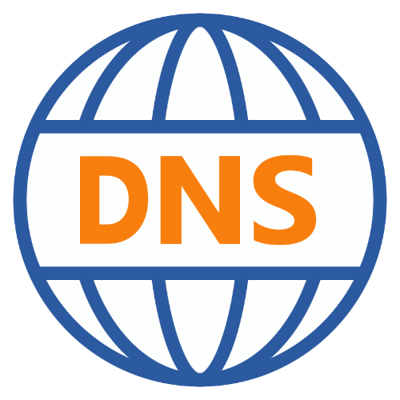

{ width="200" align=right}

# :material-dns-outline: DNS

## Introduction

The DNS probe is a synthetic monitor and can even monitor changes to specific DNS records.


## Features 

THe DNS probe can perform forward and reverse DNS queries for an FQDN

## Deployment

The DNS probe is deployed as a :material-docker: docker container using [docker compose](appliance/docker_compose.md).

## Probe configuration

Property    | Description
------------|------------------------
DNS Servers | DNS servers to query, note all configured DNS servers are queried
FQDN        | FQDN of the DNS record you want to monitor

!!! Note "Reverse DNS lookups"
    Using the special `.arpa.` domain it is possible to perform a reverse DNS lookup. See our [PTR](dns.md#ptr) section for a detailed explanation and examples.
    
### Example configuration

* DNS servers: `8.8.8.8, 8.8.4.4`
* FQDN: `dns.google.com`

## Checks

We support the DNS record types described in the next paragraphs.

Most of the information in this chapter is an extract from [this](https://en.wikipedia.org/wiki/List_of_DNS_record_types) Wikipedia article.

### A

Address record, List of IPv4 addresses, most commonly used to map hostnames to an IP address of the host

Example:

**<div style="width:120px">FQDN</div> ** | **Result**
-----------------------------------------|-----------
`infrasonar.com`                         | `185.199.111.153, 185.199.108.153, 185.199.109.153, 185.199.110.153`

### AAAA

IPv6 address record, list of IPv6 addresses, most commonly used to map hostnames to an IP address of the host

Example:

**<div style="width:120px">FQDN</div> ** | **Result**
-----------------------------------------|-----------
`infrasonar.com`                         | `2606:50c0:8003::153, 2606:50c0:8002::153, 2606:50c0:8001::153, 2606:50c0:8000::153`

### CAA

Certification Authority Authorization. DNS Certification Authority Authorization, constraining acceptable CAs for a host/domain.

CAA record structure: `flag` `tag` `value`

`flag`
:   A flags byte which implements an extensible signaling system for future use. As of 2018, only the issuer critical flag has been defined, which instructs certificate authorities that they must understand the corresponding property tag before issuing a certificate. This flag allows the protocol to be extended in the future with mandatory extensions, similar to critical extensions in X.509 certificates.

`tag`
:   One of the following property:

    `issue`
    :   This property authorizes the holder of the domain specified in associated property value to issue certificates for the domain for which the property is published.

    `issuewild`
    :   This property acts like issue but only authorizes the issuance of wildcard certificates, and takes precedence over the issue property for wildcard certificate requests.

    `iodef`
    :   This property specifies a method for certificate authorities to report invalid certificate requests to the domain name holder using the Incident Object Description Exchange Format. As of 2018, not all certificate authorities support this tag, so there is no guarantee that all certificate issuances will be reported.

    `contactemail`
    :   Increasingly, contact information is not available in WHOIS due to concerns about potential GDPR violations. This property allows domain holders to publish contact information in DNS.

    `contactphone`
    :   As above, for phone numbers.

`value`
:   The value associated with the chosen property tag.


Example:

**<div style="width:120px">FQDN</div> ** | **Result**
-----------------------------------------|-----------
`infrasonar.com`                         | `0 issue "pki.goog"`

### CNAME

Canonical name record, alias of one name to another.

A CNAME lookup returns only **one** canonical name.

Example:

**<div style="width:120px">FQDN</div> ** | **Result**
-----------------------------------------|-----------
`docs.infrasonar.com`                    | `cesbit.github.io.`

### DS

Delegation signer. The record used to identify the DNSSEC signing key of a delegated zone.

DS record structure: `Key Tag` `Algorithm` `Digest` `Type` `Digest`

Example:

**<div style="width:120px">FQDN</div> ** | **Result**
-----------------------------------------|-----------
`infrasonar.com`                         | `9907 8 2 33D13AB164664236CF3EF302E8057AF46FC226AAE2B6A2759E4E80BA AF448970`

### MX

Mail exchange record, list of mail exchange servers that accept email for a domain.

Example output: `1 aspmx.l.google.com.,10 alt3.aspmx.l.google.com.,10 alt4.aspmx.l.google.com.,5 alt1.aspmx.l.google.com.,5 alt2.aspmx.l.google.com.`

!!! info "MX Record"
    An MX record is returned as follows:
    `preference`  `address`

Example:

**<div style="width:120px">FQDN</div> ** | **Result**
-----------------------------------------|-----------
`infrasonar.com`                         | `1 aspmx.l.google.com., 5 alt1.aspmx.l.google.com., 5 alt2.aspmx.l.google.com., 10 alt3.aspmx.l.google.com., 10 alt4.aspmx.l.google.com.`

### NS

Name server record, Delegates a DNS zone to use the given authoritative name servers.

Example: 

**<div style="width:120px">FQDN</div> ** | **Result**
-----------------------------------------|-----------
`infrasonar.com`                         | `ns-cloud-a1.googledomains.com, ns-cloud-a2.googledomains.com, ns-cloud-a3.googledomains.com, ns-cloud-a4.googledomains.com`

### PTR

PTR Resource Record, possible for IP addresses in the format:

`in-addr.arpa` is the namespace within `.arpa` for reverse DNS lookups in IPv4.

!!! tip "IPv6"
    IPv6 addresses are constructed differently from IPv4 addresses, and IPv6 PTR records exist in a different namespace within .arpa. IPv6 PTR records are stored under the IPv6 address, reversed and converted into four-bit sections (as opposed to 8-bit sections, as in IPv4), plus ".ip6.arpa".

    So `2001:4860:4860::8844` becomes: `4.4.8.8.0.0.0.0.0.0.0.0.0.0.0.0.0.0.0.0.0.6.8.4.0.6.8.4.1.0.0.2.ip6.arpa`

Example:

**<div style="width:120px">FQDN</div> **                                  | **Result**
--------------------------------------------------------------------------|-----------
`8.8.8.8.in-addr.arpa.`                                                   | `dns.google.`
`.4.8.8.0.0.0.0.0.0.0.0.0.0.0.0.0.0.0.0.0.6.8.4.0.6.8.4.1.0.0.2.ip6.arpa` | `dns.google.`

### SRV

Service locator, generalized service location record, used for newer protocols instead of creating protocol-specific records such as MX.

SRV record structure: `Priority` `Weight` `Port` `Target`

`priority`
:   the priority of the target host, lower value means more preferred.

`weight`
:   A relative weight for records with the same priority, higher value means higher chance of getting picked.

`port`
:   the TCP or UDP port on which the service is to be found.

`target`
:   the canonical hostname of the machine providing the service, ending in a dot.


Example:

**<div style="width:120px">FQDN</div> ** | **Result**
-----------------------------------------|-----------
`_srv._test.test-technology.nl.`         | `0 5 5060 srvrecordtest.test-technology.nl.`

### SOA

Start of [a zone of] authority record. Specifies authoritative information about a DNS zone, including the primary name server, the email of the domain administrator, the domain serial number, and several timers relating to refreshing the zone.

SOA record structure: `Primary NS` `Responsible name` `Serial` `Refresh` `Retry` `Expire` `Miniumum`

`Primary NS`
:   Primary master name server for this zone.

`Responsible name`
:   Email address of the administrator responsible for this zone. (As usual, the email address is encoded as a name. The part of the email address before the @ becomes the first label of the name; the domain name after the @ becomes the rest of the name. In zone-file format, dots in labels are escaped with backslashes; thus the email address john.doe@example.com would be represented in a zone file as john\.doe.example.com.)

`Serial`
:   Serial number for this zone. If a secondary name server slaved to this one observes an increase in this number, the slave will assume that the zone has been updated and initiate a zone transfer.

`Refresh`
:   Number of seconds after which secondary name servers should query the master for the SOA record, to detect zone changes. Recommendation for small and stable zones: 86400 seconds (24 hours).

`Retry`
:   Number of seconds after which secondary name servers should retry to request the serial number from the master if the master does not respond. It must be less than Refresh. Recommendation for small and stable zones: 7200 seconds (2 hours).

`Expire`
:   Number of seconds after which secondary name servers should stop answering request for this zone if the master does not respond. This value must be bigger than the sum of Refresh and Retry. Recommendation for small and stable zones: 3600000 seconds (1000 hours).

`Miniumum`
:   Used in calculating the time to live for purposes of negative caching. Authoritative name servers take the smaller of the SOA TTL and the SOA MINIMUM to send as the SOA TTL in negative responses. Resolvers use the resulting SOA TTL to understand for how long they are allowed to cache a negative response. Recommendation for small and stable zones: 172800 seconds (2 days). Originally this field had the meaning of a minimum TTL value for resource records in this zone; it was changed to its current meaning by RFC 2308.

Example:

**<div style="width:120px">FQDN</div> ** | **Result**
-----------------------------------------|-----------
`infrasonar.com`                         | `ns-cloud-e1.googledomains.com. cloud-dns-hostmaster.google.com. 15 21600 3600 259200 300`

## Best practices

### Internal vs External response

Setup an asset to monitor your internal and external DNS response.

This can easily be done by monitoring for example `google.com` on your internal DNS servers and Google DNS servers, for IPv4: `8.8.8.8` and/or `8.8.4.4`  and for IPv6: `2001:4860:4860::8888` and/or `2001:4860:4860::8844`.

The average DNS lookup time should be between 20 and 120 milliseconds. Anything between that and under is generally considered very good.

### Microsoft Active Directory

[source](https://learn.microsoft.com/en-us/troubleshoot/windows-server/networking/verify-srv-dns-records-have-been-created)

Setup a DNS probe to monitor for Microsoft Active Directory specific DNS entries for each DNS server in your forest / domain.

!!! note "Legend"
    * *Domain_Name* is the name of your domain.
    * *SiteName*, name of your Active Directory Site
    * *DnsForestName*, name of your DNS Forest.

The following SRV records are registered by Net Logon:

* **`_ldap._tcp.<Domain_Name>.`**<br>Allows a client to locate servers running the LDAP service in the domain of *Domain_Name*.
* **`_ldap._tcp.<SiteName>._sites.<Domain_Name>.`**<br>Allows a client to locate servers running the LDAP service in a domain in a site *SiteName* *Domain_Name*. *SiteName* relative file name, which is stored in the Configuration container in Active Directory.
* **`_ldap._tcp.dc._msdcs.<Domain_Name>.`**<br>Allows a client to find a domain controller in the domain *Domain_Name*. All DC register this SRV record.
* **`_ldap._tcp. <SiteName>._sites.dc._msdcs.<Domain_Name>.`**<br>Allows a client to find a domain controller in the domain in site *SiteName* *Domain_Name*.<br>All DC register this SRV record.
* **`_ldap._tcp.pdc._msdcs.<Domain_Name>.`**<br>Allows a client to find a domain PDC *Domain_Name*.<br>Only PDC server registers this SRV record.
* **`_ldap._tcp.gc._msdcs.<DnsForestName>.`**<br>Allows a client to find a DC in the forest *DnsForestName*.<br>Only GC servers register this SRV record.
* **`_ldap._tcp. <SiteName>._sites.gc._msdcs.<DnsForestName>.`**<br>Allows a client to find a GC in the forest.<br>Only GC server *DnsForestName* owned by this forest register this SRV record
* **`_gc._tcp.<DnsForestName>.`**<br>Allows a client to find a GC in the domain. Only GC servers owned by this forest *DnsForestName* register this SRV record.
* **`_gc._tcp.<SiteName>._sites.<DnsForestName>.`**<br>Allows a client to find a GC in this forest site *SiteName* *DnsForestName*.<br>Only GC servers owned by this forest *DnsForestName* register this SRV record.
* **`_ldap._tcp.DomainGuid.domains._msdcs.<DnsForestName>.`**<br>Allows customers to find the DC GUID.<br>A GUID is a 128-bit unique index. Admits when *Domain_Name* *DnsForestName* and changed.
* **`_kerberos._tcp.<Domain_Name>.`**<br>Allows clients to find a Kerberos KDC in that domain: *Domain_Name*.<br>All DC register this SRV record.
* **`_kerberos._udp.<Domain_Name>.`**<br>Same as _kerberos `._tcp.<Domain_Name>` only over UDP
* **`_kerberos._tcp.<SiteName>._sites.<Domain_Name>.`**<br>Allows clients to find a Kerberos KDC in that domain: *Domain_Name* site *SiteName*.<br>All DC register this SRV record.
* **`_kerberos._tcp.dc._msdcs.<Domain_Name>.`**<br>Allows clients to find a DC running a Kerberos KDC's role in that domain: *Domain_Name*.<br>All DC with the KDC log this SRV record.
* **`_kerberos.tcp.<SiteName>._sites.dc._msdcs.<Domain_Name>.`**<br>Allows clients to find a DC running a Kerberos KDC's role in that domain: *Domain_Name* site *SiteName*.<br>All DC with the KDC log this SRV record.
* **`_kpasswd._tcp.<Domain_Name>.`**<br>Kerberos Password Change allows you to search for current domain.<br>All kerberos KDC DC (c) role of the register this SRV record
* **`_kpasswd._udp.<Domain_Name>.`**<br>Same as `_kpassword._tcp.<Domain_Name>` only over UDP


## Known issues

### Resolution lifetime expired after 5.xxx seconds

The DNS probe returns following the notification:

```
The resolution lifetime expired after 5.402 seconds:
 Server xx.xx.xx.xx UDP port 53 answered The DNS operation timed out after 2.000 seconds;
 Server xx.xx.xx.xx UDP port 53 answered The DNS operation timed out after 2.000 seconds;
 Server xx.xx.xx.xx UDP port 53 answered The DNS operation timed out after 0.696 seconds
```

The potential rootcause is a DNS server responding with `connection refused`

This can be validated using the `dig` command on Linux:

```
dig @xx.xx.xx.xx google.com
;; communications error to xx.xx.xx.xx#53: connection refused
```

## Additional information

:material-github: [DNS probe source code](https://github.com/infrasonar/dns-probe)