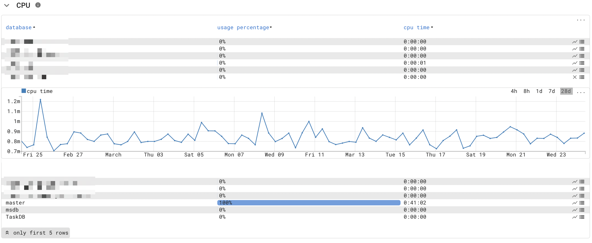
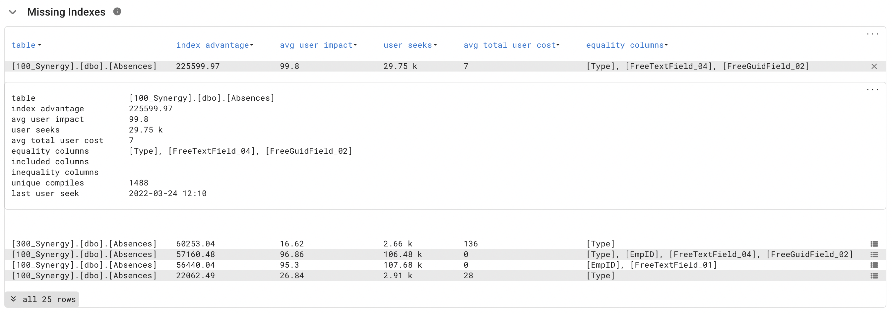
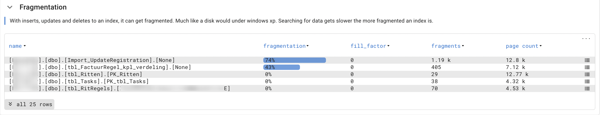

{ width="150" align=right}

# :material-microsoft: Microsoft SQL Server

## Introduction

The Microsoft SQL probe uses SQL statements to monitor and analyze the health of a Microsoft SQL Server database.

!!! quote "Goal"
    The MSSQL probe offers a unified view that provides common ground for infrastructure engineers, DBA, and application managers to analyze and troubleshoot Microsoft SQL server performance issues.

## Features

The Microsoft SQL probe allows for in-depth analyses of a SQL server.

Some of the included measurements:

* Memory Page life Expectancy.
* Parallelism configuration.
* CPU, memory and disk IO per database.
  
* SQL Table information.
* Wait statistics.
* Top 25 query information (*all queries would put too much strain on the SQL server*).
    * Top worker time; which queries consume a lot of time and thus cpu usage.
    * Top logical reads; which queries cost the most IO.
    * Top execution count; shows the most active queries.
* Index information.
    * Frequently used indexes (top used).
    * Missing indexes, where would an index make sense.
    * Unused indexes, only written but never queried.
      
* Fragmentation.
  
* IO, per file and per volume.
* Backup status.
* Agent jobs.
* SQL Config.
* Session and application information.
* Plan cache.
* Blocked count.

!!! Tip Consultancy
    Our implementation consultants can assist in creating a detailed analysis of a Microsoft SQL server.

## Deployment

The Microsoft SQL probe is deployed as a :material-docker: docker container using [docker compose](appliance/docker_compose.md).

## Probe configuration

The MSSQL probe requires the host's IP address running the monitored SQL server and requires access to curtain SQL tables as defined in our grant scripts.

### Credentials

The Microsoft SQL probe supports SQL authentication and domain authentication.

For both scenarios it is advisable to setup a separate account for this probe and grant this account access via the supplied grant scripts.

The corresponding `infrasonar.yaml` [^1] section when using for example *infrasonar@windows.domainl* as user id looks as follows:

```yaml
mssql:
  config:
    password: "some_secure_passw0rd"
    username: infrasonar@windows.domain
```
[^1]: Passwords are encrypted on the appliance the moment the file is saved, see our [credentials documentation](appliance/credentials.md).

### Authorization

The previously created user needs to be granted access onto various tables and resources.

Let your DBA analyses our scripts and [contact us](../../images/support.png) if there are any questions.

We created grant scripts for SQL authentication and domain authentication; pick the correct script for your use case.

#### Grants for domain user

Replace `domainnamehere\usernamehere` in [this](mssql/grantsfordomainuser.sql) script with the correct domain/username and execute it in SQL Server Management Studio to grant the user sufficient permissions.

It is good practice to create a dedicated account for SQL monitoring.

#### Grants for SQL User

[This](mssql/grantsforsqluser.sql) script uses the default username `svc_infrasonar` and the password `someSuperSecurePasswordHereOfCourse`, which you should change before running the script.

## Best practices

### SQL Server maximum server memory is set to default

Setting max server memory value too high can cause a single instance of SQL Server to compete for memory with other SQL Server instances hosted on the same host. However, setting this value too low could cause significant memory pressure and performance problems. Setting max server memory to the minimum value can even prevent SQL Server from starting. If you cannot start SQL Server after changing this option, start it using the -f startup option and reset max server memory to its previous value. For more information, see Database Engine Service Startup Options.

A rule of thumb is to leave 4GB or 10% of total memory free, whichever is larger on your instance to start with, and adjust this as needed.

See also:

- [Microsoft.com - Server memory configuration options](https://docs.microsoft.com/en-us/sql/database-engine/configure-windows/server-memory-server-configuration-options)
- [Brent Ozar - Memory Dangerously Low or Max Memory Too High](https://www.brentozar.com/blitz/max-memory/)

### SQL Server Cost threshold for parallelism

SQL Server Cost threshold for parallelism is a value you might want to review.

While the default value of 5 is adequate for most systems, a different value may be appropriate. Perform application testing with higher and lower values if needed to optimize application performance.

A Microsoft SQL DBA can change this by changing the threshold for parallelism to for example `50`, using this SQL statement:

```sql
EXEC sp_configure 'show advanced options', 1;
GO
RECONFIGURE
exec sp_configure 'cost threshold for parallelism', 50;
GO
RECONFIGURE
GO
```

### Max Degree of parallelism

A typical SQL server misconfiguration is the [Max Degree of parallelism](https://docs.microsoft.com/en-us/sql/database-engine/configure-windows/configure-the-max-degree-of-parallelism-server-configuration-option?view=sql-server-ver15).

Rules of thumb:

* MDOP (Max Degree of parallelism) equal the number of CPU cores.
* MDOP should **not** be set greater then 8, _so a 16 core system should have MDOP configured as 8_.

Set `ChangeMe` to the desired MDOP and execute it using SQL Server Management Studio.

```sql
EXEC sp_configure 'show advanced options', 1;
GO
RECONFIGURE
exec sp_configure 'Max Degree of parallelism', ChangeMe;
GO
RECONFIGURE
GO
```

## Operational

### New databases

The monitoring account does not automatically gain access to databases created after the initial setup.
This scenario results in the following InfraSonar alert:

> The server principal "_account_" is not able to access the database "_databasename_" under the current security context.

Either grant script contains a marked section that a SQL Admin must run to grant access to these newly created databases.

## Additional information

:material-github: [Microsoft SQL probe source code](https://github.com/infrasonar/mssql-probe)
