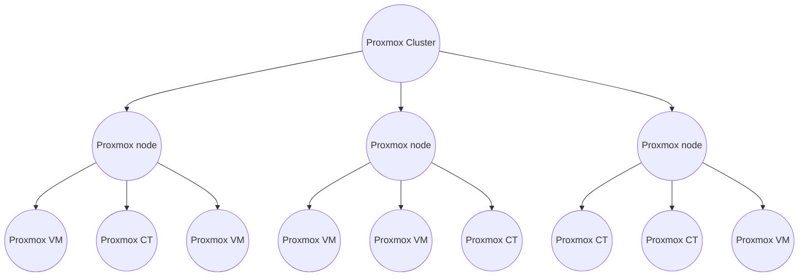

{ width="150" align=right}

# Proxmox

## Introduction

A Proxmox environment has a hierarchical setup, a cluster, one or more nodes and VM's or LXE containers running on the nodes. 

To fully support this hierarchical setup we created four corresponding collectors:

* Proxmox Cluster
* Proxmox Node
* Proxmox CT
* Proxmox VM

## Credentials

All four collectors use the Proxmox API to collect data from the Proxmox nodes.

You can easily configure these credentials using our [remote appliance manager](../../application/agentcores.md#remote-appliance-manager).

### Authorization

Proxmox has a pre-defined role **PVEAuditor** which allows read-only access to your proxmox cluster.
Read  [here](https://pve.proxmox.com/wiki/User_Management) how to create a user.

<figure markdown>
  { width="500"}
  <figcaption>Proxmox_permissions</figcaption>
</figure>

## Deployment

1. Start by adding you Proxmox cluster collector to gain an overview of proxmox nodes and an easy way of adding them to InfraSonar.
2. Our Proxmox node collector provides you with a deep insight into your Proxmox node and offers you an easy way to add your Proxmox containers and/or virtual machines as InfraSonar assets.
3. Optionally add additional collector for your Proxmox containers and/or virtual machines.

You can automate this step using our [InfraSonar Commandline Interfase](../../guides/cli.md) and Proxmox devices report.

## Additional information

* :material-github: [Proxmox Cluster probe](https://github.com/infrasonar/proxmoxcluster-probe)
* :material-github: [Proxmox Node probe](https://github.com/infrasonar/proxmoxnode-probe)
* :material-github: [Proxmox CT probe](https://github.com/infrasonar/proxmoxct-probe)
* :material-github: [Proxmox VM probe](https://github.com/infrasonar/proxmoxvm-probe)
