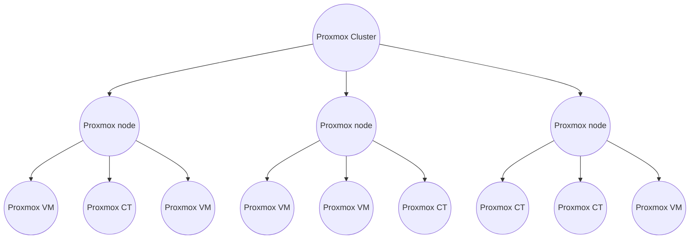
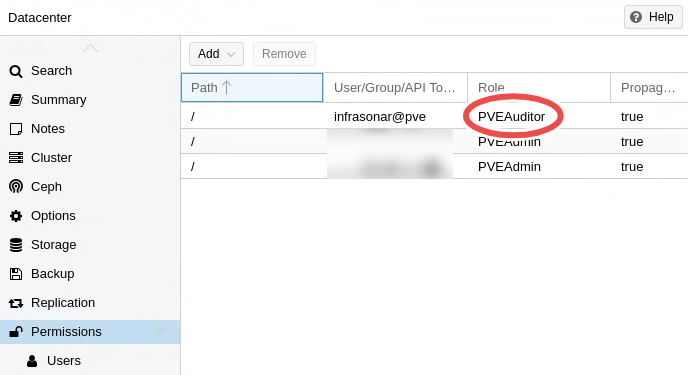

{ width="150" align=right}

# Proxmox

## Introduction

A Proxmox environment has a hierarchical setup, a cluster, one or more nodes and VM's or LXE containers running on the nodes. 


``` mermaid
graph TD
  controller(("`Proxmox Cluster`"))
  node-1(("`Proxmox node`"))
  node-2(("`Proxmox node`"))
  node-3(("`Proxmox node`"))
  device-1-1(("`Proxmox VM`"))
  device-1-2(("`Proxmox CT`"))
  device-1-3(("`Proxmox VM`"))
  device-2-1(("`Proxmox VM`"))
  device-2-2(("`Proxmox VM`"))
  device-2-3(("`Proxmox CT`"))
  device-3-1(("`Proxmox CT`"))
  device-3-2(("`Proxmox CT`"))
  device-3-3(("`Proxmox VM`"))
  controller --> node-1
  controller --> node-2
  controller --> node-3
  node-1 --> device-1-1
  node-1 --> device-1-2
  node-1 --> device-1-3
  node-2 --> device-2-1
  node-2 --> device-2-2
  node-2 --> device-2-3
  node-3 --> device-3-1
  node-3 --> device-3-2
  node-3 --> device-3-3
```

To fully support this hierarchical setup we created four corresponding collectors:

* Proxmox Cluster
* Proxmox Node
* Proxmox CT
* Proxmox VM


## Credentials

All four collectors use the Proxmox API to collect data from the Proxmox nodes.

You can easily configure these credentials using our [remote appliance manager](../../application/agentcores.md#remote-appliance-manager).

### Create a user

To create a user in Proxmox, follow these steps:

1. Log in to your Proxmox web interface.
2. Click on **Datacenter** in the left-hand navigation pane.
3. Click on **Permissions** in the left-hand navigation pane.
4. Click on **Users** in the left-hand navigation pane.
5. Click on **Add** in the top-right corner.
6. Fill in the following information:
   * **User name**: `infrasonar`
   * **Password**: `[PASSWORD]`
   * **Email**: [EMAIL_ADDRESS]`
   * **Realm**: `pve`
   * **Enabled**: `true`
7. Click on **Add** in the bottom-right corner.
8. Click on **Permissions** in the left-hand navigation pane.
9. Click on **Add** in the top-right corner.
10. Fill in the following information:
    * **User**: `infrasonar@pve`
    * **Path**: `/`
    * **Privileges**: `PVEAuditor`
    * **Propagte**: `true`
11. Click on **Add** in the bottom-right corner.
12. Click on **API Tokens** in the left-hand navigation pane.
13. Click on **Add** in the top-right corner.
14. Fill in the following information:
    * **User**: `infrasonar@pve`
    * **Token name**: `infrasonar`
    * **Description**: `infrasonar`
    * **Enabled**: `true`
15. Click on **Add** in the bottom-right corner.
16. Copy the **Token ID** and **Secret** to a safe place. You will need them to configure the collector in InfraSonar.

!!! note
    Proxmox has a pre-defined role **PVEAuditor** which allows read-only access to your proxmox cluster.

<figure markdown>
  { width="500"}
  <figcaption>Proxmox_permissions</figcaption>
</figure>


### Troubleshooting

You can use the following curl command to test your credentials:

```bash
curl -k https://<node-ip>:8006/api2/json/version \
     -H 'Authorization: PVEAPIToken=<userid>@<realm>!<tokenid>=<secret>'
```

Explanation:

* node-ip: the ip address of your proxmox node
* userid: the user id of your proxmox user
* realm: the realm of your proxmox user
* tokenid: the token id of your proxmox user
* secret: the secret of your proxmox user

## Deployment

1. Start by adding you Proxmox cluster collector to gain an overview of proxmox nodes and an easy way of adding them to InfraSonar.
2. Our Proxmox node collector provides you with a deep insight into your Proxmox node and offers you an easy way to add your Proxmox containers and/or virtual machines as InfraSonar assets.
3. Optionally add additional collector for your Proxmox containers and/or virtual machines.


You can automate this step using our [InfraSonar Commandline Interfase](../../guides/cli.md) and Proxmox devices report.

## Additional information

* :material-github: [Proxmox Cluster probe](https://github.com/infrasonar/proxmoxcluster-probe)
* :material-github: [Proxmox Node probe](https://github.com/infrasonar/proxmoxnode-probe)
* :material-github: [Proxmox CT probe](https://github.com/infrasonar/proxmoxct-probe)
* :material-github: [Proxmox VM probe](https://github.com/infrasonar/proxmoxvm-probe)
