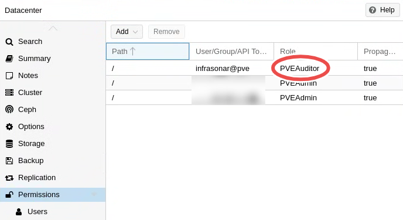

{ width="150" align=right}

# Proxmox

WIP

## Autorisation

https://pve.proxmox.com/wiki/User_Management

PVEAuditor role

<figure markdown>
  { width="500"}
  <figcaption>Proxmox_ ermissions</figcaption>
</figure>

# klad

## Introduction

A Proxmox environment has a hierarchical setup, a cluster, one or more nodes and VM's or LXE containers running on the nodes. 

To fully support this hierarchical setup we created three corresponding collectors:

* [UniFi Controller](./unifi.md#unifi-controller)
* [UniFi Site](./unifi.md#unifi-site)
* [UniFi Device](./unifi.md#unifi-devices)

!!! note "See also our UniFi SNMP probe"
    When you have no controller you can also use our [UniFi SNMP probe](./snmp/unifi.md) to access UniFi devices directly.

### Credentials

All three collectors use the UniFi API to collect data from the UniFi controller and this the same read-only credentials.

You can easily configure these credentials using our [remote appliance manager](../../application/agentcores.md#remote-appliance-manager).

#### UniFi controller

1. Start by adding an asset for the controller.
2. Next set kind to **UniFi** in the *General* section.
3. Add the **unificontroller** collector.
4. Open the **unificontroller** collector configuration tab.
      1. Enter the **address** (IP or FQDN) of the UniFi controller.
      2. Ensure the correct **port** is set.

#### UniFi Site

1. Open the UniFi controller asset.
2. Locate the **Sites** widget
3. Click the :material-wrench: icon for the site you want to add.
4. Choose wether you want to create a new asset of add the site to an existing asset, using a new asset is most often preferred.
5. Verify the suggested settings and click **Save**.
6. The site will now appear with a :material-link: icon indicating it has been setup.
7. Add the correct labels to the newly created asset and add the [lastseen](./../services/last_seen.md) collector if desired.

You can automate this step using our [InfraSonar Commandline Interfase](../../guides/cli.md) and UniFi devices report.

#### UniFi devices

1. Open the UniFi Site you want to add UniFi devices for.
2. Locate the **Devices** widget
3. Click the :material-wrench: icon for the device you want to add.
4. Choose wether you want to create a new asset of add the site to an existing asset, using a new asset is most often preferred.
5. Verify the suggested settings and click **Save**.
6. The device will now appear with a :material-link: icon indicating it has been setup.
7. Add the correct labels to the newly created asset and add the [lastseen](./../services/last_seen.md) collector if desired.

You can automate this step using our [InfraSonar Commandline Interfase](../../guides/cli.md) and UniFi devices report.

## Additional information

* :material-github: [UniFi Controller probe](https://github.com/infrasonar/unificontroller-probe)
* :material-github: [UniFi Site probe](https://github.com/infrasonar/unifisite-probe)
* :material-github: [UniFi Device probe](https://github.com/infrasonar/unifidevice-probe)