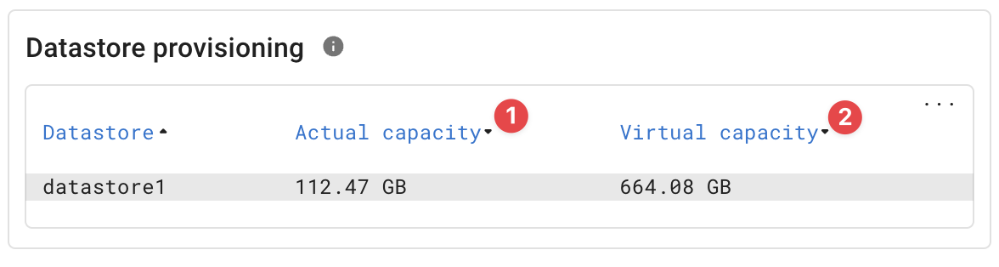

{ width="150" align=right}

# VMware ESXi

## Introduction

The VMware **esx-probe** uses the [VMware API](https://www.vmware.com/support/pubs/sdk_pubs.html) to monitor VMware ESXi hosts.

## Features

THe ESXi probe can be used to monitor standalone VMware ESXi hosts as hosts part of a VMware V-center deployment.

We have a default label that contains specific conditions for monitoring stand alone ESXi hosts.

See our overall [VMwware](index.md) documentation for additional information.

* Configuration issues
* Hypervisor status
* Datastores
    * Virtual datastore provisioning<br>
      
        * *Actual capacity :material-numeric-1-circle:{ .red } on the datastore*
        * *Virtual capacity :material-numeric-2-circle:{ .red } space actual virtually provisioned when using thin provisioning.*


!!! tip "VMware guest monitoring"

    We offer a specific probe for VMware guest monitoring to retrieve even more in-depth metrics per virtual machine.
    See our [VMware guest documentation](./vmwareguest.md) for more information.

## Configuration

### Credentials

The VMware API requires a user account which is assigned the **Read-only** rol on each monitored ESXi host.

See the [VMware documentation](https://docs.vmware.com/en/VMware-vSphere/7.0/com.vmware.vsphere.hostclient.doc/GUID-172218B8-6DAB-4CEF-A5B7-E3865B9E9EE8.html) on how to setup a local account and assign this accountto the **Read-only** role.

!!! danger "Don't use root"

    We strongly advise setting up a separate user for monitoring to have a clear separation of responsibilities but also to avoid lock-out issues.

## Operational

### Known issues

#### Cached API response

Sometimes InfraSonar reports different values than VMware consoles.

The cause for this is that the VMware API sends cached data as a response to queries.

The solution to mitigate this situation is to clean the VMware cache using the following commands on the affected ESXi host:

```bash
localcli hardware ipmi sel clear
etc/init.d/sfcbd-watchdog restart
etc/init.d/hostd restart
etc/init.d/vpxa restart
```

## Additional information

:material-github: [esx probe source code](https://github.com/infrasonar/esx-probe)