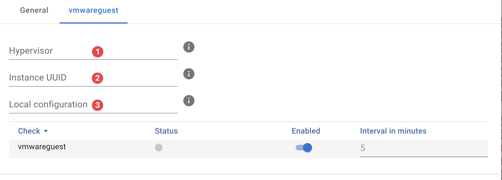

{ width="150" align=right}

# VMware guest

## Introduction

The **VMware guest** uses the [VMware API](https://www.vmware.com/support/pubs/sdk_pubs.html) to monitor VMware guests on either ESXi or VMware vCenter.

!!! note
    The VMware guest probes requires the [VMware vcenter](vcenter.md) or [VMware ESXi](esx.md) probe to be installed first as these act as a "proxy" for the guest queries.

## Features

The VMware guest probe offers a deep inside into individual virtual machines running on VMware:

* Overview
* CPU Readiness
* Disk bus resets
* Virtual disks
* Snapshots
* VMware tools version

## Deployment

The VMware guest probe can easily be deployed using our [remote appliance manager](../../../application/agentcores.md#remote-appliance-manager).

## Probe configuration

**Hypervisor :material-numeric-1-circle:{ .red }**

:   Address of the hypervisor you want to query, usually you would use the IP or FQDN of the Vcenter asset used to managed the VMware cluster. When using an ESXi without Vcenter you can also enter the IP or FQDN of the ESXi host here.

**Instance UUID :material-numeric-2-circle:{ .red }**

:   You can lookup the **instance UUID** on the details page of the asset you want specified as [hypervisor](#hypervisor-material-numeric-1-circle-red)

**Credentials :material-numeric-3-circle:{ .red }**

:   As the VMware guest connects to a VMware vCenter host or ESXi host we urge you to use the same credentials for the VMware guest queries.

    When monitoring guests running on a standalone ESXi environment you can use `esx` and when monitoring guest on Vcenter managed environment use `vcenter` 

You can automate this step using our toolkit and VMware guests report.

Please reach out to [support](../../../introduction/support.md) for additional information.

## Additional information

:material-github: [vcenter probe source code](https://github.com/infrasonar/vcenter-probe)