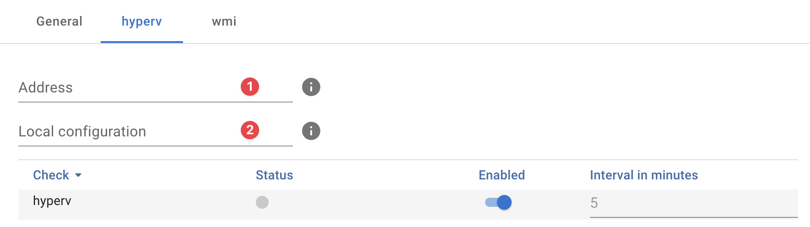

{ width="150" align=right}

# HyperV

## Introduction

The Hyper-V guest probes uses [WMI](./index.md) to to monitor Microsoft Windows Hyper-V hosts.

## Features

* Hyper-V quest overview

## Deployment

The HyperV probe can easily be deployed using our [appliance manager](./../appliance/appliance_manager.md).

## Probe configuration

Deployment of the Hyper-V probe is the simulair to deploying the [WMI](index.md) probe as it is in essence an extension of the WMI probe.

**:material-numeric-1-circle:{ .red } Address**

:   Address of the Hyper-V host you want to query, in most cases this is the same address as used for the WMI probe. 

**:material-numeric-2-circle:{ .red }Local conguration**

:   In most scenarios setting this to `wmi` is fine as this is the default section for WMI credentials. See our [credentials documentation](../appliance/credentials.md) for more advanced implementation scenarios.

## Additional information

:material-github: [Microsoft Hyper-V guest probe source code](https://github.com/infrasonar/hypervguest-probe)

## Additional information

:material-github: [Microsoft Hyper-V probe source code](https://github.com/infrasonar/hyperv-probe)
