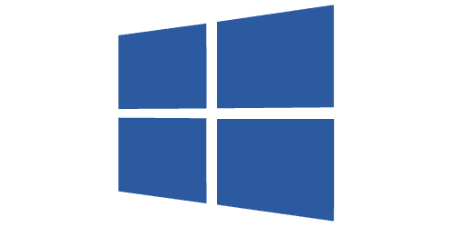

{ width="150" align=right}

# HyperV

## Introduction

The Hyper-V guest probes uses [WMI](./index.md) to to monitor Microsoft Windows Hyper-V hosts.

## Features

* Hyper-V quest overview

## Probe configuration

Configuration of the Hyper-V probe is the similar to deploying the [WMI](index.md) probe as it is in essence an extension of the WMI probe.

## Additional information

:material-github: [Microsoft Hyper-V probe source code](https://github.com/infrasonar/hyperv-probe)