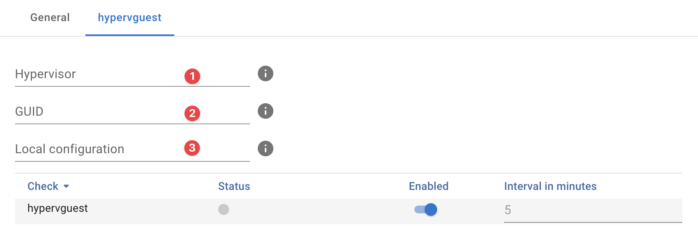

{ width="150" align=right}

# Hyper-V guest

## Introduction

The Hyper-V guest probes uses [WMI](./index.md) to to monitor Microsoft Windows Hyper-V guests.

!!! note
    The Microsoft Hyper-V guest probes requires the [Hyper-V](hyperv.md) probe to be installed first as these act as a "proxy" for the guest queries.

## Features

* Guest status as provided by the `Msvm_ComputerSystem` class

## Probe configuration

**:material-numeric-1-circle:{ .red } Hypervisor**

:   Address of the hypervisor you want to query, usually you would use the IP or FQDN of the Hyper-V host. 

**:material-numeric-2-circle:{ .red } GUID**

:   You can lookup the **GUUID** on the details page of the asset you want specified as Hyper-V host :material-numeric-1-circle:{ .red }

**:material-numeric-3-circle:{ .red } Local conguration**

:   Here you can set an optional `Local configuration`.

## Good to know

You can automate deployment using our [InfraSonar Commandline Interfase](../../../guides/cli.md) and the Hyper-V guests report.

## Additional information

:material-github: [Microsoft Hyper-V guest probe source code](https://github.com/infrasonar/hypervguest-probe)