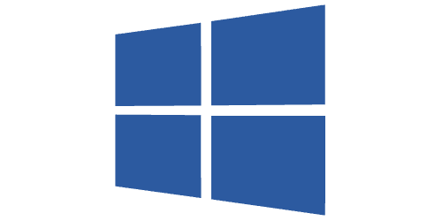

{ width="150" align=right}

# WMI

## Introduction

InfraSonar can use the [WMI](https://en.wikipedia.org/wiki/Windows_Management_Instrumentation) protocol to monitor Microsoft Windows hosts without installing an agent on them. Monitoring in this scenario is performed by periodically querying the Windows host using WQL queries.

InfraSonar uses the open source [aiowmi](https://github.com/cesbit/aiowmi) library released in 2021 by Cesbit.

## Features

* CPU, memory and disk utilization
* Network utilization
* Windows services
* Domain information for domain joined hosts
* Time drift
* Process information
* User information
  * Local sessions
  * Remote sessions (RDP)
* Configured shares
* Installed software (as reported by add/remove programs)
* Installed Windows updates
* VSS usage

## Deployment

The WMI probe can easily be deployed using our [appliance manager](./../appliance/appliance_manager.md).

## Probe configuration

### Credentials

The WMI-probe requires a service account with domain admin rights or a local administrative to perform the WMI queries.

> While it is possible to configure a regular user with additional DCOM permissions we feel this provides a false sense of security as the DCOM privileges required are quite broad.

## Checks

## Best practices

## Operational

### Firewall requirements

The WMI-probe requires no configuration on the monitored asset, other then access via the [WMI protocol](https://docs.microsoft.com/en-us/openspecs/windows_protocols/ms-wmi/c0088a94-1107-48a5-8d4d-cd16d34de5ef).

#### Local firewall

If the Microsoft Windows local firewall is enabled, you will need to allow "Windows Management Instrumentation" traffic.

**To enable or disable WMI traffic using the firewall UI**

1. In the Control Panel, click on **Security** and then click on **Windows Firewall**.
2. Click on **Change Settings** and then click on the **Exceptions** tab.
3. In the *Exceptions* window, select the check box for Windows Management Instrumentation (WMI) to enable WMI traffic through the firewall. To disable WMI traffic, clear the check box.

!!! tip
    Windows 11 has a special firewall that only allows access from hosts inside the same local subnet.

**To enable WMI traffic at command prompt using WMI rule group**

We can easily allow remote WMI using the following set of `netsh` commands:

```
netsh advfirewall firewall set rule group="Windows Management Instrumentation (WMI-In)" new enable=yes
netsh advfirewall firewall set rule group="Windows Management Instrumentation (DCOM-In)" new enable=yes
netsh advfirewall firewall set rule group="Windows Management Instrumentation (ASync-In)" new enable=yes
```

#### Corporate firewall

When monitoring hosts which are located behind a firewall, for example hosts in a DMZ, the firewall must be configured to allow WMI.

> To comply with Internet Assigned Numbers Authority (IANA) recommendations, Microsoft has increased the dynamic client port range for outgoing connections in Windows Vista and Windows Server 2008. The new default start port is 49152, and the new default end port is 65535. This is a change from the configuration of earlier versions of Windows that used a default port range of 1025 through 5000.

* **Windows server below 2008**, access for the RPC Endpoint Mapper (135) as well as WMI (variable port range, by default 1024-5000) should be granted.
* **Windows server 2008 and higher versions**. access for the RPC Endpoint Mapper (135) as well as WMI (variable port range, by default 49152-65535) should be granted.

You can lookup the dynamic port range actually used by the Windows host using these commands:

```
netsh int ipv4 show dynamicport tcp
netsh int ipv4 show dynamicport udp
netsh int ipv6 show dynamicport tcp
netsh int ipv6 show dynamicport udp
```

!!! note
    The range is set separately for each transport (TCP or UDP).

    The port range is now truly a range that has a starting point and an ending point.

    Microsoft customers who deploy servers that are running Windows Server 2008 may have problems that affect RPC communication between servers if firewalls are used on the internal network.

    In these situations, we recommend that you reconfigure the firewalls to allow traffic between servers in the dynamic port range of 49152 through 65535.

    This range is in addition to well-known ports that are used by services and applications. Or, the port range that is used by the servers can be modified on each server.

    You adjust this range by using the netsh command, as follows: netsh int <ipv4|ipv6> set dynamic <tcp|udp> start= number num= range. This command sets the dynamic port range for TCP. The start port is number, and the total number of ports is range.


### None domain credentials

!!! info "None domain members"
    This is only required for hosts that are not a member of your Windows domain or when using a local account is required due to other circumstances.

By default only the true local administrator account can be used for remote WMI queries.
You can use the following steps to create a local account:

1. Create a local account and ensure the account is member of the group **Remote Management Users**.
2. Authorize CIMV2 access:
    1. Open the WMI management console `wmimgmt.msc`.
    2. Right click **WMI Control (Local)** and select **properties** from the menu.
    3. Select the **security** tab.
    4. Browse to **Root\CIMV2**.
    5. Click the button labeled **security**.
3. Authorize COM access:
    1. Start the **component Services** console.
    2. Browse in the left pane to: _Component Services \ Computers_.
    3. Right click **My Computer** and select **properties from the menu.
    4. Open the tab **COM Security**.
    5. Click **Edit Limits** in the _Access Permissions_ pane.
    6. Add the account used for monitoring using the **Add** button.
    7. Ensure the account has *Remote Access* permissions.
    8. Close the access permission screen by clicking **OK**.
    9. Click on **Edit Limits** in the _Launch and Activation Permissions_ pane.
    10. Add the account used for monitoring using the **Add** button.
    11. Ensure to allow: _Local Launch_, _Remote Launch_, _Local Activation_ and _Remote Activation_.
    12. Close the windows by clicking **OK** twice and exit the Component Services console.


See also our WMI trouble shooting section about [remote-UAC](wmi-troubleshooting.md#remote-uac) as you might need to disable this.

### Microsoft Windows server 2003

You should ensure **Management and Monitoring Tools** are installed using **Add/remove windows components**

The **software** and **updates** check might not work as expected, we advise you to turn off these checks.

### Microsoft ISA Server?

Monitoring a Microsoft ISA server requires the following rules on the ISA server:

* Allow traffic from the monitoring appliance to localhost for all protocols.
* Within this rule, filtering "Enforce strict RPC compliance" must be disabled.

### Known issues

See our [troubleshooting section](wmi-troubleshooting.md) for known issues and ways to troubleshot WMI queries.


## Additional information

:material-github: [Microsoft WMI probe source code](https://github.com/infrasonar/wmi-probe)


