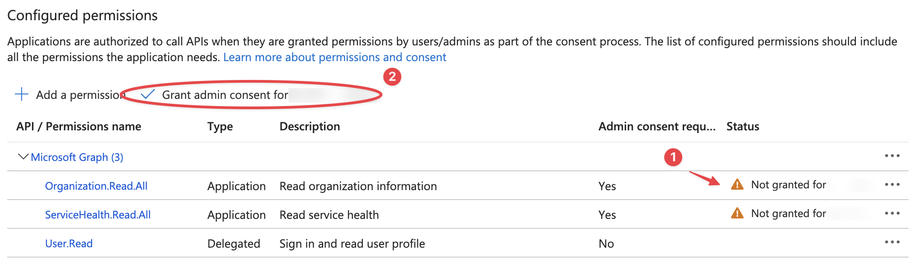

{ width="150" align=right}

# Microsoft 365

Microsoft 365 is an InfraSonar service which can monitor your Microsoft 365 tenant.

## Features

Add the moment the following Azure resources are supported:

* Subscriptions
* Health status

## Configuration

Our Microsoft 365 service needs the following properties:

* Directory (tenant) Id
* Application (client) Id
* Client secret value

In the next paragraphs we describe how to setup the Azure service and how to retrieve the required properties.

### Prepare your Azure environment

Open the Azure portal (**https://portal.azure.com/**) using an account with sufficient privileges to register an Azure app and set permissions.

#### Create an app registration

1. From the main menu, open **Azure Active Directory**
2. Open **App registrations** from the *Azure Active Directory sub-menu*
3. Select **new registration**
4. Enter the **user-facing display name** e.g., *InfraSonar Azure Service*
5. Who can use this application or access this API: Selecting **Accounts in this organizational directory only** in most cases
6. Click **Register**
7. A new Windows opens, note the following ID's down:
      1. *Application (client) ID*
      2.  *Directory (tenant) ID*
8. Click **Add a certificate or secret** next to client credentials
9. Click **New client secret** in the *Client secrets* tab
      1.  Enter a description: e.g.m *InfraSonar azure Service client secret*
      2.  Set an expiration date, note this value down and remember to renew before this date!
      3.  Click **Add**
      4.  Note down the **Value**, note this can not be retrieved again once you close this window!

Don't close this Windows, next step is setting API permissions.

### API permissions

1. Select **API permissions** from the menu
2. Click **Add a permisssion**
3. Click **Microsoft Graph**
4. Select **Application permissions**
      1. Search **ServiceHealth**
      2. Expand the **ServiceHealth** tab
      3. Select **ServiceHealth.Read.All**
      4. Search **Organization**
      5. Expand the **Organization** tab
      6. Select **Organization.Read.All**
5. Click the **Add permisssions** button
6. Note the status column shows a `Not granted...` :material-numeric-1-circle:{ .red } status
   
7. click `Grant admin consent for <your domain-name>` :material-numeric-2-circle:{ .red }
8. You will be asked if you are sure to grant consent for the requested permissions for all accounts in your domain, click **yes** to continue.

### Deploy the InfraSonar service

1. Open the InfraSonar environment you want to add the resource to
2. Click **add asset** or use an existing asset
3. Add the **microsoft365** collector
4. Open the **microsoft365** collector tab and enter the required information
   1. Directory (tenant) Id
   2. Application (client) Id
   3. Client value
5. Optional, deselect checks you don't want to use.