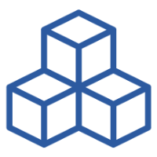

{ width="150" align=right}

# :material-laptop: Assets

## The Foundation of Your Monitoring

In InfraSonar, "assets" represent the objects you monitor. This encompasses a wide range of devices, from traditional IT components like routers, switches, and servers to diverse assets such as elevators, IoT devices, and more.

> Essentially, if we can retrieve data from it and transmit it to our cloud platform, we can monitor it.

## Features

* **Collectors:** [Collectors](./collectors.md) are deployed directly onto assets to gather monitoring data.
* **Labels:** [Labels](../application/labels.md) serve dual purposes: they facilitate easy identification and enable the application of conditions. By grouping conditions with labels, you can efficiently apply them to multiple assets.
* **Asset Kinds:** Assigning a predefined asset kind not only enhances filtering capabilities but also visually distinguishes assets with relevant icons.

## Guest to asset

Some collectors allow assets to be easily added from a "guest list" retrieved by the collector.

Collectors that support this feature include:

* [Discovery agent](../collectors/agents/discovery.md)
* [Microsoft hyperV](../collectors//probes/wmi/hyperv.md)
* [Unifi collector](../collectors/probes/unifi.md#unifi-controller)
* [VMware ESXi](../collectors/probes/vmware/esx.md)
* [VMware vCenter](../collectors/probes/vmware/vcenter.md)

