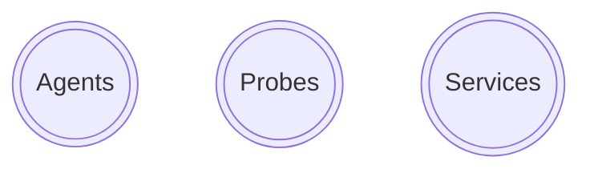
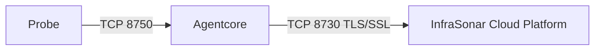

{ width="150" align=right}

# Collectors

InfraSonar collectors collect monitoring data to be parsed by the InfraSonar cloud platform.

## Collector types

InfraSonar supports three types of collectors used to retrieve monitoring data.

### Agents

Agents are deployed on an asset an run autonomously.

Monitoring data is typically send directly to the InfraSonar platform using an HTTPS connection to our api endpoint (`api.infrasonar.com`) 

!!! tip "Proxy"
    It is possible to use the [InfraSonar appliance](../collectors/probes/appliance/index.md) as a proxy for agents which don't have a direct internet connection, contact [support](../support/index.md) for more information regarding this setup.

Collected data is associated to the correct asset by providing an Asset ID and an authentication [token](../application/tokens.md) to access the [InfraSonar container](./containers.md).

See our [agent documentation](../collectors/agents/index.md) for additional agent related documentation and an overview currently supported agents.

### Probes

Probes collect data remotely from an asset using open standards or other vendor provided methods.

Probes are orchestrated by an InraSonar proces called AgentCore, this Agentcore orchestrates our [probes](../index.md), is responsible for scheduling checks and ensures an encrypted connection to our backend.

During the startup sequence of a probe, it will “:material-bullhorn-variant-outline: announce” itself to the Agentcore.

#### Connectivity

During the startup sequence of a probe, a connection is established on TCP port 8750 between the probe and to the InfraSonar Agentcore to “:material-bullhorn-variant-outline: announce” its presence. As probes usually run in the same Docker network as the Agentcore, they can easily connect to it.

The InfraSonar Agentcore connects to our platform using TCP poort 8730 using an TLS/SSL encrypted connection.

!!! note ""
    it is possible to use TCP port 443 instead of 8730 we don't recommended this but some environment refuse inter traffic to ports other then 80 and 443

#### InfraSonar appliance

When we refer to our [InfraSonar appliance](../collectors/probes/appliance/index.md) we refer to an Agentcore and a collection of probes. In a typicly deployment the appliance is a Linus host running Docker as our preferred deployment method for probes are Docker containers.

#### Configuration

Probes can easily be deployed and maintained using our [appliance manager](../collectors/probes//appliance/appliance_manager.md which also allows you to install a selection of agents on the appliance.

### Services

Services are like probes as they retrieve data agentless but are deployed on an isolated section on our InfraSonar cloud platform. Examples of InfraSonar services include our Microsoft Azure, Microsoft 365 and mail roundtrip.
    
See our [services documentation](../collectors/services/index.md) for additional services related documentation and an overview currently supported services.

## Mix and match 

Collectors can be combined on assets.

You can for example use our Microsoft Azure service to provide information from a cloud provider perspective while using our Microsoft Windows agent to monitoring the Microsoft Windows internals and our DNS probe to monitor internal DNS records.

When you are monitoring an on-premise infrastructure we suggest deploying our [InfraSonar appliance](../collectors/probes/appliance/index.md) first and start with an agent-less implementation.

## Check interval

InfraSonar has a minimum check-interval of 1 minute per check.
We strive to spread our checks to ensure a minimum footprint

## Exact check interval

InfraSonar also uses an exact schedule interval as this ensures more accurate predictions, consistent comparisons, and streamlined data analysis. This approach ensures that measurements are made at predetermined times, regardless of external factors or human error.

## Data analysis

Probes, services and agents send their collected data to the InfraSonar [platform](../introduction/platform.md), a fully managed cloud solutions where the last known state is stored, data is evaluated using conditions and performance metrics are stored for future analysis.

## Available collectors

See our [collector documentation](../collectors/index.md) for a list of available collectors or [contact support](../support/index.md) if you feel a collector is missing as some of our collectors are running in extensive private beta's.

All InfraSonar provided probes are available as :material-open-source-initiative: open source on our :material-github: [GitHub repository](https://github.com/infrasonar/) as we believe in transparency with regards to data collection and systems access.