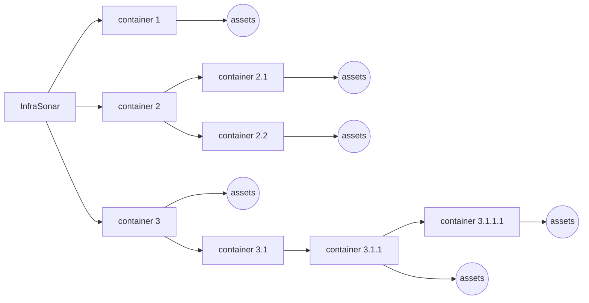
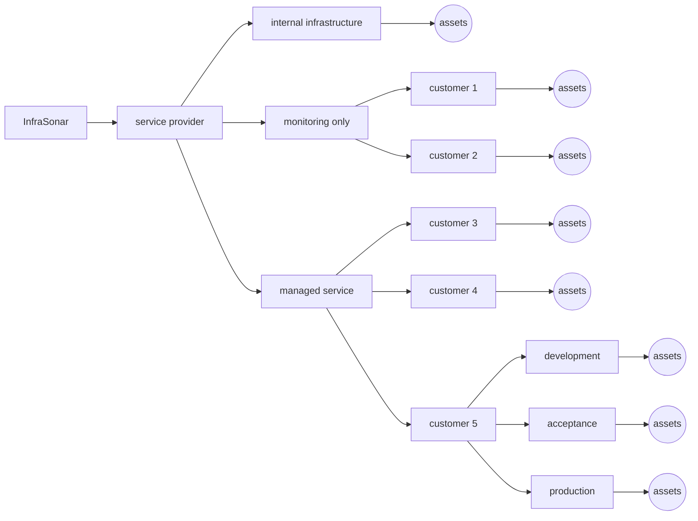

{ width="150" align=right}

# Containers

Containers represent a logical grouping of monitored infrastructure assets in the InfraSonar platform

## Usage

Here's how InfraSonar uses containers:

* **Grouping and managing assets**: Containers act as organizational units for assets, collectors, alerts, notifications, rules and views.
* **Querying and filtering**: InfraSonar allows users to query containers and their associated data, such as IDs, alerts, assets, and collectors
* **Configuration**: 
    * Containers have configurable properties like mode, properties, zones, external notification rules etc.
    * [Authorizations](../application/users.md), [labels](../application/labels.md) and [conditions](../application/conditions.md) propagate form their parents to their children.
    * Authorization is inherited to "lower" containers. Inheritance can be "broken" down the chain.

The picture below outlines our container conceptually:

Don't overthink this, InfraSonar makes it easy to move containers and assets. Labels and conditions can also be moved but only to an "upstream" parent. 

!!! note First time users

    When you are new to InfraSonar and sign in for the first time, you will see the message:
    > Welcome to InfraSonar! It appears that you are not yet a member of an InfraSonar container. If you are a member of an organization that uses InfraSonar, ask for permission from an authorized person to add you to the relevant container. Otherwise, request a free demo via the [website](https://infrasonar.com/support)!

## Service provider specific

Containers are a useful feature for managed service providers as it allows them to create a container per customer.

If you feel our container concept might fit your needs we suggest to use your top level container as an organization placeholder and not to add assets here.

An example hierarchy implementation for a service provider using an elaborate container hierarchy

## Limitations

A container can contain a maximum of 2.000 assets.

If you have the need to add more assets please reach out to [support](../support/index.md) so we can discuss potential solutions.