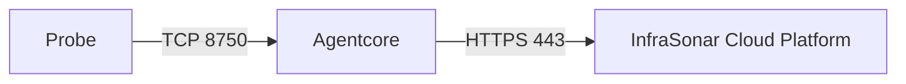

{ width="200" align=right}

# :material-radar: Agentcore

The Agentcore orchestrates our [probes](../collectors/probes/index.md) and is responsible for scheduling checks.
During the startup sequence of a probe, it will “:material-bullhorn-variant-outline: announce” itself to the Agentcore.

The Agentcore also acts as a communication gateway. Data retrieved by the probes is sent to the InfraSonar cloud platform via the Agentcore.

!!! note ""

    Because probes usually run in the same Docker network as the Agentcore, they can easily connect to it.

## Features

### Resumable operation

If an agentcore is shutdown properly a list of assets and a check result queue are saved on disk.
Given the agentcore starts and it can't connect to the InfraSonar cloud platform the list of saved assets will be used to resume operations.
Check results up to a maximum of 100.000 packages will be stored in a queue

### Multiple agentcores

InfraSonar supports multiple agentcores within a monitored environment. Deploying multiple agentcores can be useful in spreading the network load, accommodate for network segmentation, and supporting large-scale implementations.

To support network segmentation, assets can be assigned to a [zone](zones.md). When this zone also has an agentcore assigned its assets will automatically be monitored using the agentcores in this zone.

When you deploy multiple agentcores in a zone, assets will be evenly distributed between all agentcores in this zone..

!!! tip "No automagic failover"
    If an agentcore fails it's role will not automatically be taken over by another agentcore. To accomplish this, the failing agentcore needs to be removed by an InfraSonar admin.

## Operational

### Removing an Agentcore

When an Agentcore is decommissioned, all hosts monitored by are automatically transferred to other agentcores in the configured zone.