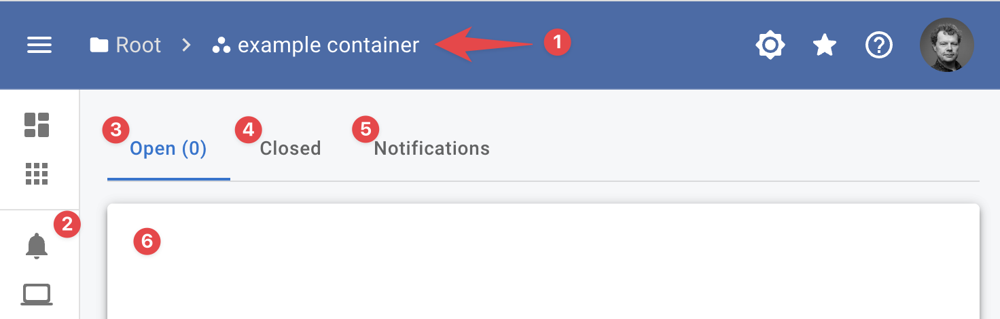
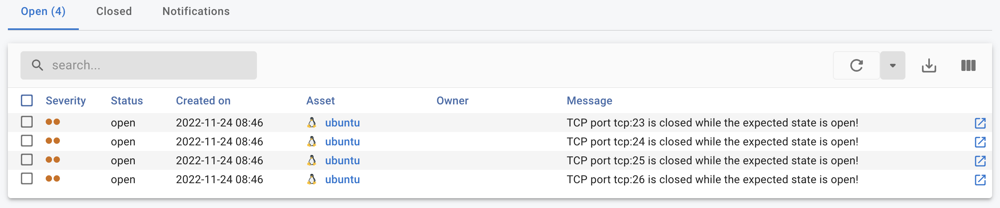
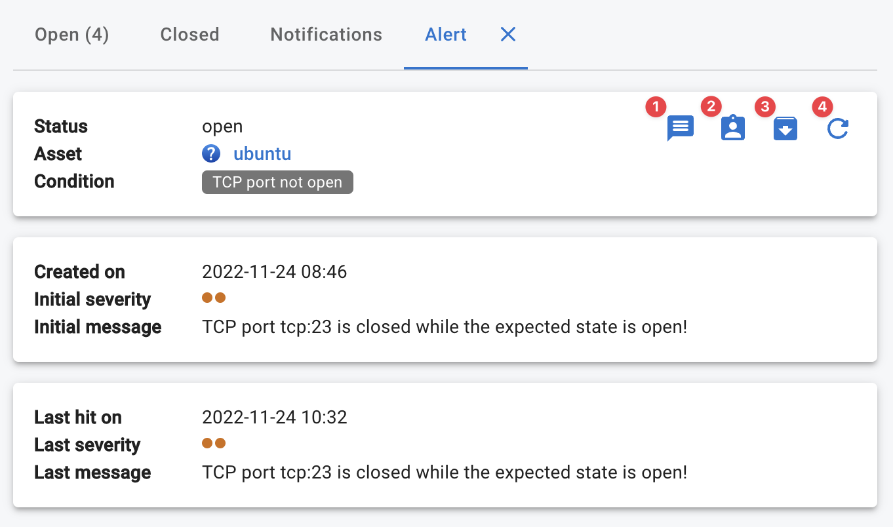

# Alerts

When a condition is hit an alert can be send using the condition `return` statement.

When an alert is raised it is visible in various locations within the InfraSonar application.

Using [rules](rules.md) it is possible to route the alert to email or [DutyCalls](https://dutycalls.me).

## Viewing alerts

When you are in a container view (1) you can view the alerts and [notifications](notifications.md) in the **:material-bell: Alerts & Notificatins page** (2) 

{ width="500"}

This view shows:

### Open alerts

The open alerts (3) pane shows a list (6) of all open alerts and its status.

{ width="500"}

When you click the show details button :octicons-link-external-16: the details pane opens.

{ width="500"}

1. **Add message** 
   Allows you to add a message to the alert, this might be usefully to inform coworkers.
2. **Assign alert** 
   Allows you to assign the alert to yourself or another member on this container.
3. **Close alert** 
   Closes the alert, when the issue is not resolved the issue is reopened and automatically assigned to the user who closed the alert.
4. **Refresh** 
   Refreshes the alert pane.

### Closed alerts

The closed alerts pane (4) shows a list of closed alerts.

### Notifications

The closed alerts pane (5) shows a list of all open notifications (6), see the [notification section](notifications.md) for more information.