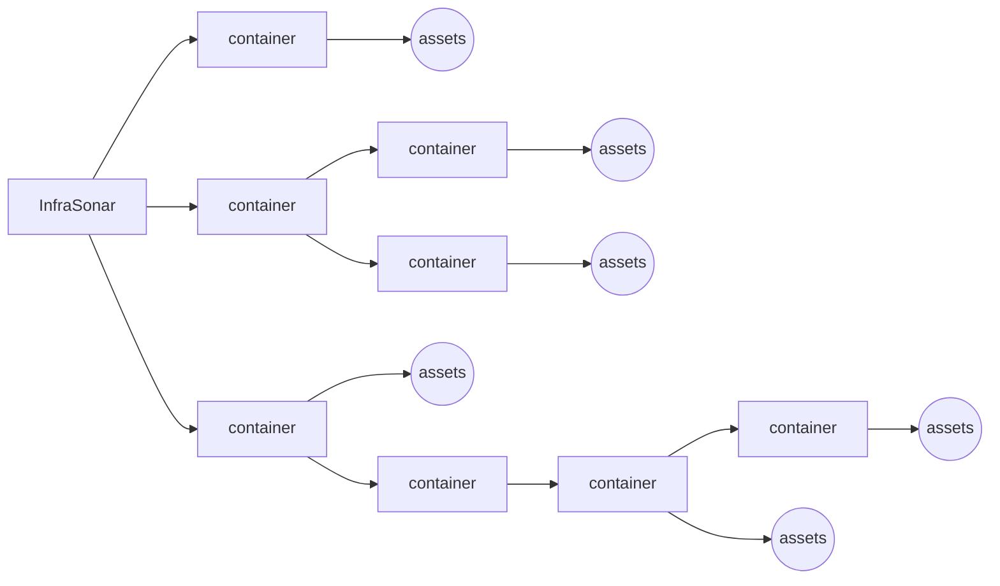

# :material-apps: InfraSonar containers 

InfraSonor containers are a hierarchial setup of you monitored infrastructure.

A container can contain monitored assets and/or sub-containers.

On the container level an admin can configure authorization, custom labels, and conditions.

## Hierarchy

### Principles

* Authorization is inherited to "lower" containers. Inheritance can be "broken" down the chain.
* Timezones can be configured per container.

#### InfraSonar hierarchical setup



??? Example "Hierarchy implementation for a service provider"

    ``` mermaid
    graph LR
      A[InfraSonar] --> B[service provider];
      B --> C[internal infrastructure]
      B --> D[monitoring only]
      B --> E[managed service]
      C --> F((assets))
      D --> customer1[customer 1]
      D --> customer2[customer 2]
      customer1 --> I((assets))
      customer2 --> J((assets))
      E --> customer3[customer 3]
      customer3 --> K((assets))
      E --> customer4[customer 4]
      customer4 --> L((assets))
      E --> customer5[customer 5]
      customer5 --> M[development]
      customer5 --> N[acceptance]
      customer5 --> O[production]
      M --> Q((assets))
      N --> R((assets))
      O --> S((assets))
    ```

## Setup a new environment

!!! note First time users

    When you are new to InfraSonar and sign in for the first time, you will see the message:
    > Welcome to InfraSonar! It appears that you are not yet a member of an InfraSonar environment. If you are a member of an organization that uses InfraSonar, ask for permission from an authorized person to add you to the appropriate environment.
    At the moment, it is impossible to create the first environment without our assistance, please [contact us](../introduction/contact_us.md) so we can set up an empty environment for you.

From the container view, you can add a new environment.

<figure markdown>
  { width="800" }
  <figcaption>InfraSonar add environment</figcaption>
</figure>

1. When you are in asset view you can use the child containers button :material-file-tree: to switch to container view;
2. Click the add **container button**;
3. Enter a name for your container;
4. Select the mode, this is usual **normal**;
5. Select the **timezone** for this container;
6. CLick **save**.