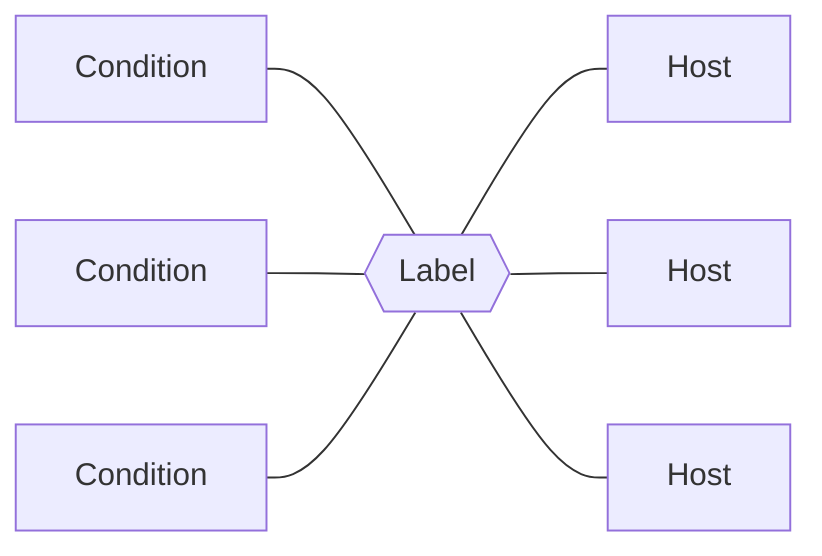

# :material-label: Labels

## Purpose

Labels can be added to hosts to group and identify them quickly.

Labels are also used to control which conditions are active and which conditions should be suppressed. A label can enforce multiple conditions on a host and is not bound to a specific probe.

!!! tip "Glue"

    Labels "glue" conditions onto hosts.

## How to use

Labels can be assigned to hosts either by :material-playlist-edit: editing a host or by selecting one or more hosts and using the **action menu**.

<figure markdown>
  
  <figcaption>Action menu in action</figcaption>
</figure>

## Deep dive

## Label classes

InfraSonar has five label classes which can be identified by their color.

Class                          | Description
-------------------------------|-------------------
:material-label:{.blue-icon}   | **Base labels** in InfraSonar are prefixed with a `#` sign, followed by a descriptive name. Every host in InfraSonar should be associated with a base label, as these contain the best practices and set the main view for an asset/host.
:material-label:{.gray-icon}   | **Regular labels** are usually used to add extra conditions to a host or for grouping purposes.
:material-label:{.purple-icon} | **Ignore labels** that are primarily used to suppress a condition are prefixed with a `≠` sign.
:material-label:{.red-icon}    | **Maintenance label** suppresses all conditions effectively muting a host.
:material-label:{.green-icon}  | **Ansible labels** using the InfraSonar API, it is possible to integrate InfraSonar with an automation solutions such as Ansible. InfraSonar uses the `&` prefix to identify special labels.

### Custom labels

InfraSonar administrators can create custom labels for an environment.

<figure markdown>
  { width="800" }
  <figcaption>InfraSonar add label</figcaption>
</figure>

1. Navigate to the labels page (:material-label:) in the left navigation drawer.
2. Click the **Add label** button.
3. Enter a name.
4. Enter an optional description.
5. Click **Save**.

!!! Note "Additional tabs"
    The additional tabs: *Hosts*, *Conditions*, *Suppressed* and *Channels* show how the label is used. It is not possible to edit the label usage here.

## Predefined labels

### :material-label:{.blue-icon} Base labels

labels in InfraSonar that are prefixed with an `#`, follwed by a descriptive name.

Every host in InfraSonar should be associated with a base label, as these contain the best practices and set the main view for an asset/host.

## **:material-label:{.blue-icon} # access switch**

Generic switch conditions:

- Interface status
- Reboot detection
- Entity monitoring
- Standard hardware sensors

## **:material-label:{.blue-icon} # base**

Basic conditions.

#### **:material-label:{.blue-icon} # Cisco UCS**

Cisco Unified Computing System

- Interface status
- Reboot detection
- Entity monitoring
- Standard hardware sensors
- Cisco UCS specific hardware status

#### **:material-label:{.blue-icon} # Citrix Netscaler**

Citrix Netscaler conditions:

- Interface status
- Reboot detection
- Entity monitoring
- Standard hardware sensors
- Failover detection
- Detect new or removed services
- Detect service state changes

#### **:material-label:{.blue-icon} # datacenter switch**

Generic switch conditions:

- Interface status
- Reboot detection
- Entity monitoring
- Standard hardware sensors

Additional to the base conditions the :material-label:{.gray-icon} # datacenter switch label also monitors port up and down events.

#### **:material-label:{.blue-icon} # Docker**

Docker base label.

This label adds the following predefined Docker conditions:

- Container CPU thresholds
- Notification upon container creation
- Notification upon tag changes

#### **:material-label:{.blue-icon} # Firewall**

Basic firewall label.

- Interface status
- Reboot detection
- Entity monitoring
- Standard hardware sensors

!!! note "Palo Alto firewalls"
    For Palo-Alto devices use the :material-label:{.gray-icon} # Palo-alto label.

#### **:material-label:{.blue-icon} # FreeBSD**

Predefined *NIX* host configuration.

- CPU thresholds
- Memory / swap thresholds
- Diskfree thresholds
- Reboot detection
- Interface port status (ifoper)
- Interface discarded & error packets

!!! info "FreeBSD vs Linux label"
    The difference between the FreeBSB and Linux label is cosmetic.

#### **:material-label:{.blue-icon} # Linux**

Predefined *NIX* host configuration.

- CPU thresholds
- Memory / swap thresholds
- Diskfree thresholds
- Reboot detection
- Interface port status (ifoper)
- Interface discarded & error packets

#### **:material-label:{.blue-icon} # Mailroundtrip**

Conditions used for the SMTP-probe.

#### **:material-label:{.blue-icon} # Microsoft SQL Server**

Widget to add conditions for SQL Server monitoring.

This label adds the following predefined best practice Microsoft SQL conditions:

- Memory pressure detection
- Configuration state (e.g. parallelism settings, memory settings)
- Buffer cache hit ratio
- Log shipping status
- Deadlock detection
- Job status

Additional labels that can be combined with this label:

- :material-label:{.gray-icon} Microsoft SQL deadlocks > 10 min
- :material-label:{.gray-icon} ≠ auto-update-statistics
- :material-label:{.gray-icon} ≠ mssql buffercache
- :material-label:{.gray-icon} ≠ mssql cost threshold
- :material-label:{.gray-icon} ≠ deadlocks
- :material-label:{.gray-icon} ≠ max server mem
- :material-label:{.gray-icon} ≠ sql conn autoclose

#### **:material-label:{.blue-icon} # Microsoft Windows**

Predefined Microsoft Windows host configuration.

This label adds the following predefined Microsoft Windows conditions:

- CPU thresholds
- Memory / swap thresholds
- Disk free thresholds
- Reboot detection
- Interface port status (ifoper)
- Interface discarded & error packets
- Time difference
- [Windows services](condition_wmi_services_autostart.md)

Additional labels that can be combined with this label:

- :material-label:{.gray-icon} [Citrix XenApp](label-maintenance.md#citrix-xenapp)
- :material-label:{.gray-icon} CPU 30 min
- :material-label:{.gray-icon} Daily reboot
- :material-label:{.gray-icon} Exchange C: (15%)
- :material-label:{.gray-icon} Exchange D: (15%)
- :material-label:{.gray-icon} Microsoft Exchange
- :material-label:{.gray-icon} Rolling reboot (48h)
- :material-label:{.gray-icon} Windows Volumes (5%)

#### **:material-label:{.blue-icon} # NetApp**

Netapp specific conditions for 7mode and cMode ONTAP versions

- CPU thresholds
- Memory / swap thresholds
- Aggregate / volume thresholds
- Aggregate / volume changes
- Reboot detection
- Interface port status (ifoper)
- Interface discarded & error packets
- Time difference
- Windows services
- Health status (hardware, subSystem, global)
- Snapshot status

Additional labels that can be combined with this label:

- :material-label:{.gray-icon} NetApp dangling snapshots
- :material-label:{.gray-icon} NetApp SnapMirror lag (26h)
- :material-label:{.gray-icon} NetApp SnapMirror lag (9h)
- :material-label:{.gray-icon} NetApp snapshots required
- :material-label:{.gray-icon} NetApp SnapVault lag (25h)
- :material-label:{.gray-icon} NetApp SnapVault lag (9h)
- :material-label:{.gray-icon} ≠ sas-connect
- :material-label:{.gray-icon} ≠ snapshot volumes
- :material-label:{.gray-icon} ≠ spare disks regex

#### **:material-label:{.blue-icon} # Netbotz**

Netbotz specific

#### **:material-label:{.blue-icon} # Nimble storage**

Nimble storage

#### **:material-label:{.blue-icon} # Palo-alto**

Palo Alto firewalls

- Interface status
- Reboot detection
- Entity monitoring
- Standard hardware sensors
- Palo Alto failover
- Palo Altop VPN tunnel status (ifoper)

#### **:material-label:{.blue-icon} # PDU**

PDU configuration.

#### **:material-label:{.blue-icon} # Pure**

Pure specific conditions:

- Array status
- CheckMessages alert
- Connections (added, lost, missing, replication address changed)
- Failover detection
- Drive status
- Hardware status
- HostConnection status
- Mirror Write latency
- Capacity
- Volume changes 

#### **:material-label:{.blue-icon} # Router**

Basis router label

- Interface status
- Reboot detection
- Entity monitoring
- Standard hardware sensors

#### **:material-label:{.blue-icon} # SAN Switch**

SAN Switch specific label

- Interface status
- Reboot detection
- Entity monitoring
- Standard hardware sensors
- Logging
- Sensor statusses
- Fibre channel bad EOF delimiter status

#### **:material-label:{.blue-icon} # Synology**

Synology Storage specific conditions:

- Basic conditions (see Linux)
- Synology system status
- Synology system fan status
- Synology raid status
- Synology power status
- Synology disk temperature
- Synology disk status
- Synology disk smart status
- Synology cpu fan status

!!! note "Disk status"
    As a Synology system is sometimes configured with spare disks we ignore the statuses:

    2. The disk has system partitions but no data
    3. The disk is not partitioned

#### **:material-label:{.blue-icon} # UPS**

Basic UPS label.

#### **:material-label:{.blue-icon} # VMware ESX host**

VMWare ESX host label.

#### **:material-label:{.blue-icon} # VMware vCenter**

VMWare virtual center label.

#### **:material-label:{.blue-icon} # website**

Monitors website specifics.

### :material-label:{.gray-icon} Regular labels

:material-label:{.gray-icon} Regular labels are gray in color and have no special character pre-fixing them.

Notable regular labels:

- :material-label:{.gray-icon} **core**, InfraSonar Agent-core host.
- :material-label:{.gray-icon} **ß test**, label used for testing purposes.

#### **:material-label:{.gray-icon} Citrix XenApp**

Citrix XenApp ICA latency condition.

#### **:material-label:{.gray-icon} core**

InfraSonar Agent-core host. This label is added automatically.

#### **:material-label:{.gray-icon} CPU 30 min**

Alert high CPU after 30 minutes.

#### **:material-label:{.gray-icon} Daily reboot**

Reports if a Microsoft Windows host is up longer then 24 hours.

This label marks a host as daily rebooted, by verifying if the uptime does not exceed 24 hours as this indicates a failed reboot.

!!! note "Reboots are still reported."
    When a hosts reboots, this will still raise an alert as we can't determine if the reboot was planned.
    Adding a maintenance routine to your reboot schedule will avoid these alerts.

#### **:material-label:{.gray-icon} Dell iDrac**

Dell iDrac Server conditions:

- Detect eventlog changes
- Detect firmware changes
- System state amperage status
- System state battery status status
- System chassis intrusion status status
- System chassis status status
- System cooling status status
- System state amperage status
- System state powersupply status
- System state global status
- System state memory status
- System state power unit status
- System state processor status
- System state temperature status
- System state voltage status

#### **:material-label:{.gray-icon} dns**

Checks performance and changes for the following checks:

- checkA
- checkAAAA
- checkMX
- checkS
- checkPTR
- checkTXT

#### **:material-label:{.gray-icon} Exchange C: (15%)**

Exchange >= 2016. When QueueDB is installed on C. It will stop receiving new email when below 15% free disk space.

#### **:material-label:{.gray-icon} Exchange D: (15%)**

Exchange >= 2016. When QueueDB is installed on D. It will stop receiving new email when below 15% free disk space.

#### **:material-label:{.gray-icon} Exchange Volumes (15%)**

MS-Exchange Volumes (15%)

#### **:material-label:{.gray-icon} HP Procurve switch**

HP ProCurve switch specific conditions:

- Firmware changes
- Software changes
- ProCurve sensor status changes

#### **:material-label:{.gray-icon} HP Proliant**

HP Proliant Server conditions.

#### **:material-label:{.gray-icon} Linux process httpd**

Checks if the httpd process is running.

#### **:material-label:{.gray-icon} Linux process java**

Checks if the java process is running.

#### **:material-label:{.gray-icon} maintenance**

This label wil disable all condition checking for data that comes in.

#### **:material-label:{.gray-icon} Microsoft Exchange**

Microsoft Exchange specific conditions. 

!!! note 
    This label disables memory thresholds, as Exchange tends to take as much memory as possible.

#### **:material-label:{.gray-icon} Microsoft SQL Exeptions**

Microsoft SQL Server specifics.

#### **:material-label:{.gray-icon} mssql deadlocks > 10 min**

Monitors for Microsoft SQL deadlocks that exist more than 10 minutes.

#### **:material-label:{.gray-icon} NetApp dangling snapshots**

Detects dangling snapshots on NetApp ONTAP systems (7mode and cMode).

When the time difference between 2 snapshots is greater than 21 (a.k.a. monthly backup), then an InfraSonar alert is triggered.
There is also a label (`dangeling snapshots (vmfs) 7d`) which generates an alert if the snapshot contains the word `vmfs` and the time difference is greater then 7 days.

Possible causes:

* Manual snapshots that have not been cleaned up.
* A reconfigured snapmanager.
* A server that is powered off while the mirror is still running.

#### **:material-label:{.gray-icon} NetApp SnapMirror lag (>26h)**

NetApp snap-mirror lag should be less then 26 hours.

#### **:material-label:{.gray-icon} NetApp SnapMirror lag (>9h)**

Netapp snap-mirror lag should be less then 9 hours.

#### **:material-label:{.gray-icon} NetApp snapshots required**

When applied on a NetApp host every volume is checked whether it has snapshots.

#### **:material-label:{.gray-icon} NetApp SnapVault lag (>25h)**

Netapp snap-vault lag should be less then 24 hours.

#### **:material-label:{.gray-icon} NetApp SnapVault lag (>9h)**

Netapp snap-vault lag should be less then 9 hours.

#### **:material-label:{.gray-icon} PoE changes**

monitors status changes for PoE.

#### **:material-label:{.gray-icon} Rolling reboot (48h)**

Rolling reboots uptime > 48h.

#### **:material-label:{.gray-icon} UPS temperature <15° or >38°**

Broader temperature window for UPS temperature window.

#### **:material-label:{.gray-icon} vmfs 100Gb threshold**

Threshold for large VMFS volumes, e.g > 1Tb.

#### **:material-label:{.gray-icon} VMware vm changes**

Notifies on virtual machine creation or deletion.

#### **:material-label:{.gray-icon} Windows Volumes (5%)**

Only warn if a volume has less then 5% free.

#### **:material-label:{.gray-icon} XenServer**

Ignore some check(s). Please also use Linux Label.

#### **:material-label:{.gray-icon} ß test**

Label used for testing purposes.

### :material-label:{.purple-icon} Ignore labels

Labels that are primarily used to suppress a condition are prefixed with a `≠` sign.

Notable regular labels:

* :material-label:{.purple-icon} **≠ unstable connection**, this label delays connection alerts to 15 minutes for connections that are deemed unstable.
* :material-label:{.purple-icon} **≠ Age check**, do not check if this host is aged.

#### **:material-label:{.purple-icon} ≠ age check**

Do not check if this host is aged.

#### **:material-label:{.purple-icon} ≠ CPU**

High CPU usage does no longer result in an alert.

#### **:material-label:{.purple-icon} ≠ http401**

Considers http response code 401 as valid state (since InfraSonar has no credentials for the monitored site).

#### **:material-label:{.purple-icon} ≠ interface discards**

Suppresses interface discards.

#### **:material-label:{.purple-icon} ≠ interface errors**

Suppresses interface errors and discards.

#### **:material-label:{.purple-icon} ≠ interface qlen errors**

Ignores QLen thresholds.

#### **:material-label:{.purple-icon} ≠ interface status**

Network ports on office switches tend to go down when PC's are turned off, hence we ignore the port status for these switches.

#### **:material-label:{.purple-icon} ≠ mssql auto-update-statistics**

Ignores auto update statistics setting.

#### **:material-label:{.purple-icon} ≠ mssql conn autoclose**

Suppresses Microsoft SQL best practice on auto close connections.

#### **:material-label:{.purple-icon} ≠ mssql buffercache**

Suppresses buffer cache hit ratio < 97% for longer than 15 mins this indicates memory pressure.

#### **:material-label:{.purple-icon} ≠ mssql cost threshold**

Ignores the Microsoft SQL server configuration setting for parallelism cost.

#### **:material-label:{.purple-icon} ≠ mssql deadlocks**

Ignore Microsoft SQL server deadlocks.

#### **:material-label:{.purple-icon} ≠ mssql max memory setting**

Ignores the Microsoft SQL server configuration setting for maximum server memory.

#### **:material-label:{.purple-icon} ≠ NetApp sas-connect**

Suppresses NetApp sas-connect health status.

#### **:material-label:{.purple-icon} ≠ NetApp spare disks**

Suppresses "There are not enough spare disks."

#### **:material-label:{.purple-icon} ≠ new volumes**

Suppresses the detection of new volumes.

#### **:material-label:{.purple-icon} ≠ no native**

Used when no nativeprobe is installed while an Agent-core is.

#### **:material-label:{.purple-icon} ≠ Pagefile memory**

Ignores pagefile conditions.

#### **:material-label:{.purple-icon} ≠ Physical memory**

#### **:material-label:{.purple-icon} ≠ smtp open relay**

Ignores open relay check, useful when an open relay is ok.

#### **:material-label:{.purple-icon} ≠ snapshot volumes**

Suppresses the detection for new or missing volumes.

#### **:material-label:{.purple-icon} ≠ SNMP**

Ignore InfraSonar Probe SNMP Check.

#### **:material-label:{.purple-icon} ≠ spf record**

Ignores the SPF record condition.

#### **:material-label:{.purple-icon} ≠ SSL cipher**

Suppress weak cipher detection.

#### **:material-label:{.purple-icon} ≠ SSL expiration**

Ignores SSL expiration date.

#### **:material-label:{.purple-icon} ≠ unstable connection**

This label delays connection alerts to 15 minutes for connections that are deemed unstable.

#### **:material-label:{.purple-icon} ≠ UPS Output load**

Ignores UPS output load, used for UPS devices which have almost no output.

#### **:material-label:{.purple-icon} ≠ VMware alert**

Suppresses VMware alerts with a yellow or red status.

#### **:material-label:{.purple-icon} ≠ VMware yellow alert**

Suppresses VMware alerts with a yellow status.

#### **:material-label:{.purple-icon} ≠ Windows service state degraded**

Ignores Windows degraded service states.

## :material-label:{.red-icon} Maintenance label

The :material-label:{.red-icon} Maintenance label suppresses all conditions effectively muting an asset / host.

!!! note "Automation"
    It is possible to automate setting the :material-label:{.red-icon} maintenance label using the API. A more detailed instruction can be found [here](label-maintenance.md).
    InfraSonar tasks are also a great way to automate the :material-label:{.red-icon} maintenance label.

## :material-label:{.green-icon} Ansible labels

Using the InfraSonar API it is possible to integrate InfraSonar with an automation solutions such as Ansible. InfraSonar uses the `&` prefix to identify special labels.
