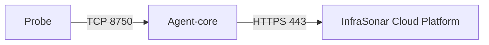

# :material-radar: Agent-core

{ width="200" align=right}

The Agent-core orchestrates our [probes](index.md) and is responsible for scheduling checks. During the startup sequence of a probe, it will “announce” itself to the Agent-core.

The Agent-core also acts as a communication gateway. Data retrieved by the probes is sent to the InfraSonar cloud platform via the Agent-core.

## Features

If an agent-core is shutdown properly the list of assets and a check result queue are saved on disk.
Given the agent-core starts and it can't connect to the InfraSonar cloud platform the list of saved assets will be used to resume operations.
Check results up to a maximum of 100.000 packages will be stored in a queue

### Communication

Because probes usually run in the same Docker network as the Agent-core, they can easily connect to it.

### Multiple agent-cores

InfraSonar supports multiple agent-cores within a monitored environment. Deploying multiple agent-cores can be usefull in spreading the network load, accomendate for network segmentation, and supporting large-scale implementations.

To support network segmentation, assets can be assigned to a zone. When this zone also has an agent-core assigned its assets will automatically be monitored using the agent-cores in this zone.

When you deploy multiple agent-cores in a zone, assets will be evenly distributed between all agent-cores in this zone..

!!! note "No automagic failover"
    If an agent-core fails it's role will not automatically be taken over by another agent-core. To accomplish this, the failing agent-core needs to be removed by an InfraSonar admin.

## Operational

### Removing an Agent-core

When an Agent-core is decommissioned, all hosts monitored by are automatically transferred to other agent-cores in the configured zone.