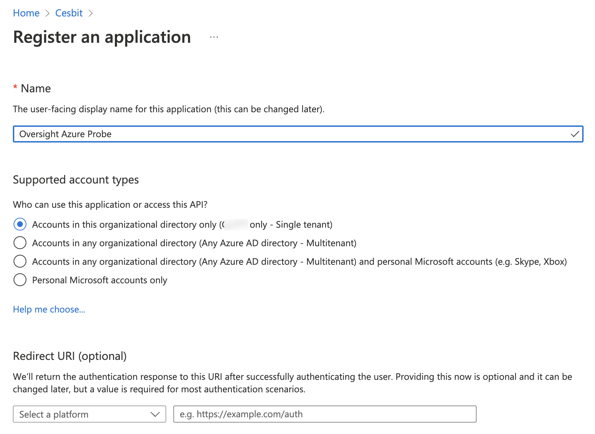
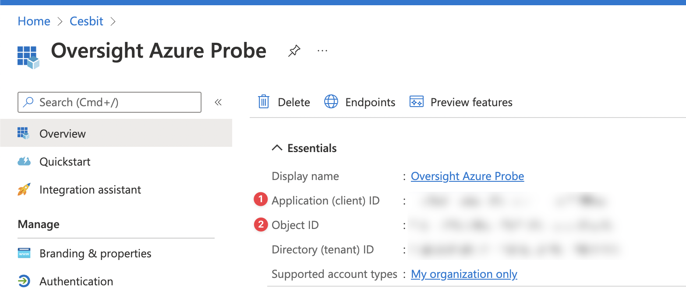

# :material-microsoft-azure: Microsoft Azure

!!! danger "Beta"

    The Azure probe is still an alpha α release.
    Contact InfraSonar support if you want to get involved in the alpha testing phase.

## Features

Add the moment the following Azure resources are supported:

* Virtual machine
* Private DNS zone
* DNS zone
* Regular Network Interface
* Public IP address

## Configuration

### Prepare your Azure environment

Two steps are required to prepare your Azure environment for the InfraSonar Azure probe.

1. Register the InfraSonar probe as an Azure app
2. Authorize the registered app to the resources you want to monitor

Open the Azure portal (https://portal.azure.com/) to ensure your account has sufficient privileges.

#### Create an app registration

1. From the main menu, open **Azure Active Directory**
2. Open **App registrations** from the *Azure Active Directory sub-menu*
3. Select **new registration**
4. Enter the **user-facing display name** e.g., *InfraSonar Azure Probe*
5. Who can use this application or access this API: Select **Accounts in this organizational directory only**
6. Click **register application**

#### app authorization

1. Open the resource group containing the Azure resource you want to monitor
2. Open **Access control (IAM)**
3. Select the tab **Role assignments**
4. Click **Add** and then **Add role assignment**
5. Search the **Reader** role from the *Role* tab
6. Open the *Members* tab
7. Ensure Assign access to *User, group, or service principal* is selected
8. Click **Select members**
9. **Search** the name used by the app registration e.g., *InfraSonar Azure Probe*
10. **Select** the app and **click** the select button
11. Give an optional description
12. Verify the role assignment and press **Review + assign**
    

The registered app can now query the Azure portal's resources via the Azure API

!!! note "Rinse and repeat"
    Repeat the above app authorization steps for each resource group containing the resource you want to monitor.

#### Credentials

The Data needed for the credentials are:

* Directory (tenant) ID
* Application (client) ID
* Client Secret 

These can be found in the registered app:

1. From the main menu open **Azure Active Directory**
2. Open **App registrations** from the *Azure Active Directory sub menu*
3. Open the previous created application e.g. *InfraSonar Azure Probe*
4. Note down the `Application (client) ID` and `Directory (tenant) ID`
   
5. Open **Certificates & secrets** from the *Manage* submenu
6. Click **New client secret**
7. Enter a description e.g. InfraSonar azure probe
8. Provide an expiration date
9. Note down the `Value`, note this can not be retrieved again once you close this window.

Create a `defaultAssetConfig.ini` for in `/etc/infrasonar/azureprobe` as documented [here](appliance/credentials.md#microsoft-azure-probe)

### Setup Azure resources as InfraSonar assets

!!! note "Ensure the container is running"
    Ensure the Azure probe docker container has been setup

The next step is to add the Azure resources you want to monitor to InfraSonar.

1. Navigate to the [InfraSonar environment](https://oversig.ht/#/environments) you want to add Azure resources to
2. Click **Add host** in the host overview screen
3. Enter a name in the hostname field
4. Add the **AzureProbe**
5. Open the **Azureprobe** tab
6. Fill out the required details:
   1. Resource Name
   2. Resource Group
   3. Subscription Id
7. Click save

!!! note "Patience is a virtue"
    The first time it can take up to 5 minutes for the first data to come in.

