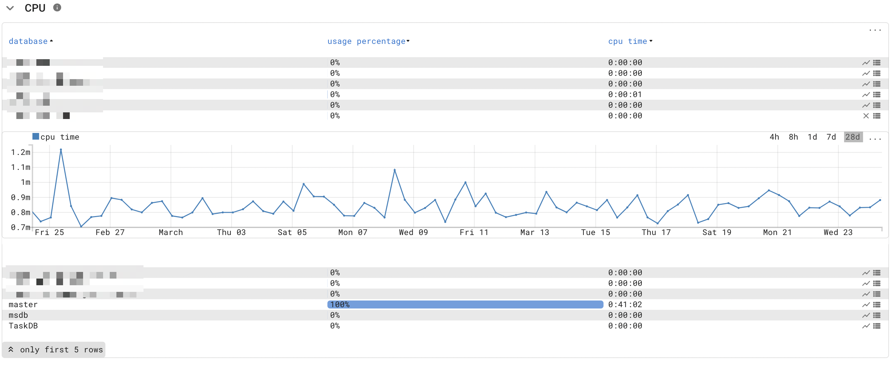

# :material-microsoft: Microsoft SQL Server

The MSSQL probe uses SQL statements to monitor and analyze the health of a Microsoft SQL Server database.

!!! quote "Goal"
    The MSSQL probe offers a unified view that provides common ground for infrastructure engineers, DBA, and application managers to analyze and troubleshoot Microsoft SQL server performance issues.

## Features

The MSSQL probe allows for in-depth analyses of a SQL server.

Some of the included measurements:

* Memory Page life Expectancy.
* Parallelism configuration.
* CPU, memory and disk IO per database.
<figure markdown>
  { width="600" }
  <figcaption>Microsoft SQL server CPU usage</figcaption>
</figure>
* SQL Table information.
* Wait statistics.
* Top 25 query information (*all queries would put too much strain on the SQL server*).
  * Top worker time; which queries consume a lot of time and thus cpu usage.
  * Top logical reads; which queries cost the most IO.
  * Top execution count; shows the most active queries.
* Index information.
  * Frequently used indexes (top used).
  * Missing indexes, where would an index make sense.
  * Unused indexes, only written but never queried.
<figure markdown>
  { width="600" }
  <figcaption>Microsoft SQL server missing indexes</figcaption>
</figure>
* Fragmentation.
<figure markdown>
  { width="600" }
  <figcaption>Microsoft SQL server fragmentation</figcaption>
</figure>
* IO, per file and per volume.
* Backup status.
* Agent jobs.
* SQL Config.
* Session and application information.
* Plan cache.
* Blocked count.

!!! Tip Consultancy
    Our implementation consultants can assist in creating a detailed analysis of a Microsoft SQL server.

## Configuration

### Probe configuration

The MSSQL probe requires the host's IP address running the monitored SQL server.

### SQL Server configuration

#### Authentication

Microsoft SQL Server supports SQL and Windows authentication.

We have implementation scripts for both options but prefer to use Windows authentication, preventing passwords from being stored.

Choose the correct script for your setup and execute the script using SQL Server Management Studio. Both scripts will grant the account used for monitoring sufficient access to query performance metrics.

The InfraSonar admin must configure the credentials to query the database on the appliance that monitors the specific SQL server. See the [credentials section](appliance/credentials.md) on how to configure these.

##### Grants for domain user

Replace `domainnamehere\usernamehere` in [this](microsoft_sql/grantsfordomainuser.sql) script with the correct domain/username and execute it in SQL Server Management Studio to grant the user sufficient permissions.

It is good practice to create a dedicated account for SQL monitoring.

##### Grants for SQL User

[This](microsoft_sql/grantsforsqluser.sql) script uses the default username `svc_infrasonar` and the password `someSuperSecurePasswordHereOfCourse`, which you should change before running the script.

### Appliance

In order to use the Microsoft MSSQL-probe, it should be added as a service to the docker-compose file.

```yaml
  mssqlprobe:
    << : *infrasonar
    image: ghcr.io/infrasonar/mssqlprobe
    environment: *default-infrasonar-environment
```

## Operational

### New databases

The monitoring account does not automatically gain access to databases created after the initial setup. 
This scenario results in the following InfraSonar alert:

> The server principal "_account_" is not able to access the database "_databasename_" under the current security context.

Either grant script contains a marked section that a SQL Admin must run to grant access to these newly created databases.

## Analysis

### SQL Server Cost threshold for parallelism

InfraSonar can report the following message:

> SQL Server Cost threshold for parallelism is set to 5. Suggested is to set this value to 50.

A Microsoft SQL DBA can resolve this by changing the threshold for parallelism to 50, using this SQL statement:

```sql
EXEC sp_configure 'show advanced options', 1;
GO
RECONFIGURE
exec sp_configure 'cost threshold for parallelism', 50;
GO
RECONFIGURE
GO
```

### Max Degree of parallelism

A typical SQL server misconfiguration is the [Max Degree of parallelism](https://docs.microsoft.com/en-us/sql/database-engine/configure-windows/configure-the-max-degree-of-parallelism-server-configuration-option?view=sql-server-ver15).

Rules of thumb:

* MDOP (Max Degree of parallelism) equal the number of CPU cores.
* MDOP should **not** be set greater then 8, _so a 16 core system should have MDOP configured as 8_.

Set `ChangeMe` to the desired MDOP and execute it using SQL Server Management Studio.

```sql
EXEC sp_configure 'show advanced options', 1;
GO
RECONFIGURE
exec sp_configure 'Max Degree of parallelism', ChangeMe;
GO
RECONFIGURE
GO
```
