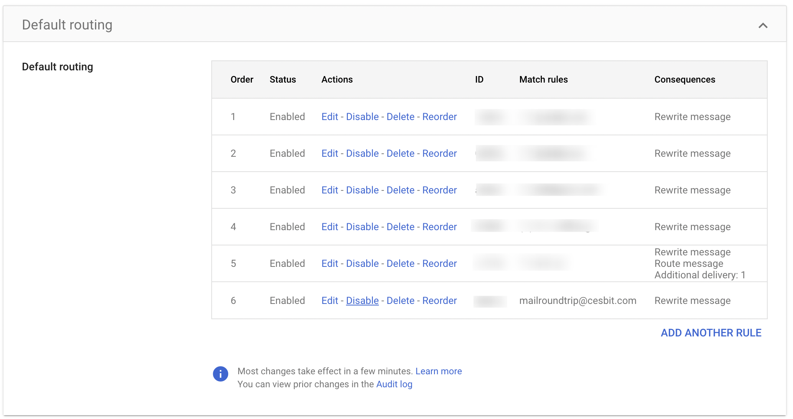

# Google workspace

1. Open the [Google Admin Console](https://admin.google.com/).
2. Navigate to: **Apps** > **Google Workspace** > **Gmail**.
3. Select **Default routing**:
   <figure markdown>
    { width="600" }
    <figcaption>Google workspace routing</figcaption>
   </figure>
4. Click on **ADD ANOTHER RULE**:
   1. In the section *Specify envelope recipients to match*, select **Single recipient** and enter the email address: mailroundtrip@<fqdn>. 
      Where <fqdn> is your email domain.
   2. In the section *If the envelope recipient matches the above, select **Change envelope recipient**, set **Replace recipient** and enter: `mailroundtrip@mrt.oversig.ht`.
   3. Under **Spam**, select **Bypass spam filter for this message**.
   4. Click **Save**.
