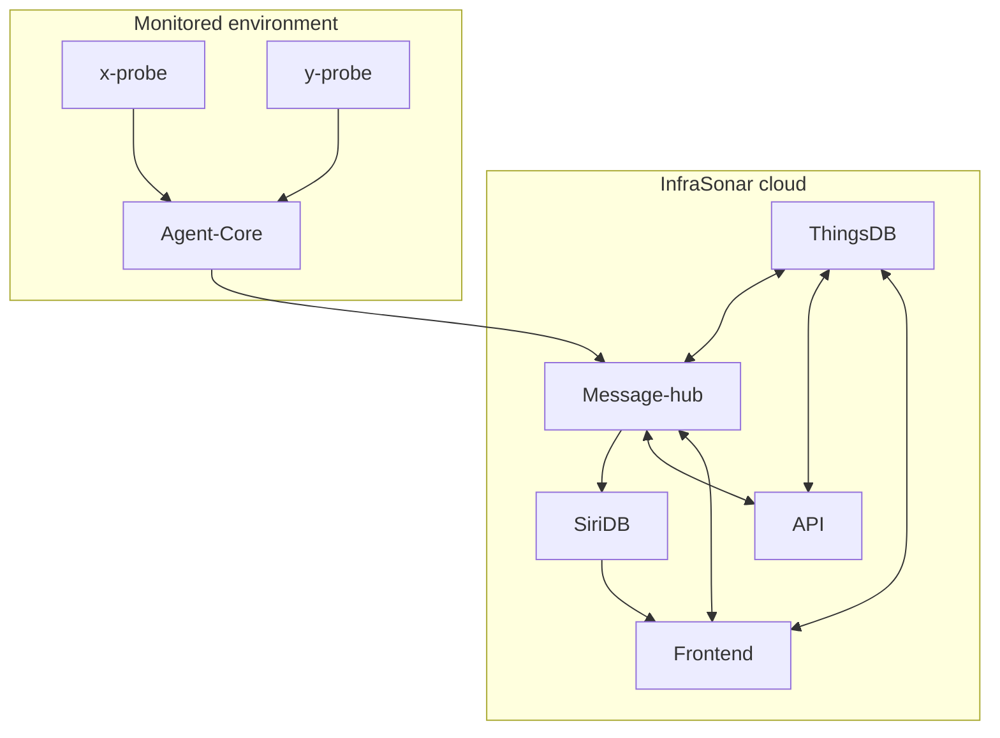
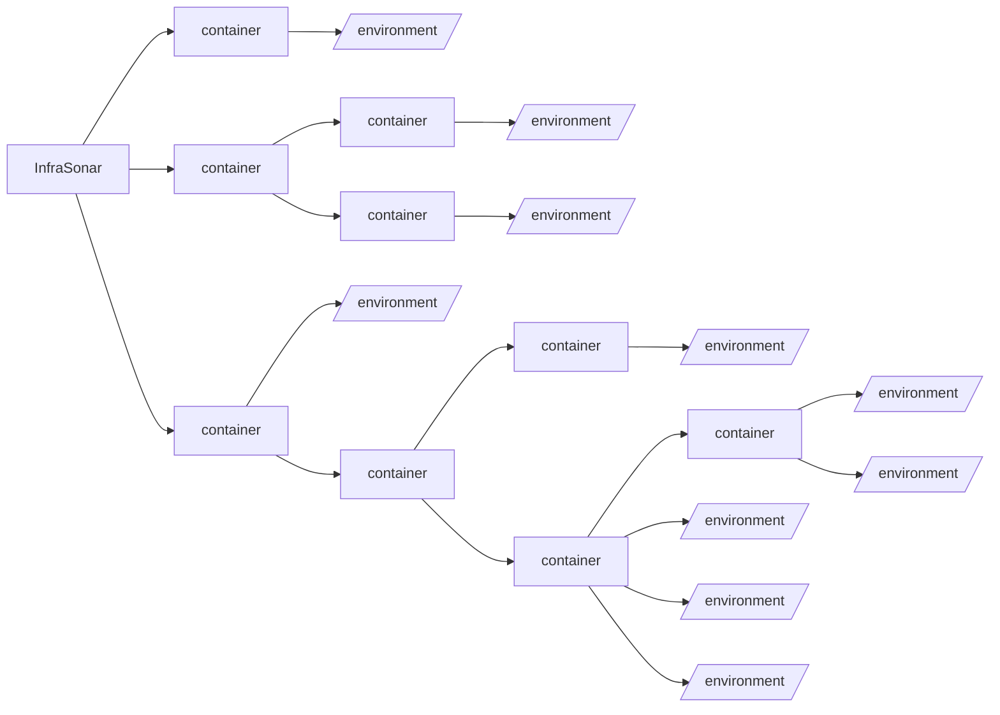

# Platform

This section provides an overview of the InfraSonar monitoring platform.

## An architectural overview of the InfraSonar platform



## Terminology

- **Frontend**: These are the webservers hosting the UI for end users to access InfraSonar.
- **API**: The [API](../../api/overview) allows users to perform automated access using a personal access token.
- **Message-hub**: State is stored here in memory, and logic is performed when new monitoring data arrives.
- **SiriDB**: The [database](https://siridb.com) used for storing [timeseries data](https://en.wikipedia.org/wiki/Time_series) with a long term retention.
- **Agent-core**: Central component in a monitored infrastructure that acts as a relay between probes and the InfraSonar cloud.
- **Probes**: These perform the actual measurement and are tailored per monitored component.
- **Agents**: A standalone InfraSonar component that can send monitoring data to InfraSonar via the [API](../../api/overview)
- **Appliance**: A dedicated (virtual) Linux appliance for InfraSonar.
- **Container**: Used to organize environments and authorization in those environments.
- **Environment**: A business or an IT infrastructure monitored using InfraSonar.
- **Host**: A monitored network component in an environment.

## Breakdown

InfraSonar can be broken down in three area's:

1. Monitored infrastructure
2. InfraSonar cloud
3. End-user access

In the following sections, we will describe each component with an example implementation to better understand InfraSonar's interwork.

### Monitored environment

A monitored environment commonly refers to a business or an IT infrastructure monitored using InfraSonar.

A typical installation consists of a Linux appliance on which all the InfraSonar Agent-cores and probes are installed using [Docker](https://www.docker.com/). Additional documentation on how to set this up is available [here](../collectors/probes/appliance/appliance_deployment.md).

#### Probes

A probe interfaces with the monitored host or component, which checks and the interval are controlled by the Agent-core. The probe formats the retrieved data in the InfraSonar data format and sends the data via the Agent-core to the InfraSonar cloud platform.

Some probes require credentials to access monitored components securely. [WMI](https://docs.microsoft.com/en-us/windows/win32/wmisdk/wmi-start-page) requires a Windows account to retrieve data from monitored servers remotely. These credentials are encrypted and stored in a configuration file per probe. This way, we ensure credentials are securely stored in the monitored environment. More information on how to configure credentials can be found [here](../collectors/probes/appliance/credentials.md).

#### Agent-core

The Agent-core controls the check schedular for all probes and ensures that all checks are balanced across the monitored host.

The Agent-core is also responsible for communication between the InfraSonar cloud and the monitored infrastructure. The Agent-core sends the collected data from the probes to the InfraSonar cloud and listens to configuration changes performed by InfraSonar admins.

### InfraSonar cloud

The InfraSonar cloud platform is hosted on the [Google Cloud Platform](https://cloud.google.com/).

Data from a monitored environment is received and processed in the InfraSonar cloud platform on what we call the Message-hubs. These Message-hubs evaluate the data against configured conditions and store received time series data in [SiriDB](https://siridb.net/). Received state data is kept in memory by the Message-hubs.

### Frontend

The InfraSonar user interface is accessible using any modern web browser.

User authentication is performed using a personal [GitHub](https://github.com) account, a personal [Microsoft](https://account.live.com/) account or a [Google](https://www.google.com/account/about/) account (_this can be a personal or Google workspace account_).

## Authorization

Since InfraSonar is a cloud solution, authorization is an important aspect.

### Roles

The roles that exist in InfraSonar are as follows:

| **Role**     | **Description**                                                                                                                                   |
| ------------ | ------------------------------------------------------------------------------------------------------------------------------------------------- |
| **View**     | View only access.                                                                                                                                 |
| **Operator** | View access plus:<br><ul><li>Assign alerts.</li><li>Add messages to an alert.</li><li>Add or remove labels from a host.</li></lu>                    |
| **Admin**    | Operator access plus:<br><ul><li>Add, edit and remove hosts.</li><li>Add, edit and remove probes.</li><li>Manage users on container level.</li></lu> |

Each role has an additional `member` property that indicates whether alerts can be assigned to the user. Members are visible in the assignment table.
The `member` property is helpful for organizations where, for example, InfraSonar administrators do not have an operational role or where specific teams are responsible for a customer.

### Hierarchy

#### Principles

- A monitored *environment* is always part of a *container*.
- Authorization is inherited to "lower" containers. Inheritance can be "broken" down the chain.
- Timezones can be configured per environment.
- A user with the role _admin_:
    - Can move a container or environment to another container within that user's authorized scope.
    - Can authorize users on container level.

#### InfraSonar hierarchical setup



Example of a hierarchy implementation for a service provider:

??? example "Hierarchy implementation for a service provider"

    ``` mermaid
    graph LR
      A[InfraSonar] --> B[service provider];
      B --> C[internal infrastructure]
      B --> D[monitoring only]
      B --> E[managed service]
      C --> F[/environment/]
      D --> customer1[customer 1]
      D --> customer2[customer 2]
      customer1 --> I[/environment/]
      customer2 --> J[/environment/]
      E --> customer3[customer 3]
      customer3 --> K[/environment/]
      E --> customer4[customer 4]
      customer4 --> L[/environment/]
      E --> customer5[customer 5]
      customer5 --> M[/environment-development/]
      customer5 --> N[/environment-acceptance/]
      customer5 --> O[/environment-production/]
    ```

!!! info
    For quality and auditing purposes a strictly limited number of InfraSonar staff has access to the full hierarchy.
