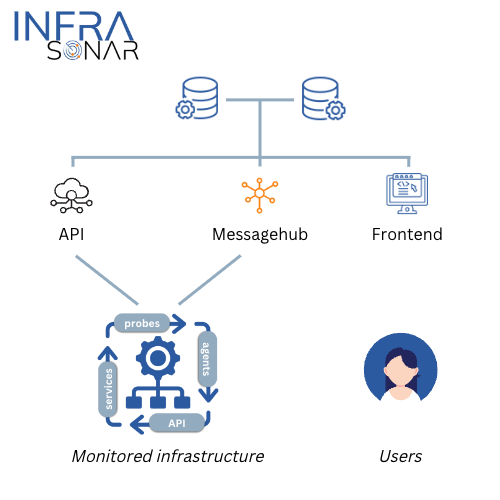

# Platform

This section provides an overview of the InfraSonar monitoring platform.

## Architectural overview

An architectural overview of the InfraSonar platform

{ width="500"}

## Collectors

### Agents

### Probes

Probes are typically deployed using an appliance.

Probes are orchestrated by the agent-core. The Agent-core is also responsible for communication between the InfraSonar cloud and the monitored asset. The Agent-core sends the collected data from the probes to the InfraSonar cloud and listens to configuration changes performed by InfraSonar admins.

A probe interfaces with the monitored asset using checks to retrieve data at regular intervals. When a probe requires credentials these can be securely stored on the appliance. More information on how to configure credentials can be found [here](../collectors/probes/appliance/credentials.md).

### Services

## Terminology

Term           | Description
---------------|----------------------------------------------------------
**Frontend**   | These are the webservers hosting the UI for end users to access InfraSonar.
**API**        | The [API](../../api/overview) allows users to perform automated access using a personal access token.
**Messagehub** | State is stored here in memory, and logic is performed when new monitoring data arrives.
**SiriDB**     | The [database](https://siridb.com) used for storing [timeseries data](https://en.wikipedia.org/wiki/Time_series) with a long term retention.
**Agent-core** | Central component in a monitored infrastructure that acts as a relay between probes and the InfraSonar cloud.
**Probes**     | These perform the actual measurement and are tailored per monitored component.
**Agents**     | A standalone InfraSonar component that can send monitoring data to InfraSonar via the [API](../../api/overview)
**Appliance**  | A dedicated (virtual) Linux appliance for InfraSonar.
**Container**  | Used to organize environments and authorization in those environments.
**Environment**| A business or an IT infrastructure monitored using InfraSonar.
**Host**       | A monitored network component in an environment.

## Breakdown

InfraSonar can be broken down in three area's:

1. Monitored infrastructure
2. InfraSonar cloud
3. End-user access

In the following sections, we will describe each component with an example implementation to better understand InfraSonar's interwork.

### Monitored environment

A monitored environment commonly refers to a business or an IT infrastructure monitored using InfraSonar.

A typical installation consists of a Linux appliance on which all the InfraSonar Agent-cores and probes are installed using [Docker](https://www.docker.com/). Additional documentation on how to set this up is available [here](../collectors/probes/appliance/appliance_deployment.md).

### InfraSonar cloud

The InfraSonar cloud platform is hosted on the [Google Cloud Platform](https://cloud.google.com/).

Data from a monitored environment is received and processed in the InfraSonar cloud platform on what we call the Message-hubs. These Message-hubs evaluate the data against configured conditions and store received time series data in [SiriDB](https://siridb.net/). Received state data is kept in memory by the Message-hubs.

### Frontend

The InfraSonar user interface is accessible using any modern web browser.
