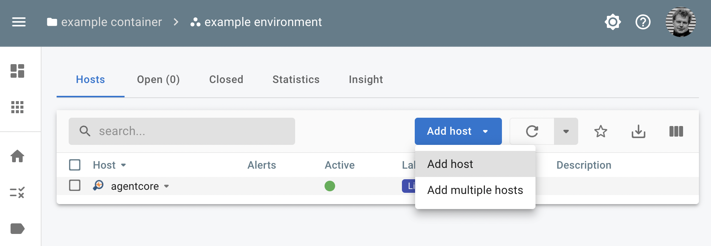
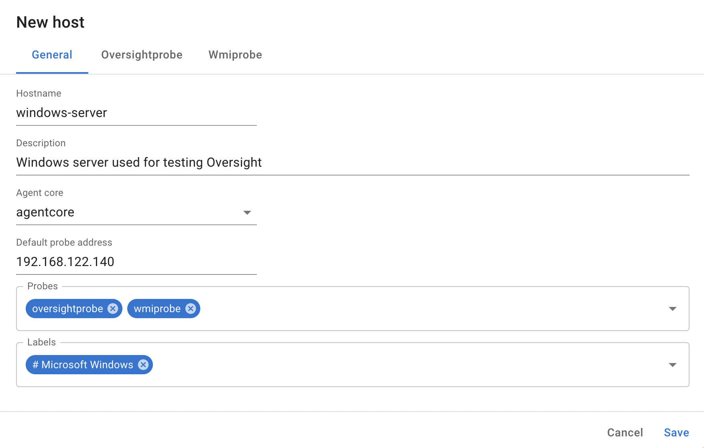
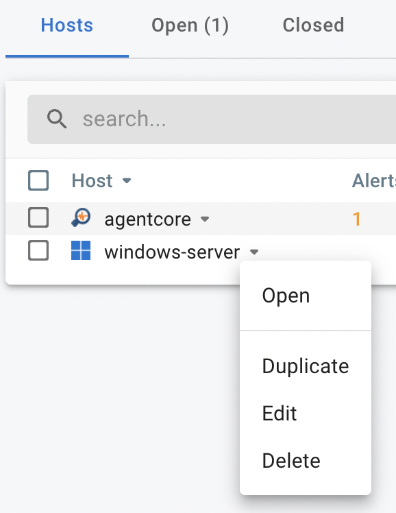
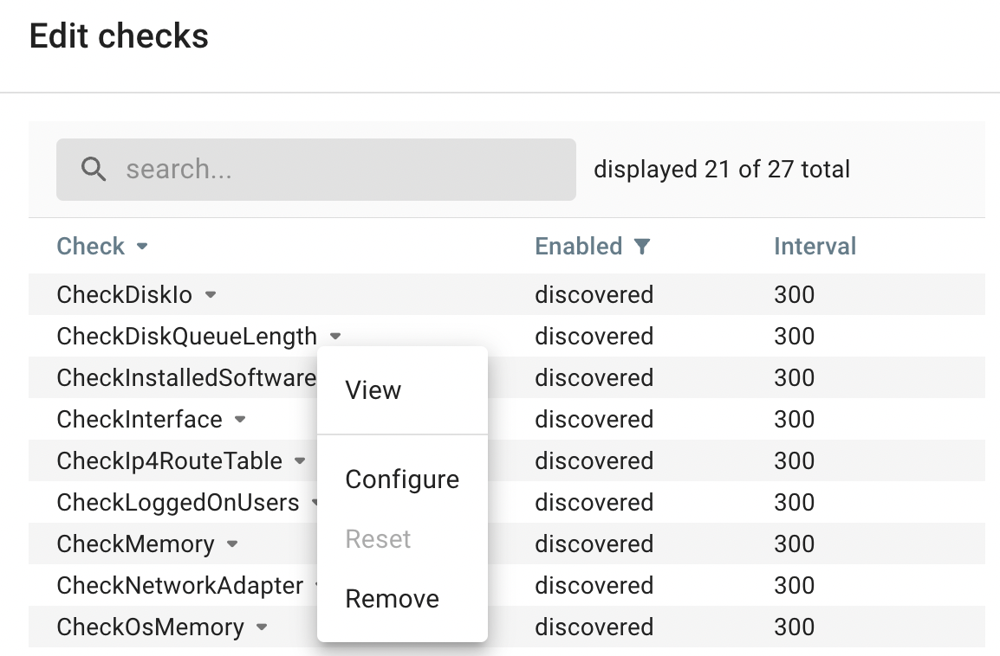

# Hosts

## Adding hosts

When you open the *Environment* page, you can add hosts via the **Add host** button.

<figure markdown>
  { width="800" }
  <figcaption>InfraSonar add host</figcaption>
</figure>

Configuration pre-requisites:

* An Agent-core must be deployed before adding hosts, as hosts need to be assigned to an Agent-core. See the [InfraSonar appliance](../collectors/probes/appliance/appliance_deployment.md) documentation on how to set this up.
* [Credentials](../collectors/probes/appliance/credentials.md) for the monitored host(s) must be configured to gain access.

<figure markdown>
  { width="800" }
  <figcaption>InfraSonar add host details</figcaption>
</figure>

Adding a host involves the following steps:

1. Enter the hostname. 
   We strongly suggest entering the correct hostname here, but do not enforce this.
2. Enter an optional description.
3. Select the Agent-core. 
   *This is only required for large environments where multiple Agent-cores are deployed.*
4. Select which [probes](../collectors/probes/index.md) you want to use.
5. Select the [label](labels.md) you want to use.
6. Provide the configuration details per probe on their respective tabs.
7. Enter details for logging when prompted.

Host discovery starts now and will take a couple of minutes.

### Adding multiple hosts

InfraSonar allows multiple hosts to be entered at once. This step requires you to add the hosts first and then add the probes and labels.

## Managing hosts

Managing a host can be done by clicking the menu next to the host in the host overview and selecting edit.

<figure markdown>
  { width="300" }
  <figcaption>InfraSonar manage host</figcaption>
</figure>

Next to adding probes and labels, the following actions are possible when editing an already discovered host:

* [Rediscover checks](assets.md#editing-hosts)
* Discover new checks
* Edit checks
* Remove probe(s)

*As credentials are not stored in the InfraSonar platform. These need to be managed on the InfraSonar appliance.*

### Rediscover checks

Rediscovering checks essentially removes and adds the host to InfraSonar while retaining the configuration in a single action.

Rediscover checks:

1. Edit a host.
2. Open the **InfraSonar probe** tab.
3. Click **Rediscover checks**.

### Discover new checks

InfraSonar tries to discover checks on its own, but sometimes you want to discover new checks right away.
The above is especially useful if you granted more access to the monitoring account and want to check instantly if the data is accessible.

Discover new checks:

1. Edit a host.
2. Open the **Probe** tab for the probe you want to discover.
3. Click **Discover new checks**.

### Edit checks

The edit checks allows you to remove a check or change the check interval for a check.

Edit checks:

1. Edit a host.
2. Open the **Probe** tab for the probe you want to discover.
3. Click **Edit checks**.

<figure markdown>
  { width="400" }
  <figcaption>InfraSonar add host</figcaption>
</figure>

!!! danger
    Try to avoid changing the default check interval for many hosts/checks as this can lead to an increase in load, especially when using a shorter check interval.

### Remove probe(s)

When removing a probe, you are prompted if you want to save the configuration. Doing so can be convenient if you want to remove the probe temporary.

## API

Adding hosts add assigning labels / probes to them can also be done via the [InfraSonar API](../../api/hosts/add-host.md).

