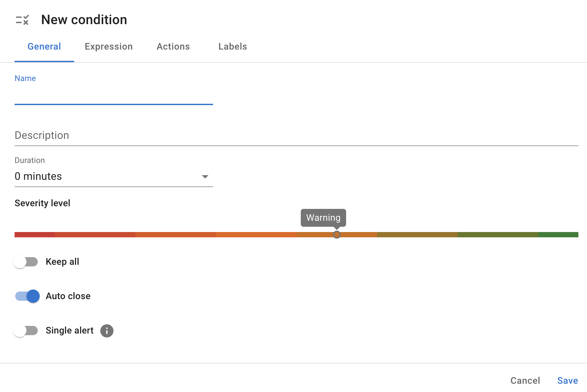

# :material-list-status: Conditions

InfraSonar comes with many predefined conditions based on years of experience and best practices.

InfraSonar conditions are used to evaluate incoming check results. Evaluations take place on the InfraSonar cloud platform.

Within InfraSonar, we can identify three methods for data evaluation, which can also be combined, allowing users to build precise and meaningful conditions.

* **Threshold** 
  Monitors if a metric is still within the required boundaries. 
  *Example: check if the disk space usage is not above 80%*
* **State** 
  Used to monitor if the desired state is still as it should be. 
  *Example: check if a process is still running*
* **Comparison** 
  Check for differences between the current state and the previous state. 
  *Example: check if the list of volumes is not missing items when compared to the previous check result*

## Guidelines

* Conditions can be assigned to a host via labels.
* Custom conditions cannot be assigned to pre-defined labels.
* Combining conditions using `and` and or `or` statements is only possible within the boundaries of a check result.

## Create a condition

!!! tip "Custom labels"
    As custom conditions cannot be assigned to pre-defined InfraSonar labels, the first step is to create a [custom label](labels.md#custom-labels) or use an already available custom label.

1. Navigate to the conditions page (:material-list-status:) in the left navigation drawer.
2. Click on the **Add condition** button.
3. Carefully fill out each of the tabs.

### General tab

<figure markdown>
  { width="800" }
  <figcaption>InfraSonar add condition general tab</figcaption>
</figure>

**Name**
:   Enter the name of your condition here. We advise prefixing the condition name with the probe name.

**Description**
:   Enter an optional description. While it's optional, do yourself a favor and describe the condition here. Your future self will thank you.

**Duration**
:   How long should this condition be 'hit' before the condition is raised.
    !!! Note
        When the condition: `new items`, `detect missing items` or `changes` is used, the duration must be set to `0` because the new, missing or changed value may be overwritten by a new check result.

**Severity level**
:   InfraSonar uses 8 severity levels derived from the Syslog levels [:material-wikipedia:](https://en.wikipedia.org/wiki/Syslog)

    Select the appropriate level for your condition here.

    |level | Severity      | Description                                                           |
    |------|---------------|-----------------------------------------------------------------------|
    |0     | Emergency     | System is unusable.                                                   |
    |1     | Alert         | Action must be taken immediately.                                     |
    |2     | Critical      | Critical conditions.                                                  |
    |3     | Error         | Error conditions.                                                     |
    |4     | Warning       | Warning conditions.                                                   |
    |5     | Notice        | Normal but significant conditions.                                    |
    |6     | Informational | Informational.                                                        |
    |7     | Debug         | Messages that contain information normally of use only when debugging.|

**Keep all**

:   TODO

**Auto close**

:   When set, the alert is automatically closed if the condition is no longer met.
    !!! note
        Be thoughtful when configuring alerts to auto close. Sometimes you want to know is something happened even though it is ok :material-check: now.
        A good example is the "Reboot detection", which uses `diff uptime` as condition trigger. If we would auto close this condition, a reboot alert would only exist for the check interval ~5 minutes.

**Single alert**

:   When a condition is hit by multiple metrics in a check, setting this property ensures only one alert is raised.
    !!! note
        When set, it can be hard to determine the impact as you don't know how many checks are being hit by the condition.

### Expression tab

The first step in the expression tab is to configure the "path" to the metrics. This path: 

<figure markdown>
  { width="600" }
  <figcaption>InfraSonar add condition expression tab</figcaption>
</figure>

1. Select a **probe**.
2. Select a **check**.
3. Select a **type**.
4. Select a **metric** or opt to monitor for **item existence**.

**Item existence**

:   Is not a metric, but a method that allows you to set a condition on the **items** returned by the check.
    Item existence supports the following conditions:

    Condition                     | Description
    ------------------------------|----------------
    detect new items              | Raised when new items are detected compared to the previous check result.
    detect missing items          | Raised when items are missing compared to the previous check result.
    specific items must exist     | 
    specific items must not exist |
    item in list                  |
    item not in list              |

**metric**

:   Depending on the value's data type (string, number or timestamp), a number of operators can be used to set up a condition.
    A particular operator is the **changed** operator, which can be used to trigger when the previously measured value deviates from the current measured value.

**and / or / group**

:   Multiple conditions on the same path (*probe/check/type*) can be combined using *and* & *or* *statements*.
    An optional *group* function allows for complex expressions. 
    
!!! tip "Pro tip"
    Open a host representative for the condition you want to create and click on the download :material-download: button. This downloads a JSON file containing all data collected for this host and helps you better understand the InfraSonar data format.
    Also feel free to [contact us](../introduction/contact_us.md) if you need help.

### Actions tab

In the action tab you can set a custom message.

### Labels tab

In the labels tab you can configure for which labels this condition should be active and or suppressed.

## Suppressing a global condition

The first step is to create a label and prefix it with a `≠` symbol.

<figure markdown>
  { width="800" }
  <figcaption>InfraSonar create ignore label</figcaption>
</figure>

!!! tip "Duplicate an existing label"
    You can also copy and modify an existing label to suit your needs. Right-click an existing label and choose duplicate.

Once you create this label navigate to the :material-list-status: condition page.

1. Click on the dropdown icon :material-menu-down: next to the condition.
2. Select **Edit** from the menu.
3. Go to the **Labels tab**.
4. **Add** the label you want to use for suppressing the condition in the *Suppressed for the following label(s)* selection.

## Overwrite a global condition

Since you can add multiple conditions to a label, it is possible to overwrite an existing condition with a new one.

1. Create a label or use an existing custom label. We suggest using a regular label type :material-label:{.gray-icon}.
2. Navigate to the :material-list-status: condition page in the left navigation drawer.
3. Click on the dropdown icon :material-menu-down: next to the condition you want to overwrite.
4. Select **Edit** from the menu.
5. Goto the **Labels tab**.
6. **Add** the label you want to use in the *Suppressed for the following label(s)* selection.
7. Save the condition.
8. Browse to the condition you want to use instead.
9. Select **Edit** from the menu.
10. Go to the **Labels tab**.
11. **Add** the label you want to use in the *Active for the following label(s)* selection.
12. Navigate to the labels page (:material-label:) in the left navigation drawer.
13. Open the label used for the overwrite.
14. Validate in the **Conditions** tab and **Suppressed** tab if the right conditions are configured.

