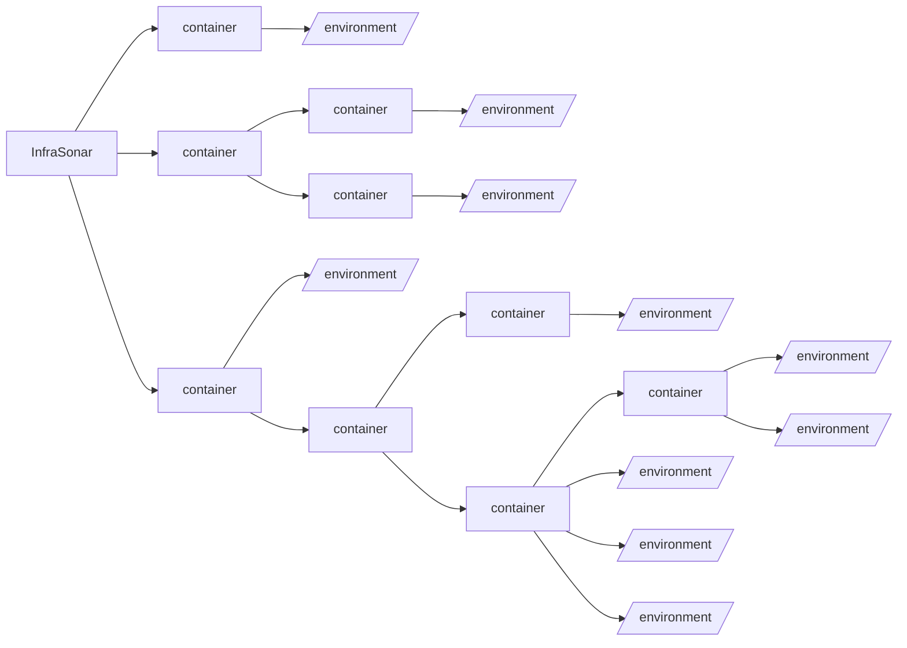
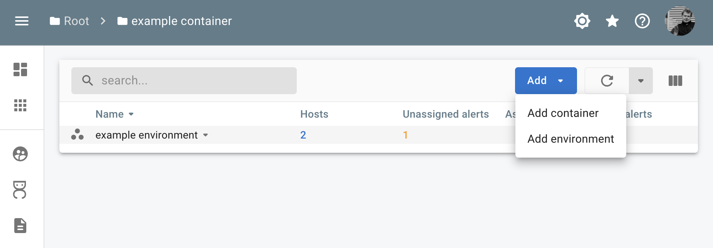

# :material-apps: InfraSonar environments 

A monitored environment often referred to as an environment, is a business or an IT infrastructure monitored using InfraSonar.

As InfraSonar is designed to be used in a multi-tenant setup, environments can be organized in a hierarchy using containers.

On the container level an admin can configure authorization, custom labels, and conditions.

## Hierarchy

### Principles

* A monitored environment is always member of a container.
* Authorization is inherited to "lower" containers. Inheritance can be "broken" down the chain.
* Timezones can be configured per environment.
* A user with the role *admin*:
    * Can move a container or environment to another container within that user's authorized scope.
    * Can authorize users on the container.

#### InfraSonar hierarchical setup




??? Example "Hierarchy implementation for a service provider"

    ``` mermaid
    graph LR
      A[InfraSonar] --> B[service provider];
      B --> C[internal infrastructure]
      B --> D[monitoring only]
      B --> E[managed service]
      C --> F[/environment/]
      D --> customer1[customer 1]
      D --> customer2[customer 2]
      customer1 --> I[/environment/]
      customer2 --> J[/environment/]
      E --> customer3[customer 3]
      customer3 --> K[/environment/]
      E --> customer4[customer 4]
      customer4 --> L[/environment/]
      E --> customer5[customer 5]
      customer5 --> M[/environment-development/]
      customer5 --> N[/environment-acceptance/]
      customer5 --> O[/environment-production/]
    ```

## Setup a new environment

!!! note First time users

    When you are new to InfraSonar and sign in for the first time, you will see the message:
    > Welcome to InfraSonar! It appears that you are not yet a member of an InfraSonar environment. If you are a member of an organization that uses InfraSonar, ask for permission from an authorized person to add you to the appropriate environment.
    At the moment, it is impossible to create the first environment without our assistance, please [contact us](../introduction/contact_us.md) so we can set up an empty environment for you.

From the container view, you can add a new environment.

<figure markdown>
  { width="800" }
  <figcaption>InfraSonar add environment</figcaption>
</figure>

When adding an environment you are asked to specify the timezone for this environment.

*:material-skip-next: The next step is to deploy the InfraSonar [appliance](../collectors/probes/appliance/appliance_deployment.md).*
