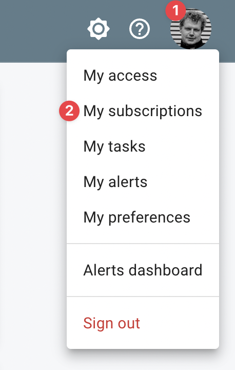
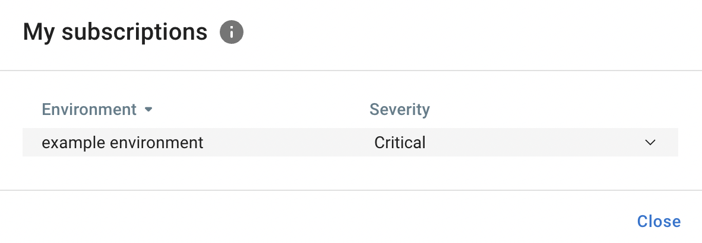

# :material-email: Subscriptions

InfraSonar users can subscribe to alerts per environment per severity level.

When subscribed, an :material-email: email is sent if an alert below or equal to the configured severity is raised.

## Configuration

Follow these steps to configure your subscriptions:

1. Click on your avatar in the top right corner.
2. Select **My subscriptions**.
3. Configure per environment for which severity levels you wish to receive :material-email: email alerts.

{ width="200" align=left}
{ width="500" align=right}

